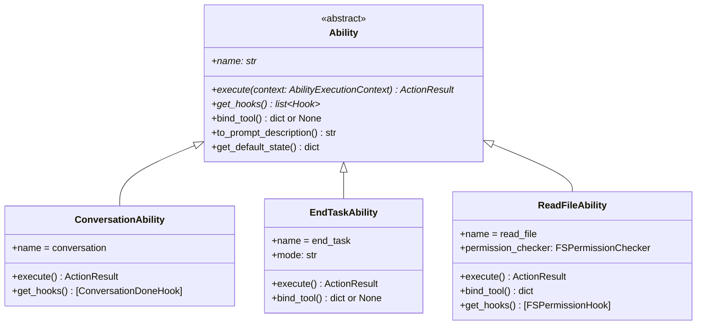
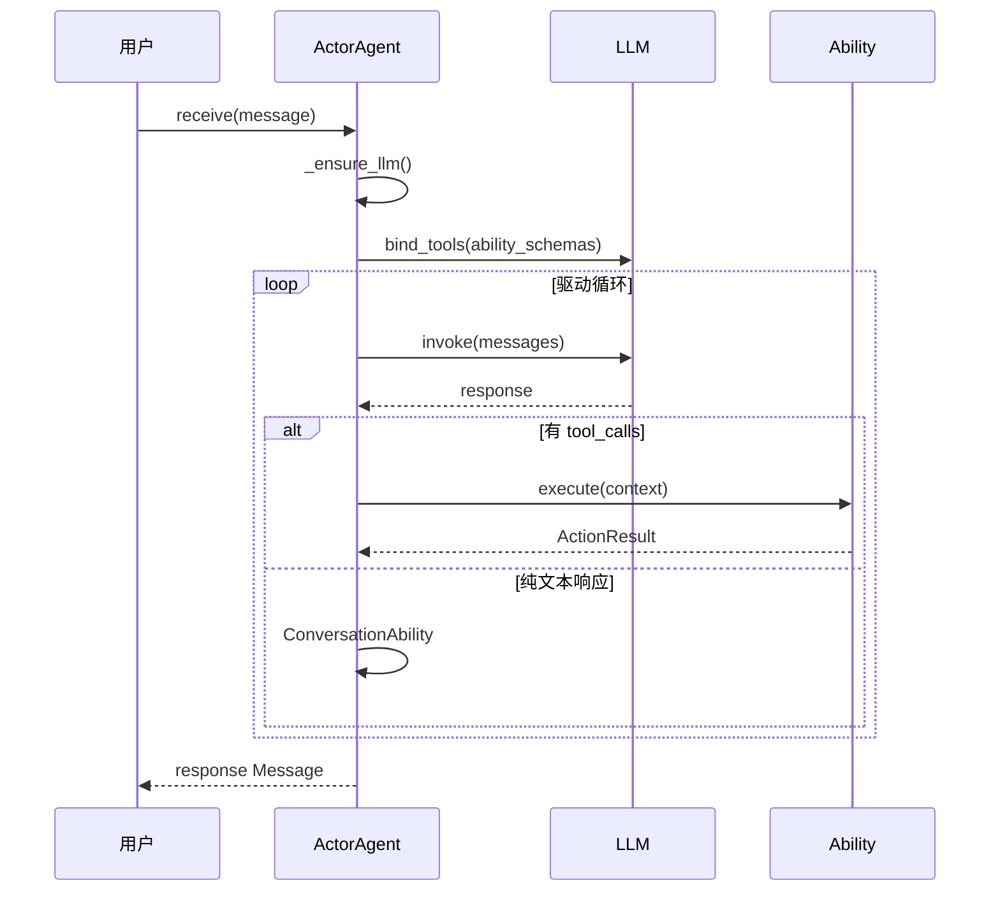

# Ability 系统

Ability 是 ghrah 的核心抽象，定义了 Agent 的能力接口契约。每个 Ability 是最小的能力单元，Agent 通过组合多个 Ability 获得完整行为。

## 设计理念

- Agent 的行为完全由注册的 Ability 组合决定
- 不同 Agent 可以复用相同的 Ability 实现
- Ability 可以在运行时动态注册/注销



## Ability 基类

[`Ability`](../src/ghrah/abilities/base.py:52) 是所有能力的抽象基类：

```python
from abc import ABC, abstractmethod
from ghrah.abilities.base import Ability, ActionOutcome, ActionResult

class MyAbility(Ability):
    @property
    def name(self) -> str:
        return "my_ability"
    
    async def execute(self, context: AbilityExecutionContext) -> ActionResult:
        # 实现能力逻辑
        return ActionResult(
            outcome=ActionOutcome.SUCCESS,
            data={"result": "done"},
        )
    
    def get_hooks(self) -> list[Hook]:
        return []  # 或返回自定义 hooks
```

### 必须实现的方法

| 方法 | 说明 |
|------|------|
| [`name`](../src/ghrah/abilities/base.py:68) | 能力名称（唯一标识） |
| [`execute(context)`](../src/ghrah/abilities/base.py:74) | 执行该能力的动作，返回 `ActionResult` |
| [`get_hooks()`](../src/ghrah/abilities/base.py:86) | 返回该能力注册的所有 hooks |

### 可选覆盖的方法

| 方法 | 说明 | 默认值 |
|------|------|--------|
| [`bind_tool()`](../src/ghrah/abilities/base.py:90) | 返回 OpenAI function calling schema | `None` |
| [`to_prompt_description()`](../src/ghrah/abilities/base.py:103) | 返回 LLM 可理解的能力描述 | `""` |
| [`get_default_state()`](../src/ghrah/abilities/base.py:115) | 返回该 ability 的默认状态 | `{}` |

## ActionResult 与 ActionOutcome

[`ActionResult`](../src/ghrah/abilities/base.py:37) 是 Ability 执行的返回值：

```python
@dataclass
class ActionResult:
    outcome: ActionOutcome       # 执行结果类型
    data: dict[str, Any] = {}    # 结果数据
    next_action_hint: str | None = None  # 建议的下一个 action
```

[`ActionOutcome`](../src/ghrah/abilities/base.py:28) 枚举：

| 值 | 说明 |
|------|------|
| `SUCCESS` | 执行成功 |
| `FAILURE` | 执行失败 |
| `NEEDS_INPUT` | 需要人工输入（HITL） |
| `DELEGATE` | 需要委托给其他 Agent |

## AbilityExecutionContext

[`AbilityExecutionContext`](../src/ghrah/abilities/context.py:21) 是 Ability 执行时的最小上下文：

```python
@dataclass
class AbilityExecutionContext:
    current_ability_name: str = ""           # 当前 ability 名称
    tool_args: dict[str, Any] = {}           # 工具调用参数
    agent_state: dict[str, Any] = {}         # Agent 完整状态（只读）
    context_manager: ContextManager | None   # ContextManager 引用
    current_node_id: str | None = None       # 当前链节点 ID
    accumulated_data: dict[str, Any] = {}    # 累积数据
    last_action_result: ActionResult | None   # 上一次 action 结果
```

### 状态 API

```python
# 获取当前 ability 作用域的状态
state = context.get_ability_state()

# 更新当前 ability 作用域的状态
context.update_ability_state({"key": "value"})

# 更新 Agent 全局状态
context.update_agent_state({"global_key": "global_value"})
```

## 注册与注销

### 注册 Ability

```python
# 注册 Ability
agent = ActorAgent(config)
agent.register_ability(ConversationAbility())
agent.register_ability(ReadFileAbility())

# 注册时自动：
# 1. 收集 bind_tool() 返回的 schema
# 2. 收集 get_hooks() 返回的 hooks
# 3. 初始化 ability 默认状态到 StateManager
```

### 注销 Ability

```python
# 移除已注册的能力
agent.unregister_ability("read_file")
# 自动移除对应的 tool schema 和 hooks
```

### 查看已注册 Ability

```python
abilities = agent.get_abilities()
# 返回: ["conversation", "read_file", ...]
```

## bind_tool 机制

[`bind_tool()`](../src/ghrah/abilities/base.py:90) 返回 OpenAI function calling 格式的 tool definition：

```python
class ReadFileAbility(Ability):
    def bind_tool(self) -> dict[str, Any]:
        return {
            "type": "function",
            "function": {
                "name": "read_file",
                "description": "Read the contents of a file",
                "parameters": {
                    "type": "object",
                    "properties": {
                        "path": {
                            "type": "string",
                            "description": "Path to the file to read",
                        }
                    },
                    "required": ["path"],
                },
            },
        }
```

**关键点**：

- `bind_tool()` 返回 `None` 表示该 Ability 没有对应的 tool call（如 `ConversationAbility`）
- 有 `bind_tool()` 的 Ability 会被 LLM 通过 function calling 调用
- 没有 `bind_tool()` 的 Ability 由框架内部路由（如 `ConversationAbility` 处理纯文本响应）

## 自定义 Ability 开发

### 示例：天气查询 Ability

```python
from ghrah.abilities.base import Ability, ActionOutcome, ActionResult
from ghrah.abilities.context import AbilityExecutionContext
from ghrah.abilities.hooks import Hook, HookPoint, HookResult

class WeatherAbility(Ability):
    """天气查询能力"""
    
    @property
    def name(self) -> str:
        return "weather"
    
    async def execute(self, context: AbilityExecutionContext) -> ActionResult:
        city = context.tool_args.get("city", "未知")
        # 模拟天气查询
        weather_info = f"{city}今天晴，温度25°C"
        return ActionResult(
            outcome=ActionOutcome.SUCCESS,
            data={"weather": weather_info},
        )
    
    def get_hooks(self) -> list[Hook]:
        return []
    
    def bind_tool(self) -> dict[str, Any]:
        return {
            "type": "function",
            "function": {
                "name": "weather",
                "description": "查询指定城市的天气",
                "parameters": {
                    "type": "object",
                    "properties": {
                        "city": {
                            "type": "string",
                            "description": "城市名称",
                        }
                    },
                    "required": ["city"],
                },
            },
        }
    
    def get_default_state(self) -> dict[str, Any]:
        return {"query_count": 0}
```

### 示例：带 Hook 的 Ability

```python
class RateLimitHook(Hook):
    """速率限制 Hook"""
    hook_point = HookPoint.PRE_EXECUTE
    
    async def should_trigger(self, context: AbilityExecutionContext) -> bool:
        return context.current_ability_name == "weather"
    
    async def execute(self, context, result=None) -> HookResult:
        state = context.get_ability_state()
        count = state.get("query_count", 0)
        if count >= 10:
            return HookResult.stop()  # 超过限制，停止循环
        return HookResult.continue_()  # 继续

class WeatherAbility(Ability):
    # ...（同上）
    
    def get_hooks(self) -> list[Hook]:
        return [RateLimitHook()]
```

## 与 LLM 的交互流程



## AbilityExecutor 双模式

Ability 的执行通过 [`AbilityExecutor`](../src/ghrah/abilities/executor.py) 抽象层解耦，支持两种执行模式：

| 模式 | 执行器 | 说明 |
|------|--------|------|
| 本地模式 | `LocalAbilityExecutor` | 在 Core 端直接执行 Ability + HITL |
| 分布式模式 | `RemoteAbilityExecutor` | 将执行委托给 Subject，通过 CommandSender 通信 |

ActorAgent 根据配置自动选择执行器。Ability 开发者无需关心执行模式，Ability 接口在两种模式下完全一致。

详见 [双模式架构](distributed-mode.md)。

## 下一步

- [内置 Ability 参考](builtin-abilities.md) — 查看所有内置 Ability 的详细文档
- [Hook 机制](hook-mechanism.md) — 深入了解三层 Hook 架构
- [上下文管理](context-management.md) — 理解 Ability 执行上下文和状态管理
- [双模式架构](distributed-mode.md) — 了解 AbilityExecutor 的双模式设计