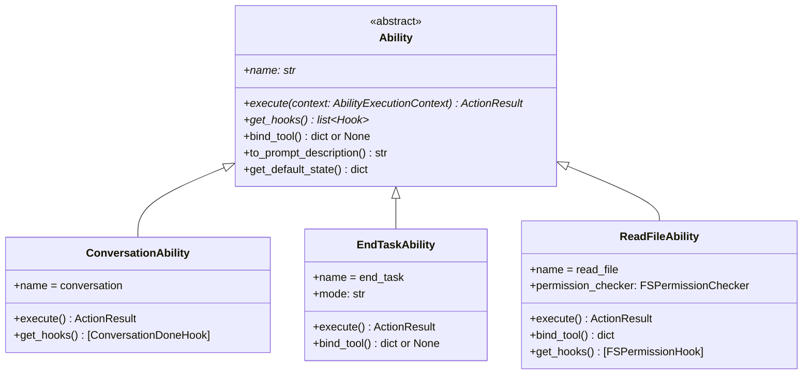
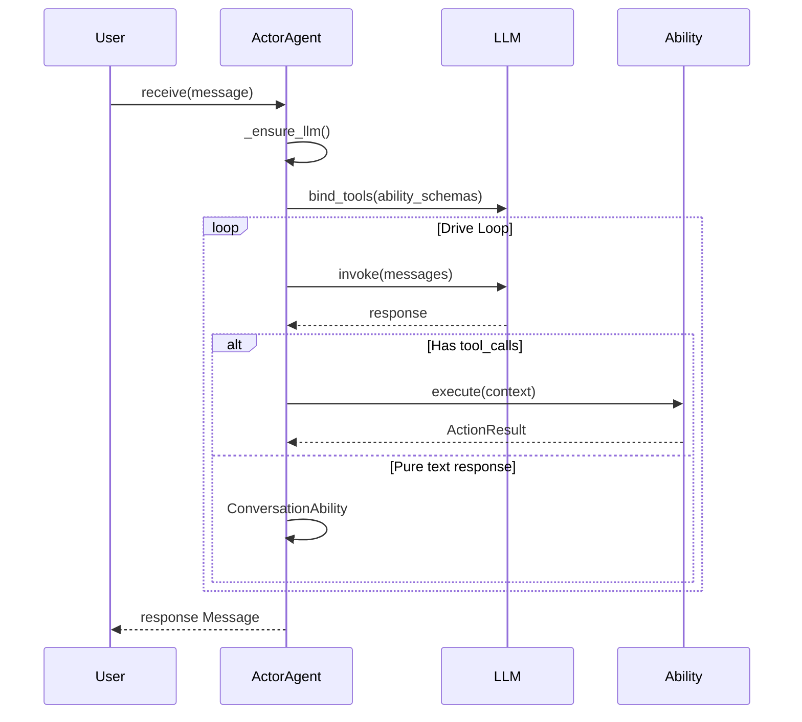

# Ability System

Ability is the core abstraction in ghrah, defining the capability interface contract for Agents. Each Ability is the smallest unit of capability, and Agents gain complete behavior by composing multiple Abilities.

## Design Philosophy

- Agent behavior is entirely determined by the composition of registered Abilities
- Different Agents can reuse the same Ability implementations
- Abilities can be dynamically registered/unregistered at runtime



## Ability Base Class

[`Ability`](../src/ghrah/abilities/base.py:52) is the abstract base class for all capabilities:

```python
from abc import ABC, abstractmethod
from ghrah.abilities.base import Ability, ActionOutcome, ActionResult

class MyAbility(Ability):
    @property
    def name(self) -> str:
        return "my_ability"
    
    async def execute(self, context: AbilityExecutionContext) -> ActionResult:
        # Implement capability logic
        return ActionResult(
            outcome=ActionOutcome.SUCCESS,
            data={"result": "done"},
        )
    
    def get_hooks(self) -> list[Hook]:
        return []  # Or return custom hooks
```

### Required Methods

| Method | Description |
|--------|-------------|
| [`name`](../src/ghrah/abilities/base.py:68) | Capability name (unique identifier) |
| [`execute(context)`](../src/ghrah/abilities/base.py:74) | Execute the capability action, returns `ActionResult` |
| [`get_hooks()`](../src/ghrah/abilities/base.py:86) | Return all hooks registered by this capability |

### Optional Override Methods

| Method | Description | Default |
|--------|-------------|---------|
| [`bind_tool()`](../src/ghrah/abilities/base.py:90) | Return OpenAI function calling schema | `None` |
| [`to_prompt_description()`](../src/ghrah/abilities/base.py:103) | Return LLM-understandable capability description | `""` |
| [`get_default_state()`](../src/ghrah/abilities/base.py:115) | Return default state for this ability | `{}` |

## ActionResult & ActionOutcome

[`ActionResult`](../src/ghrah/abilities/base.py:37) is the return value of Ability execution:

```python
@dataclass
class ActionResult:
    outcome: ActionOutcome       # Execution result type
    data: dict[str, Any] = {}    # Result data
    next_action_hint: str | None = None  # Suggested next action
```

[`ActionOutcome`](../src/ghrah/abilities/base.py:28) enum:

| Value | Description |
|-------|-------------|
| `SUCCESS` | Execution succeeded |
| `FAILURE` | Execution failed |
| `NEEDS_INPUT` | Requires human input (HITL) |
| `DELEGATE` | Needs to delegate to another Agent |

## AbilityExecutionContext

[`AbilityExecutionContext`](../src/ghrah/abilities/context.py:21) is the minimal context for Ability execution:

```python
@dataclass
class AbilityExecutionContext:
    current_ability_name: str = ""           # Current ability name
    tool_args: dict[str, Any] = {}           # Tool call arguments
    agent_state: dict[str, Any] = {}         # Agent full state (read-only)
    context_manager: ContextManager | None   # ContextManager reference
    current_node_id: str | None = None       # Current chain node ID
    accumulated_data: dict[str, Any] = {}    # Accumulated data
    last_action_result: ActionResult | None   # Last action result
```

### State API

```python
# Get current ability scope state
state = context.get_ability_state()

# Update current ability scope state
context.update_ability_state({"key": "value"})

# Update Agent global state
context.update_agent_state({"global_key": "global_value"})
```

## Registration & Unregistration

### Register Ability

```python
# Register Ability
agent = ActorAgent(config)
agent.register_ability(ConversationAbility())
agent.register_ability(ReadFileAbility())

# Registration automatically:
# 1. Collects bind_tool() schema
# 2. Collects get_hooks() hooks
# 3. Initializes ability default state in StateManager
```

### Unregister Ability

```python
# Remove a registered capability
agent.unregister_ability("read_file")
# Automatically removes corresponding tool schema and hooks
```

### View Registered Abilities

```python
abilities = agent.get_abilities()
# Returns: ["conversation", "read_file", ...]
```

## bind_tool Mechanism

[`bind_tool()`](../src/ghrah/abilities/base.py:90) returns an OpenAI function calling format tool definition:

```python
class ReadFileAbility(Ability):
    def bind_tool(self) -> dict[str, Any]:
        return {
            "type": "function",
            "function": {
                "name": "read_file",
                "description": "Read the contents of a file",
                "parameters": {
                    "type": "object",
                    "properties": {
                        "path": {
                            "type": "string",
                            "description": "Path to the file to read",
                        }
                    },
                    "required": ["path"],
                },
            },
        }
```

**Key Points**:

- `bind_tool()` returning `None` means the Ability has no corresponding tool call (e.g., `ConversationAbility`)
- Abilities with `bind_tool()` are invoked by the LLM via function calling
- Abilities without `bind_tool()` are routed internally by the framework (e.g., `ConversationAbility` handles pure text responses)

## Custom Ability Development

### Example: Weather Query Ability

```python
from ghrah.abilities.base import Ability, ActionOutcome, ActionResult
from ghrah.abilities.context import AbilityExecutionContext
from ghrah.abilities.hooks import Hook, HookPoint, HookResult

class WeatherAbility(Ability):
    """Weather query capability"""
    
    @property
    def name(self) -> str:
        return "weather"
    
    async def execute(self, context: AbilityExecutionContext) -> ActionResult:
        city = context.tool_args.get("city", "Unknown")
        weather_info = f"{city}: Sunny today, 25°C"
        return ActionResult(
            outcome=ActionOutcome.SUCCESS,
            data={"weather": weather_info},
        )
    
    def get_hooks(self) -> list[Hook]:
        return []
    
    def bind_tool(self) -> dict[str, Any]:
        return {
            "type": "function",
            "function": {
                "name": "weather",
                "description": "Query weather for a specified city",
                "parameters": {
                    "type": "object",
                    "properties": {
                        "city": {
                            "type": "string",
                            "description": "City name",
                        }
                    },
                    "required": ["city"],
                },
            },
        }
    
    def get_default_state(self) -> dict[str, Any]:
        return {"query_count": 0}
```

### Example: Ability with Hook

```python
class RateLimitHook(Hook):
    """Rate limit Hook"""
    hook_point = HookPoint.PRE_EXECUTE
    
    async def should_trigger(self, context: AbilityExecutionContext) -> bool:
        return context.current_ability_name == "weather"
    
    async def execute(self, context, result=None) -> HookResult:
        state = context.get_ability_state()
        count = state.get("query_count", 0)
        if count >= 10:
            return HookResult.stop()
        return HookResult.continue_()

class WeatherAbility(Ability):
    # ... (same as above)
    
    def get_hooks(self) -> list[Hook]:
        return [RateLimitHook()]
```

## LLM Interaction Flow



## AbilityExecutor Dual Mode

Ability execution is decoupled through the [`AbilityExecutor`](../src/ghrah/abilities/executor.py) abstraction layer, supporting two execution modes:

| Mode | Executor | Description |
|------|----------|-------------|
| Local mode | `LocalAbilityExecutor` | Executes Ability + HITL directly on the Core side |
| Distributed mode | `RemoteAbilityExecutor` | Delegates execution to Subject via CommandSender |

ActorAgent automatically selects the executor based on configuration. Ability developers don't need to worry about the execution mode — the Ability interface is identical in both modes.

See [Dual-Mode Architecture](distributed-mode_en.md) for details.

## Next Steps

- [Built-in Ability Reference](builtin-abilities_en.md) — View detailed docs for all built-in Abilities
- [Hook Mechanism](hook-mechanism_en.md) — Deep dive into the three-layer Hook architecture
- [Context Management](context-management_en.md) — Understand Ability execution context and state management
- [Dual-Mode Architecture](distributed-mode_en.md) — Learn about the AbilityExecutor dual-mode design