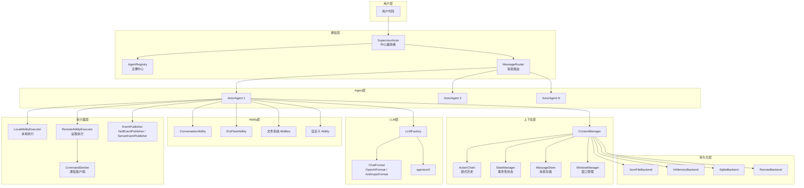
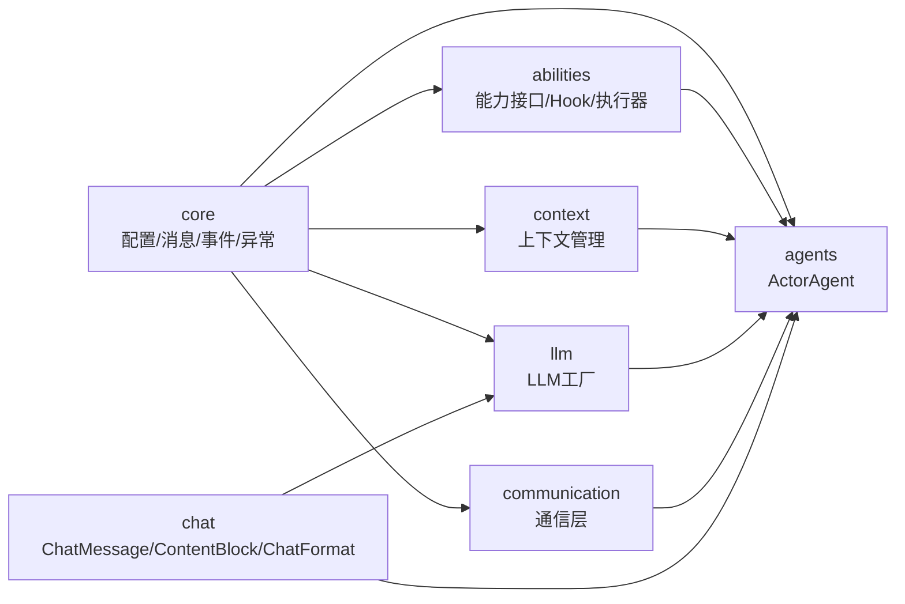
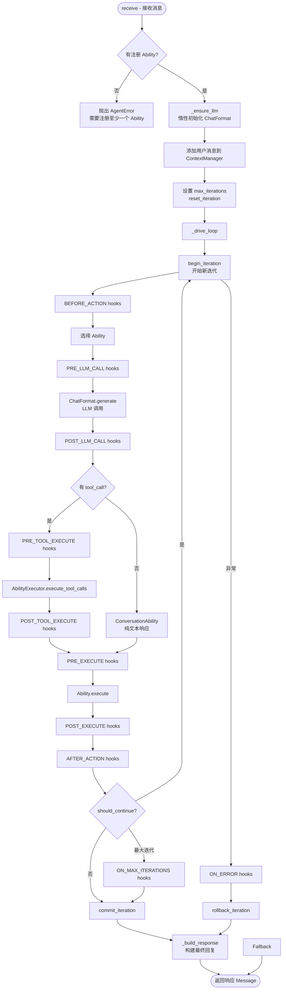
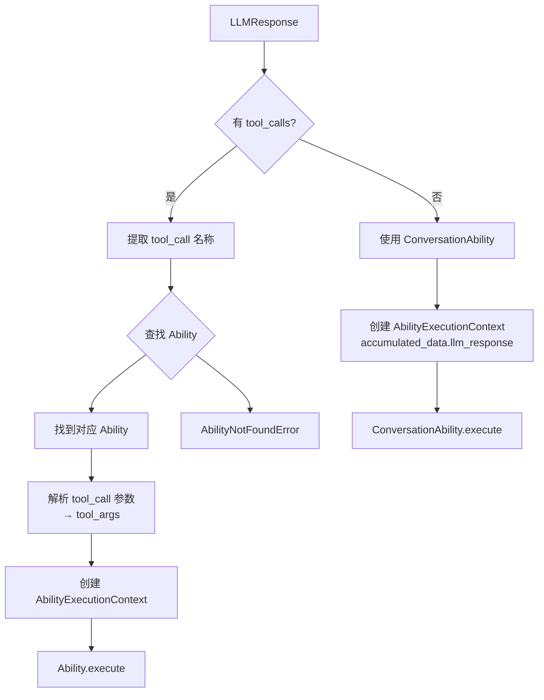
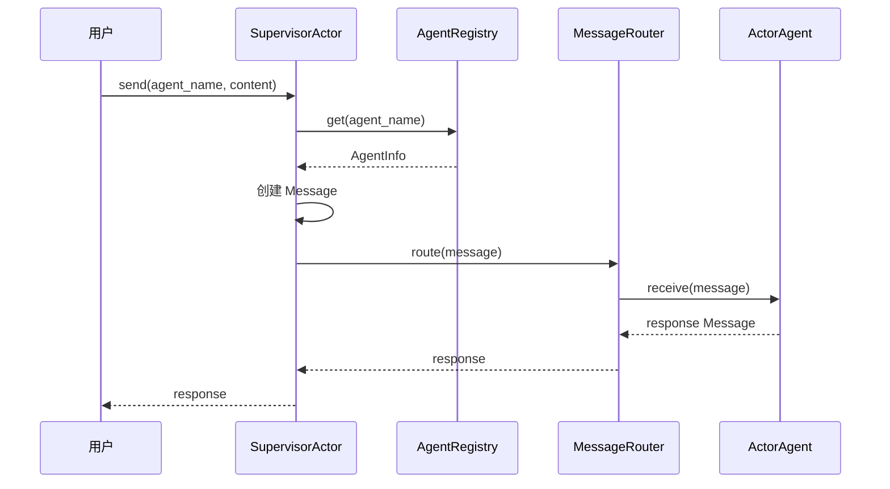
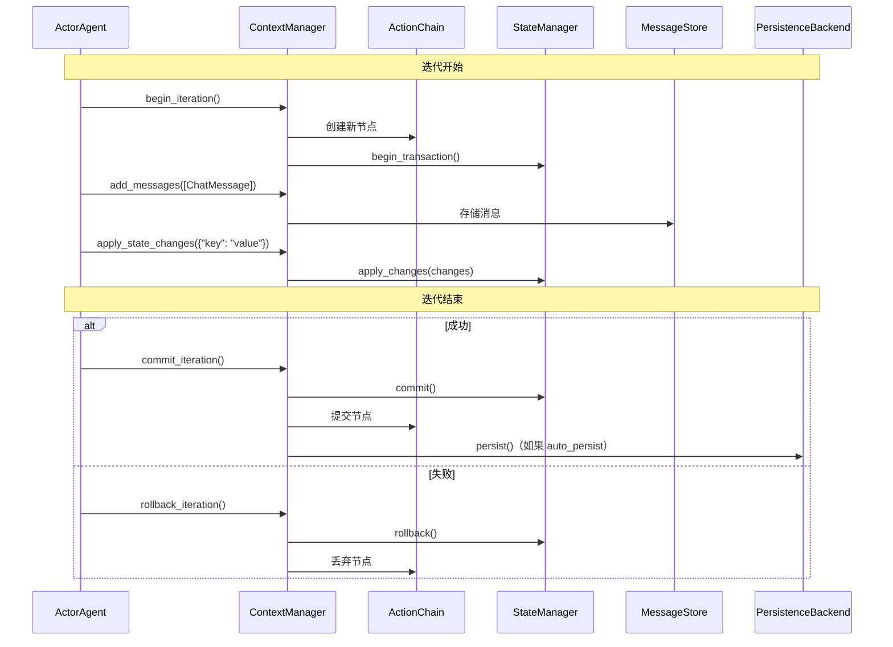
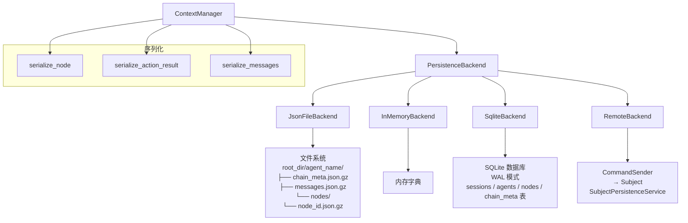
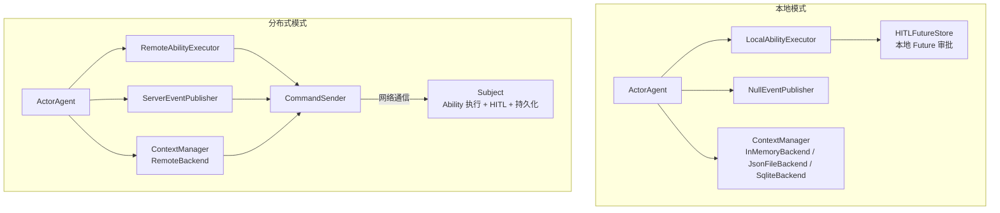
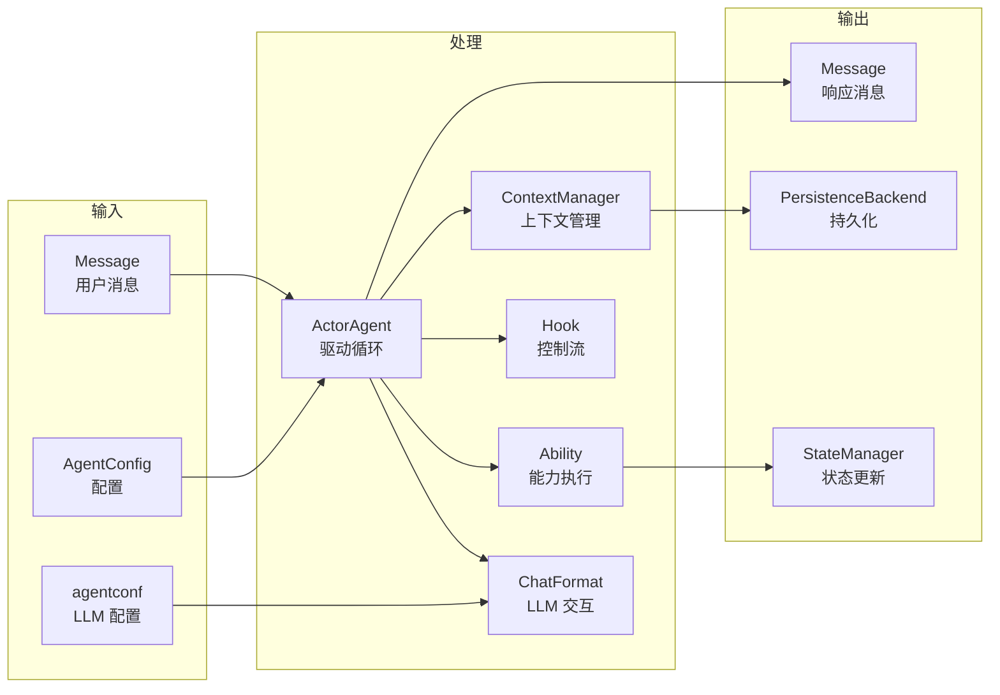

# 架构图与流程图

ghrah 的架构设计围绕三大核心概念：ActorAgent（Agent 容器）、Ability（能力组合）和 ContextManager（上下文管理），支持本地和分布式两种运行模式。

## 系统架构总览



## 模块依赖关系



## 模块说明

| 模块 | 路径 | 职责 |
|------|------|------|
| core | `src/ghrah/core/` | 核心抽象：配置、消息、事件、异常、HITL、CommandSender |
| chat | `src/ghrah/chat/` | LLM 交互层：ChatMessage、ContentBlock、ChatFormat 适配器 |
| abilities | `src/ghrah/abilities/` | Ability 接口、Hook、执行器（Local/Remote）、内置 Ability |
| agents | `src/ghrah/agents/` | ActorAgent 基类、驱动循环 |
| context | `src/ghrah/context/` | 上下文管理：链式历史、状态、消息、窗口、持久化 |
| llm | `src/ghrah/llm/` | LLM 工厂：agentconf → ChatFormat |
| communication | `src/ghrah/communication/` | 通信层：注册、路由、Supervisor |
| tools | `src/ghrah/tools/` | 工具定义层（骨架） |

## 驱动循环流程



## Ability 选择流程



## 消息路由流程



## 上下文管理流程



## Hook 执行时序

```mermaid
sequenceDiagram
    participant Loop as Drive Loop
    participant H1 as BEFORE_ACTION
    participant H2 as PRE_LLM_CALL
    participant CF as ChatFormat
    participant H3 as POST_LLM_CALL
    participant H4 as PRE_TOOL_EXECUTE
    participant AE as AbilityExecutor
    participant H5 as POST_TOOL_EXECUTE
    participant H6 as PRE_EXECUTE
    participant H7 as POST_EXECUTE
    participant H8 as AFTER_ACTION

    Loop->>H1: 触发 BEFORE_ACTION hooks
    H1-->>Loop: HookResult
    
    Loop->>H2: 触发 PRE_LLM_CALL hooks
    H2-->>Loop: HookResult
    
    Loop->>CF: generate(messages)
    CF-->>Loop: LLMResponse
    
    Loop->>H3: 触发 POST_LLM_CALL hooks
    H3-->>Loop: HookResult
    
    alt 有 tool_call
        Loop->>H4: 触发 PRE_TOOL_EXECUTE hooks
        H4-->>Loop: HookResult
        Loop->>AE: execute_tool_calls(tool_calls)
        AE-->>Loop: ActionResults
        Loop->>H5: 触发 POST_TOOL_EXECUTE hooks
        H5-->>Loop: HookResult
    end
    
    Loop->>H6: 触发 PRE_EXECUTE hooks
    H6-->>Loop: HookResult
    Loop->>AE: execute_ability(ability, context)
    AE-->>Loop: ActionResult
    Loop->>H7: 触发 POST_EXECUTE hooks
    H7-->>Loop: HookResult
    
    Loop->>H8: 触发 AFTER_ACTION hooks
    H8-->>Loop: HookResult
```

## 持久化架构



## 双模式架构



## 数据流总览



## 下一步

- [核心概念](core-concepts.md) — 深入理解架构设计
- [Chat 交互层](chat-module.md) — 了解 ChatMessage 和 ContentBlock
- [Ability 系统](ability-system.md) — 了解 Ability 组合模式
- [上下文管理](context-management.md) — 理解 ContextManager 的设计
- [多 Agent 通信](multi-agent.md) — 了解 SupervisorActor 和消息路由
- [双模式架构](distributed-mode.md) — 了解本地与分布式模式的详细对比
