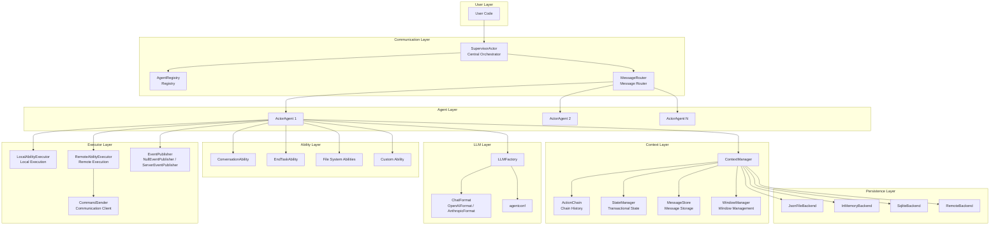
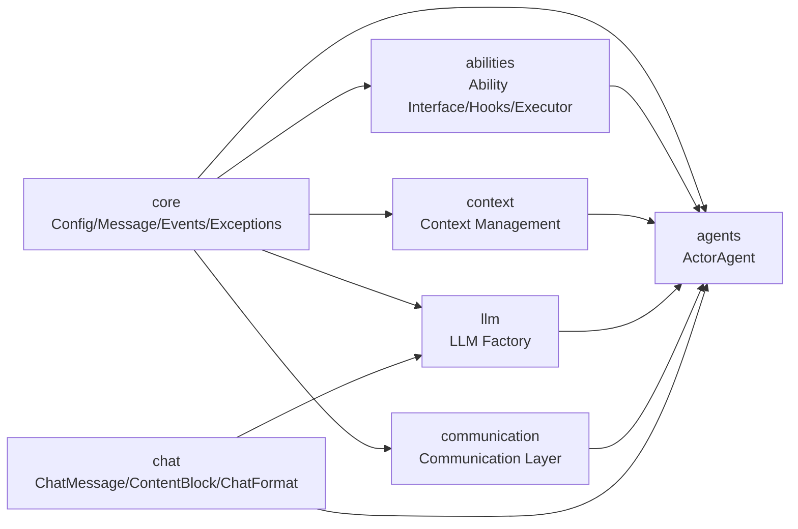
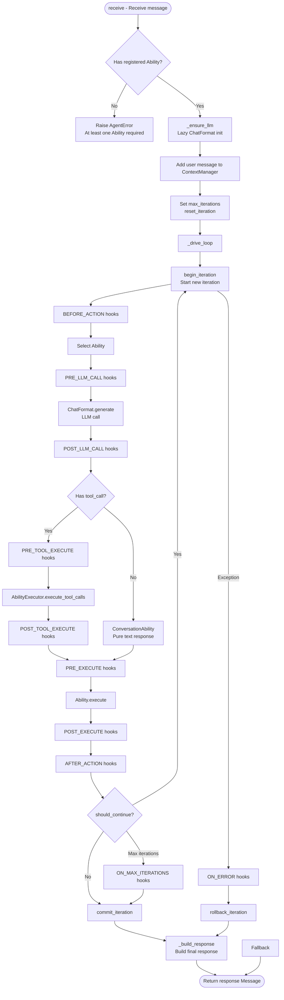
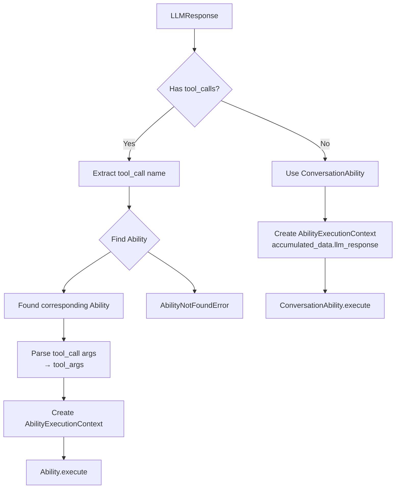
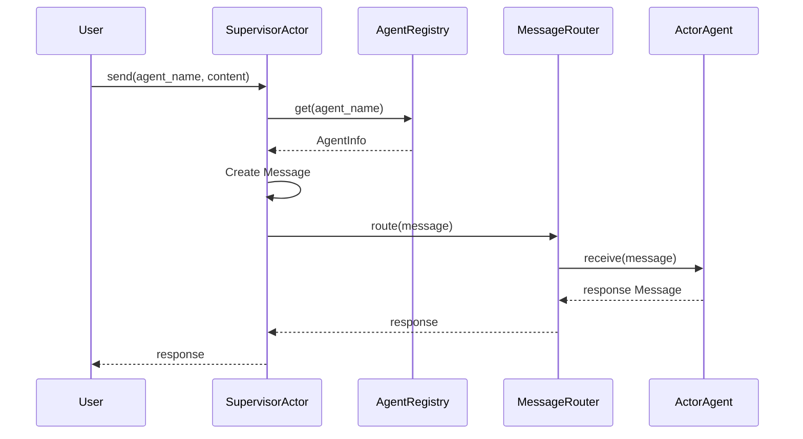
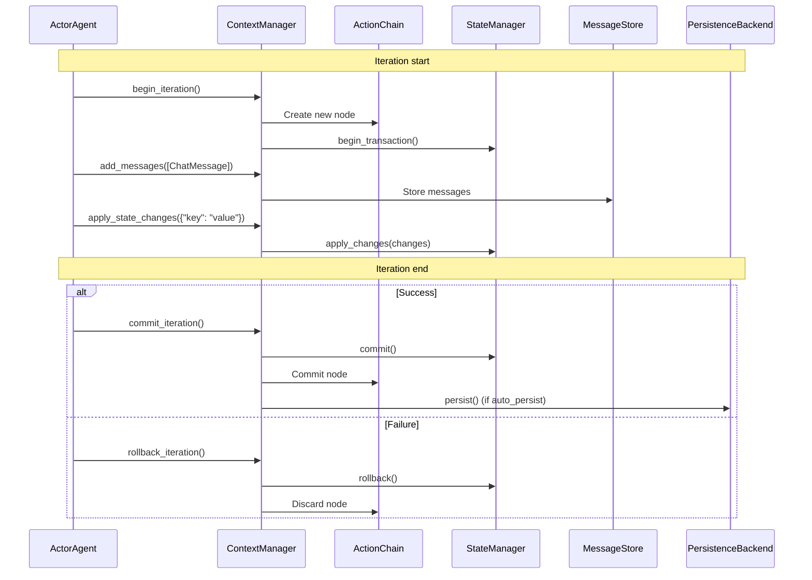
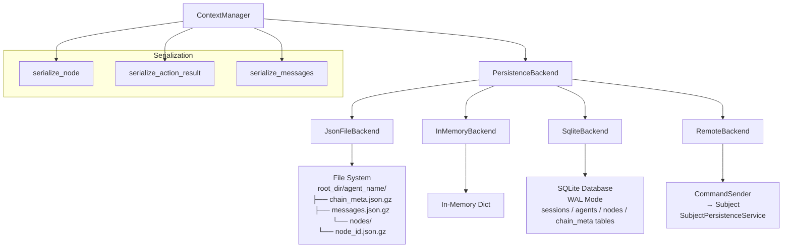
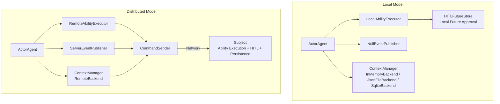
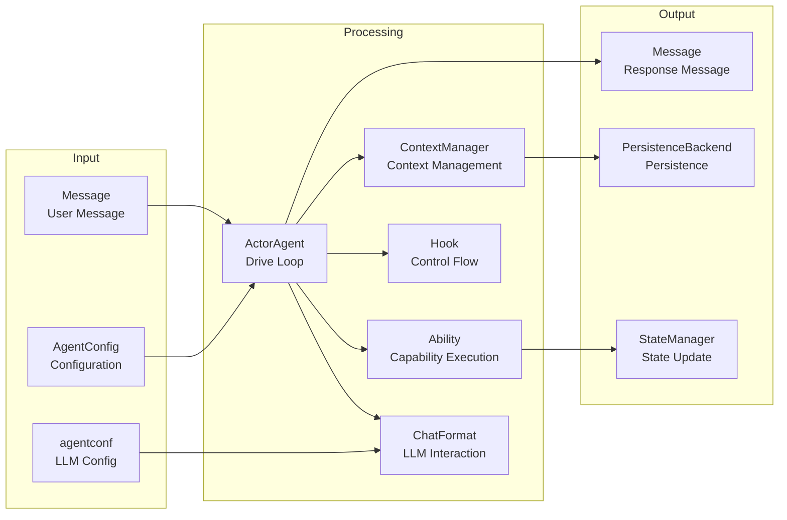

# Architecture Diagrams & Flowcharts

ghrah's architecture design revolves around three core concepts: ActorAgent (Agent container), Ability (capability composition), and ContextManager (context management), supporting both local and distributed runtime modes.

## System Architecture Overview



## Module Dependencies



## Module Descriptions

| Module | Path | Responsibility |
|--------|------|----------------|
| core | `src/ghrah/core/` | Core abstractions: config, messages, events, exceptions, HITL, CommandSender |
| chat | `src/ghrah/chat/` | LLM interaction layer: ChatMessage, ContentBlock, ChatFormat adapters |
| abilities | `src/ghrah/abilities/` | Ability interface, Hooks, executors (Local/Remote), built-in Abilities |
| agents | `src/ghrah/agents/` | ActorAgent base class, drive loop |
| context | `src/ghrah/context/` | Context management: chain history, state, messages, window, persistence |
| llm | `src/ghrah/llm/` | LLM factory: agentconf → ChatFormat |
| communication | `src/ghrah/communication/` | Communication: registry, routing, supervisor |
| tools | `src/ghrah/tools/` | Tool definition layer (skeleton) |

## Drive Loop Flow



## Ability Selection Flow



## Message Routing Flow



## Context Management Flow



## Hook Execution Sequence

```mermaid
sequenceDiagram
    participant Loop as Drive Loop
    participant H1 as BEFORE_ACTION
    participant H2 as PRE_LLM_CALL
    participant CF as ChatFormat
    participant H3 as POST_LLM_CALL
    participant H4 as PRE_TOOL_EXECUTE
    participant AE as AbilityExecutor
    participant H5 as POST_TOOL_EXECUTE
    participant H6 as PRE_EXECUTE
    participant H7 as POST_EXECUTE
    participant H8 as AFTER_ACTION

    Loop->>H1: Trigger BEFORE_ACTION hooks
    H1-->>Loop: HookResult
    
    Loop->>H2: Trigger PRE_LLM_CALL hooks
    H2-->>Loop: HookResult
    
    Loop->>CF: generate(messages)
    CF-->>Loop: LLMResponse
    
    Loop->>H3: Trigger POST_LLM_CALL hooks
    H3-->>Loop: HookResult
    
    alt Has tool_call
        Loop->>H4: Trigger PRE_TOOL_EXECUTE hooks
        H4-->>Loop: HookResult
        Loop->>AE: execute_tool_calls(tool_calls)
        AE-->>Loop: ActionResults
        Loop->>H5: Trigger POST_TOOL_EXECUTE hooks
        H5-->>Loop: HookResult
    end
    
    Loop->>H6: Trigger PRE_EXECUTE hooks
    H6-->>Loop: HookResult
    Loop->>AE: execute_ability(ability, context)
    AE-->>Loop: ActionResult
    Loop->>H7: Trigger POST_EXECUTE hooks
    H7-->>Loop: HookResult
    
    Loop->>H8: Trigger AFTER_ACTION hooks
    H8-->>Loop: HookResult
```

## Persistence Architecture



## Dual-Mode Architecture



## Data Flow Overview



## Next Steps

- [Core Concepts](core-concepts_en.md) — Deep dive into architecture design
- [Chat Module](chat-module_en.md) — Learn about ChatMessage and ContentBlock
- [Ability System](ability-system_en.md) — Understand the Ability composition pattern
- [Context Management](context-management_en.md) — Understand ContextManager design
- [Multi-Agent Communication](multi-agent_en.md) — Learn about SupervisorActor and message routing
- [Dual-Mode Architecture](distributed-mode_en.md) — Detailed comparison of local and distributed modes
