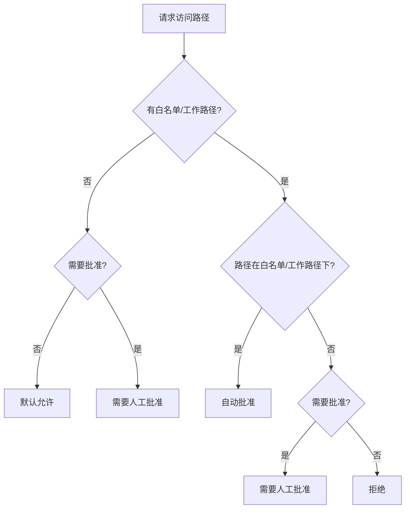

# 内置 Ability 参考

ghrah 提供了一组内置 Ability，覆盖常见的对话、文件系统操作、命令执行和集群通信场景。

## 总览

| Ability | name | bind_tool | Hooks | 说明 |
|---------|------|-----------|-------|------|
| [`ConversationAbility`](../src/ghrah/abilities/builtin/conversation.py) | `conversation` | 无 | `ConversationDoneHook` | 纯 LLM 对话 |
| [`EndTaskAbility`](../src/ghrah/abilities/builtin/end_task.py) | `end_task` | mode=toolcall 时有 | 无 | 终止循环 |
| [`ReadFileAbility`](../src/ghrah/abilities/builtin/read_file.py) | `read_file` | ✅ | FSPermissionHook | 文件读取 |
| [`WriteFileAbility`](../src/ghrah/abilities/builtin/write_file.py) | `write_file` | ✅ | FSPermissionHook + WriteApprovalHook | 文件写入 |
| [`EditFileAbility`](../src/ghrah/abilities/builtin/edit_file.py) | `edit_file` | ✅ | FSPermissionHook + WriteApprovalHook | 文件编辑 |
| [`MoveFileAbility`](../src/ghrah/abilities/builtin/move_file.py) | `move_file` | ✅ | FSPermissionHook | 文件移动/重命名 |
| [`DeleteFileAbility`](../src/ghrah/abilities/builtin/delete_file.py) | `delete_file` | ✅ | FSPermissionHook | 文件删除 |
| [`ListDirectoryAbility`](../src/ghrah/abilities/builtin/list_directory.py) | `list_directory` | ✅ | FSPermissionHook | 目录列表 |
| [`ExecuteCommandAbility`](../src/ghrah/abilities/builtin/execute_command.py) | `execute_command` | ✅ | CommandApprovalHook | 命令执行 |
| [`QueryAgentsAbility`](../src/ghrah/abilities/builtin/cluster.py) | `query_agents` | ✅ | 无 | 查询集群 Agent |
| [`SendMessageAbility`](../src/ghrah/abilities/builtin/cluster.py) | `send_message` | ✅ | 无 | Agent 间消息发送 |
| [`BroadcastMessageAbility`](../src/ghrah/abilities/builtin/cluster.py) | `broadcast_message` | ✅ | 无 | 集群广播 |
| [`SpawnAgentAbility`](../src/ghrah/abilities/builtin/cluster.py) | `spawn_agent` | ✅ | 无 | 动态创建 Agent |

## ConversationAbility

**文件**：[`conversation.py`](../src/ghrah/abilities/builtin/conversation.py)

纯 LLM 对话能力，当 LLM 返回纯文本（无 tool call）时自动使用。

### 特点

- 无 `bind_tool()` — 不暴露给 LLM 的 function calling
- 框架自动路由：当 LLM 返回纯文本时，标记为使用了 `conversation` 能力
- 内置 `ConversationDoneHook`：执行后自动终止循环

### 用法

```python
from ghrah.abilities.builtin.conversation import ConversationAbility

ability = ConversationAbility()
agent.register_ability(ability)
```

### 内置 Hook

`ConversationDoneHook` 在 `AFTER_ACTION` 触发，纯对话场景只需一次 LLM 调用，无需继续循环。

## EndTaskAbility

**文件**：[`end_task.py`](../src/ghrah/abilities/builtin/end_task.py)

终止 Agent 的执行循环并生成最终回复。

### 特点

- `mode` 参数支持三种模式：
  - `auto`：被 Hook 触发（默认，当前唯一实现的模式）
  - `toolcall`：通过 function call 触发
  - `verified`：需要验证器确认后终止
- `next_action_hint` 为 `None`，明确表示任务结束
- 从上下文中收集累积数据生成最终回复

### 用法

```python
from ghrah.abilities.builtin.end_task import EndTaskAbility

# 默认 auto 模式
ability = EndTaskAbility()

# toolcall 模式（LLM 可通过 function call 终止）
ability = EndTaskAbility(mode="toolcall")

agent.register_ability(ability)
```

## ReadFileAbility

**文件**：[`read_file.py`](../src/ghrah/abilities/builtin/read_file.py)

读取指定路径的文件内容。

### bind_tool schema

```json
{
  "type": "function",
  "function": {
    "name": "read_file",
    "description": "Read the content of a file at the specified path",
    "parameters": {
      "type": "object",
      "properties": {
        "file_path": {"type": "string", "description": "Path to the file"},
        "encoding": {"type": "string", "default": "utf-8"}
      },
      "required": ["file_path"]
    }
  }
}
```

### 用法

```python
from ghrah.abilities.builtin.read_file import ReadFileAbility
from ghrah.abilities.builtin.fs_permissions import FSPermissionChecker

# 无权限限制
ability = ReadFileAbility()

# 限制读取目录
checker = FSPermissionChecker(allowed_paths=["/tmp/data", "/home/user/docs"])
ability = ReadFileAbility(permission_checker=checker)

# 向后兼容：使用 allowed_paths 列表
ability = ReadFileAbility(allowed_paths=["/tmp/data"])

agent.register_ability(ability)
```

### ActionResult

| outcome | data | 说明 |
|---------|------|------|
| `SUCCESS` | `{"content": str, "file_path": str}` | 文件内容 |
| `FAILURE` | `{"error": str}` | 错误信息 |

## WriteFileAbility

**文件**：[`write_file.py`](../src/ghrah/abilities/builtin/write_file.py)

创建新文件或覆盖写入已有文件，支持自动创建父目录。

### bind_tool schema

```json
{
  "type": "function",
  "function": {
    "name": "write_file",
    "description": "Write content to a file. Creates the file and parent directories if they do not exist.",
    "parameters": {
      "type": "object",
      "properties": {
        "file_path": {"type": "string"},
        "content": {"type": "string"},
        "create_dirs": {"type": "boolean", "default": true},
        "encoding": {"type": "string", "default": "utf-8"}
      },
      "required": ["file_path", "content"]
    }
  }
}
```

### 用法

```python
from ghrah.abilities.builtin.write_file import WriteFileAbility
from ghrah.abilities.builtin.fs_permissions import FSPermissionChecker, WriteApprovalHook

# 无权限限制
ability = WriteFileAbility()

# 限制写入目录
checker = FSPermissionChecker(allowed_paths=["/tmp/data"])
ability = WriteFileAbility(permission_checker=checker)

# 带人工批准 Hook
hook = WriteApprovalHook(checker)
ability = WriteFileAbility(permission_checker=checker, hooks=[hook])

agent.register_ability(ability)
```

### ActionResult

| outcome | data | 说明 |
|---------|------|------|
| `SUCCESS` | `{"file_path": str, "bytes_written": int}` | 写入成功 |
| `FAILURE` | `{"error": str}` | 错误信息 |

## EditFileAbility

**文件**：[`edit_file.py`](../src/ghrah/abilities/builtin/edit_file.py)

精确字符串替换编辑文件。

### bind_tool schema

```json
{
  "type": "function",
  "function": {
    "name": "edit_file",
    "description": "Edit a file by replacing exact string matches",
    "parameters": {
      "type": "object",
      "properties": {
        "file_path": {"type": "string"},
        "old_string": {"type": "string", "description": "Exact text to find"},
        "new_string": {"type": "string", "description": "Replacement text"}
      },
      "required": ["file_path", "old_string", "new_string"]
    }
  }
}
```

### 用法

```python
from ghrah.abilities.builtin.edit_file import EditFileAbility
from ghrah.abilities.builtin.fs_permissions import FSPermissionChecker

checker = FSPermissionChecker(allowed_paths=["/tmp/workspace"])
ability = EditFileAbility(permission_checker=checker)
agent.register_ability(ability)
```

### ActionResult

| outcome | data | 说明 |
|---------|------|------|
| `SUCCESS` | `{"file_path": str, "replacements": int}` | 替换次数 |
| `FAILURE` | `{"error": str}` | 错误信息 |

## MoveFileAbility

**文件**：[`move_file.py`](../src/ghrah/abilities/builtin/move_file.py)

移动或重命名文件。

### bind_tool schema

```json
{
  "type": "function",
  "function": {
    "name": "move_file",
    "description": "Move or rename a file",
    "parameters": {
      "type": "object",
      "properties": {
        "source_path": {"type": "string"},
        "destination_path": {"type": "string"}
      },
      "required": ["source_path", "destination_path"]
    }
  }
}
```

### 用法

```python
from ghrah.abilities.builtin.move_file import MoveFileAbility

ability = MoveFileAbility()
agent.register_ability(ability)
```

## DeleteFileAbility

**文件**：[`delete_file.py`](../src/ghrah/abilities/builtin/delete_file.py)

删除文件。

### bind_tool schema

```json
{
  "type": "function",
  "function": {
    "name": "delete_file",
    "description": "Delete a file at the specified path",
    "parameters": {
      "type": "object",
      "properties": {
        "file_path": {"type": "string"}
      },
      "required": ["file_path"]
    }
  }
}
```

### 用法

```python
from ghrah.abilities.builtin.delete_file import DeleteFileAbility

ability = DeleteFileAbility()
agent.register_ability(ability)
```

## ListDirectoryAbility

**文件**：[`list_directory.py`](../src/ghrah/abilities/builtin/list_directory.py)

列出目录内容。

### bind_tool schema

```json
{
  "type": "function",
  "function": {
    "name": "list_directory",
    "description": "List contents of a directory",
    "parameters": {
      "type": "object",
      "properties": {
        "dir_path": {"type": "string"},
        "recursive": {"type": "boolean", "default": false}
      },
      "required": ["dir_path"]
    }
  }
}
```

### 用法

```python
from ghrah.abilities.builtin.list_directory import ListDirectoryAbility

ability = ListDirectoryAbility()
agent.register_ability(ability)
```

## ExecuteCommandAbility

**文件**：[`execute_command.py`](../src/ghrah/abilities/builtin/execute_command.py)

执行 shell 命令并返回输出，支持单体模式和 Subject 模式。

### 特点

- 双模式执行：
  - 单体模式（`command_runner=None`）：使用 `asyncio.create_subprocess_shell` 本地执行
  - Subject 模式（`command_runner=SandboxExecutor`）：委托给 CommandRunner 执行
- 安全检查：通过 `CommandSafetyChecker` 进行命令分类
- 输出截断：超过 1MB 的输出自动截断
- 超时控制：默认 300 秒

### bind_tool schema

```json
{
  "type": "function",
  "function": {
    "name": "execute_command",
    "description": "Execute a shell command and return its output. Use for running tests, linters, build commands, and other development tasks. Read-only commands are auto-approved. Dangerous commands are blocked. Other commands require human approval.",
    "parameters": {
      "type": "object",
      "properties": {
        "command": {"type": "string"},
        "working_dir": {"type": "string"}
      },
      "required": ["command"]
    }
  }
}
```

### 用法

```python
from ghrah.abilities.builtin.execute_command import ExecuteCommandAbility
from ghrah.abilities.builtin.command_safety import CommandSafetyChecker, CommandApprovalHook

# 单体模式（本地执行）
ability = ExecuteCommandAbility()

# 带命令安全检查
checker = CommandSafetyChecker()
hook = CommandApprovalHook(checker)
ability = ExecuteCommandAbility(command_checker=checker, hooks=[hook])

# Subject 模式（委托 SandboxExecutor）
ability = ExecuteCommandAbility(command_runner=sandbox_executor)
```

### ActionResult

| outcome | data | 说明 |
|---------|------|------|
| `SUCCESS` | `{"exit_code": int, "stdout": str, "stderr": str, "timed_out": bool, "command": str, "working_dir": str}` | 命令执行成功 |
| `FAILURE` | `{"error": str}` | 错误信息（包括命令被安全拒绝） |

### 构造参数

| 参数 | 类型 | 默认值 | 说明 |
|------|------|--------|------|
| `hooks` | `list[Hook] \| None` | `None` | Hook 列表 |
| `command_checker` | `CommandSafetyChecker \| None` | `CommandSafetyChecker()` | 命令安全分类器 |
| `command_runner` | `CommandRunner \| None` | `None` | 命令执行器（None 则本地 subprocess） |
| `timeout` | `float` | `300.0` | 命令超时秒数 |

## CommandSafetyChecker

**文件**：[`command_safety.py`](../src/ghrah/abilities/builtin/command_safety.py)

命令安全分类器，为 `ExecuteCommandAbility` 提供三级安全分类。

### 分类模型

| 分类 | 说明 | 结果 |
|------|------|------|
| `SAFE` | 只读命令（ls, cat, git status 等） | 自动通过 |
| `DANGEROUS` | 不可逆破坏命令（rm, chmod, kill 等） | 自动拒绝 |
| `REQUIRE_HITL` | 有副作用但不一定危险的命令（curl, git commit 等） | 需人工审批 |

### 子命令路由

多面性命令（git, npm, pip 等）支持子命令级分类：

```python
# 子命令级分类示例
checker.check_command("git status")   # → SAFE
checker.check_command("git clean")    # → DANGEROUS
checker.check_command("git commit")   # → REQUIRE_HITL
checker.check_command("npm test")     # → SAFE
checker.check_command("npm publish")   # → DANGEROUS
```

分类优先级：

1. 基础命令在 `DANGEROUS_COMMANDS` → DANGEROUS（不考虑子命令）
2. 基础命令有子命令路由表：
   - 子命令在 `DANGEROUS_SUB_COMMANDS` → DANGEROUS
   - 子命令在 `SAFE_SUB_COMMANDS` → SAFE
   - 其他子命令 → REQUIRE_HITL
3. 基础命令在 `SAFE_COMMANDS` → SAFE
4. 默认 → REQUIRE_HITL（当 `require_approval=True`）

### 用法

```python
from ghrah.abilities.builtin.command_safety import CommandSafetyChecker

# 默认分类器
checker = CommandSafetyChecker()

# 自定义安全/危险命令集合
checker = CommandSafetyChecker(
    safe_commands={"ls", "cat", "echo"},
    dangerous_commands={"rm", "sudo"},
    require_approval=True,
)

# 检查命令
verdict = checker.check_command("git status")
# → CommandSafetyVerdict(category=SAFE, base_command="git", sub_command="status", reason="Safe sub-command: git status")
```

### 构造参数

| 参数 | 类型 | 默认值 | 说明 |
|------|------|--------|------|
| `safe_commands` | `set[str] \| None` | `DEFAULT_SAFE_COMMANDS` | 安全命令集合 |
| `dangerous_commands` | `set[str] \| None` | `DEFAULT_DANGEROUS_COMMANDS` | 危险命令集合 |
| `safe_sub_commands` | `dict[str, set[str]] \| None` | `DEFAULT_SAFE_SUB_COMMANDS` | 安全子命令映射 |
| `dangerous_sub_commands` | `dict[str, set[str]] \| None` | `DEFAULT_DANGEROUS_SUB_COMMANDS` | 危险子命令映射 |
| `require_approval` | `bool` | `True` | 未知命令是否需要人工审批 |

### CommandSafetyVerdict

| 字段 | 类型 | 说明 |
|------|------|------|
| `category` | `CommandSafetyCategory` | 分类结果：`SAFE` / `DANGEROUS` / `REQUIRE_HITL` |
| `base_command` | `str` | 基础命令名 |
| `sub_command` | `str \| None` | 子命令名 |
| `reason` | `str` | 分类原因 |

## CommandApprovalHook

**文件**：[`command_safety.py`](../src/ghrah/abilities/builtin/command_safety.py)

命令执行审批 Hook，在 `PRE_EXECUTE` 触发点拦截 `execute_command` Ability。

### 处理逻辑

| 分类 | Hook 结果 | 说明 |
|------|-----------|------|
| `SAFE` | `HookResult.continue_()` | 自动放行 |
| `DANGEROUS` | `HookResult.stop(message=...)` | 自动拒绝 |
| `REQUIRE_HITL` | `HookResult.hitl(message=...)` | 需要人工审批 |

### 用法

```python
from ghrah.abilities.builtin.command_safety import CommandSafetyChecker, CommandApprovalHook

checker = CommandSafetyChecker()
hook = CommandApprovalHook(checker)

ability = ExecuteCommandAbility(command_checker=checker, hooks=[hook])
agent.register_ability(ability)
```

## FSPermissionChecker

**文件**：[`fs_permissions.py`](../src/ghrah/abilities/builtin/fs_permissions.py)

文件系统路径权限检查器，为所有文件系统 Ability 提供统一的权限控制。

### 权限模型



### 用法

```python
from ghrah.abilities.builtin.fs_permissions import FSPermissionChecker

# 白名单模式
checker = FSPermissionChecker(
    allowed_paths=["/tmp/data", "/home/user/docs"],
    workspace_root="/home/user/project",
)

# 读取权限检查
allowed, reason = checker.check_read_path("/tmp/data/file.txt")
# → (True, "")

# 写入权限检查
allowed, approval = checker.check_write_path("/tmp/data/output.txt")
# → (True, None)  — 自动批准

allowed, approval = checker.check_write_path("/etc/config.ini")
# → (True, "pending")  — 需要人工批准
```

### 构造参数

| 参数 | 类型 | 默认值 | 说明 |
|------|------|--------|------|
| `allowed_paths` | `list[str] \| None` | `None` | 允许访问的路径白名单 |
| `workspace_root` | `str \| None` | `None` | 工作路径根目录 |
| `require_approval` | `bool` | `True` | 不在白名单时是否需要人工批准 |

## WriteApprovalHook

**文件**：[`fs_permissions.py`](../src/ghrah/abilities/builtin/fs_permissions.py:144)

写入操作的人工批准 Hook，在 `PRE_EXECUTE` 触发点拦截写入类 Ability。

### 覆盖的 Ability

- `write_file`
- `edit_file`
- `move_file`
- `delete_file`

### 用法

```python
from ghrah.abilities.builtin.fs_permissions import FSPermissionChecker, WriteApprovalHook

checker = FSPermissionChecker(
    allowed_paths=["/tmp/workspace"],
    require_approval=True,
)
hook = WriteApprovalHook(checker)

# 将 Hook 附加到写入类 Ability
ability = WriteFileAbility(permission_checker=checker, hooks=[hook])
```

### 审批流程

1. 从 `tool_args` 中提取目标路径
2. 通过 `FSPermissionChecker.check_write_path()` 检查权限
3. 如果自动批准 → 放行
4. 如果需要人工批准 → 返回暂停信号
5. 如果拒绝 → 返回停止信号

## 集群通信 Ability

4 个集群通信 Ability 使 Agent 能在集群中发现其他 Agent 并与之通信：

- **QueryAgentsAbility** — 查询集群中已注册的 Agent 信息
- **SendMessageAbility** — 向指定 Agent 发送消息并等待回复
- **BroadcastMessageAbility** — 向集群中所有 Agent 广播消息
- **SpawnAgentAbility** — 动态创建新的平级 Agent

这些 Ability 依赖 `SupervisorActor` 提供路由和生命周期管理，通过 `AbilityExecutionContext.supervisor` 注入引用。无 Supervisor 时，所有集群 Ability 返回 `FAILURE`。

### QueryAgentsAbility

**文件**：[`cluster.py`](../src/ghrah/abilities/builtin/cluster.py)

查询集群中已注册的 Agent 信息，支持按名称子串过滤。

#### bind_tool schema

```json
{
  "type": "function",
  "function": {
    "name": "query_agents",
    "description": "Query registered agents in the cluster. Returns a list of agent names and descriptions. Optionally filter by a substring match on agent name.",
    "parameters": {
      "type": "object",
      "properties": {
        "filter": {"type": "string", "description": "Optional substring to filter agent names"}
      }
    }
  }
}
```

#### 用法

```python
from ghrah.abilities.builtin.cluster import QueryAgentsAbility

ability = QueryAgentsAbility()
agent.register_ability(ability)
```

#### ActionResult

| outcome | data | 说明 |
|---------|------|------|
| `SUCCESS` | `{"agents": list, "count": int}` | Agent 列表及数量 |
| `FAILURE` | `{"error": str}` | 错误信息 |

### SendMessageAbility

**文件**：[`cluster.py`](../src/ghrah/abilities/builtin/cluster.py)

向指定 Agent 发送消息并等待回复，用于 Agent 间点对点通信。

#### bind_tool schema

```json
{
  "type": "function",
  "function": {
    "name": "send_message",
    "description": "Send a message to a specific agent in the cluster and wait for its response. Use this for direct point-to-point communication between agents.",
    "parameters": {
      "type": "object",
      "properties": {
        "target": {"type": "string", "description": "Target agent name to send the message to"},
        "content": {"type": "string", "description": "Message content to send"}
      },
      "required": ["target", "content"]
    }
  }
}
```

#### 用法

```python
from ghrah.abilities.builtin.cluster import SendMessageAbility

ability = SendMessageAbility()
agent.register_ability(ability)
```

#### ActionResult

| outcome | data | 说明 |
|---------|------|------|
| `SUCCESS` | `{"response": str, "target": str}` | 目标 Agent 的回复 |
| `FAILURE` | `{"error": str}` | 错误信息 |

### BroadcastMessageAbility

**文件**：[`cluster.py`](../src/ghrah/abilities/builtin/cluster.py)

向集群中所有 Agent 广播消息（排除自身），收集所有回复。

#### bind_tool schema

```json
{
  "type": "function",
  "function": {
    "name": "broadcast_message",
    "description": "Broadcast a message to all agents in the cluster (excluding the sender) and collect their responses. Use this for cluster-wide announcements or queries.",
    "parameters": {
      "type": "object",
      "properties": {
        "content": {"type": "string", "description": "Message content to broadcast to all agents"}
      },
      "required": ["content"]
    }
  }
}
```

#### 用法

```python
from ghrah.abilities.builtin.cluster import BroadcastMessageAbility

ability = BroadcastMessageAbility()
agent.register_ability(ability)
```

#### ActionResult

| outcome | data | 说明 |
|---------|------|------|
| `SUCCESS` | `{"responses": list, "agent_count": int}` | 所有 Agent 的回复列表 |
| `FAILURE` | `{"error": str}` | 错误信息 |

### SpawnAgentAbility

**文件**：[`cluster.py`](../src/ghrah/abilities/builtin/cluster.py)

动态创建新的平级 Agent。新 Agent 与创建者平级，无父子层级关系。

支持指定 Agent 名称、描述、系统提示词和初始 Ability 列表。

#### bind_tool schema

```json
{
  "type": "function",
  "function": {
    "name": "spawn_agent",
    "description": "Spawn a new peer agent in the cluster. The new agent is at the same level as the spawner — there is no parent-child hierarchy. Specify the agent's name, optional description, system prompt, and initial abilities.",
    "parameters": {
      "type": "object",
      "properties": {
        "name": {"type": "string", "description": "Unique name for the new agent"},
        "description": {"type": "string", "default": "", "description": "Description of the new agent's role"},
        "system_prompt": {"type": "string", "default": "", "description": "System prompt for the new agent"},
        "abilities": {"type": "array", "items": {"type": "string"}, "description": "List of ability type names to register (e.g. ['conversation', 'read_file'])"}
      },
      "required": ["name"]
    }
  }
}
```

#### 用法

```python
from ghrah.abilities.builtin.cluster import SpawnAgentAbility

ability = SpawnAgentAbility()
agent.register_ability(ability)
```

#### ActionResult

| outcome | data | 说明 |
|---------|------|------|
| `SUCCESS` | `{"agent_name": str, "status": "spawned"}` | 创建成功的 Agent 名 |
| `FAILURE` | `{"error": str}` | 错误信息 |

## 常见组合

### 纯对话 Agent

```python
agent.register_ability(ConversationAbility())
agent.register_ability(EndTaskAbility())
```

### 文件读取 Agent

```python
checker = FSPermissionChecker(allowed_paths=["/tmp/data"])
agent.register_ability(ConversationAbility())
agent.register_ability(EndTaskAbility())
agent.register_ability(ReadFileAbility(permission_checker=checker))
agent.register_ability(ListDirectoryAbility(permission_checker=checker))
```

### 代码编写 Agent

```python
checker = FSPermissionChecker(allowed_paths=["/tmp/workspace"])
agent.register_ability(ConversationAbility())
agent.register_ability(EndTaskAbility())
agent.register_ability(ReadFileAbility(permission_checker=checker))
agent.register_ability(WriteFileAbility(permission_checker=checker))
agent.register_ability(EditFileAbility(permission_checker=checker))
agent.register_ability(ListDirectoryAbility(permission_checker=checker))
```

### 带人工批准的写入 Agent

```python
checker = FSPermissionChecker(allowed_paths=["/tmp/workspace"], require_approval=True)
approval_hook = WriteApprovalHook(checker)

agent.register_ability(ConversationAbility())
agent.register_ability(EndTaskAbility())
agent.register_ability(ReadFileAbility(permission_checker=checker))
agent.register_ability(WriteFileAbility(
    permission_checker=checker,
    hooks=[approval_hook],
))
```

### 命令执行 Agent

```python
from ghrah.abilities.builtin.command_safety import CommandSafetyChecker, CommandApprovalHook

command_checker = CommandSafetyChecker()
command_hook = CommandApprovalHook(command_checker)
fs_checker = FSPermissionChecker(allowed_paths=["/tmp/workspace"])

agent.register_ability(ConversationAbility())
agent.register_ability(EndTaskAbility())
agent.register_ability(ReadFileAbility(permission_checker=fs_checker))
agent.register_ability(ListDirectoryAbility(permission_checker=fs_checker))
agent.register_ability(ExecuteCommandAbility(
    command_checker=command_checker,
    hooks=[command_hook],
))
```

### 集群协作 Agent

```python
from ghrah.abilities.builtin.cluster import (
    QueryAgentsAbility,
    SendMessageAbility,
    BroadcastMessageAbility,
    SpawnAgentAbility,
)

agent.register_ability(ConversationAbility())
agent.register_ability(EndTaskAbility())
agent.register_ability(QueryAgentsAbility())
agent.register_ability(SendMessageAbility())
agent.register_ability(BroadcastMessageAbility())
agent.register_ability(SpawnAgentAbility())
```

## 下一步

- [Ability 系统](ability-system.md) — 了解如何自定义 Ability
- [Hook 机制](hook-mechanism.md) — 深入了解 WriteApprovalHook 等内置 Hook
- [配置参考](configuration.md) — 查看 FSPermissionChecker 的配置选项