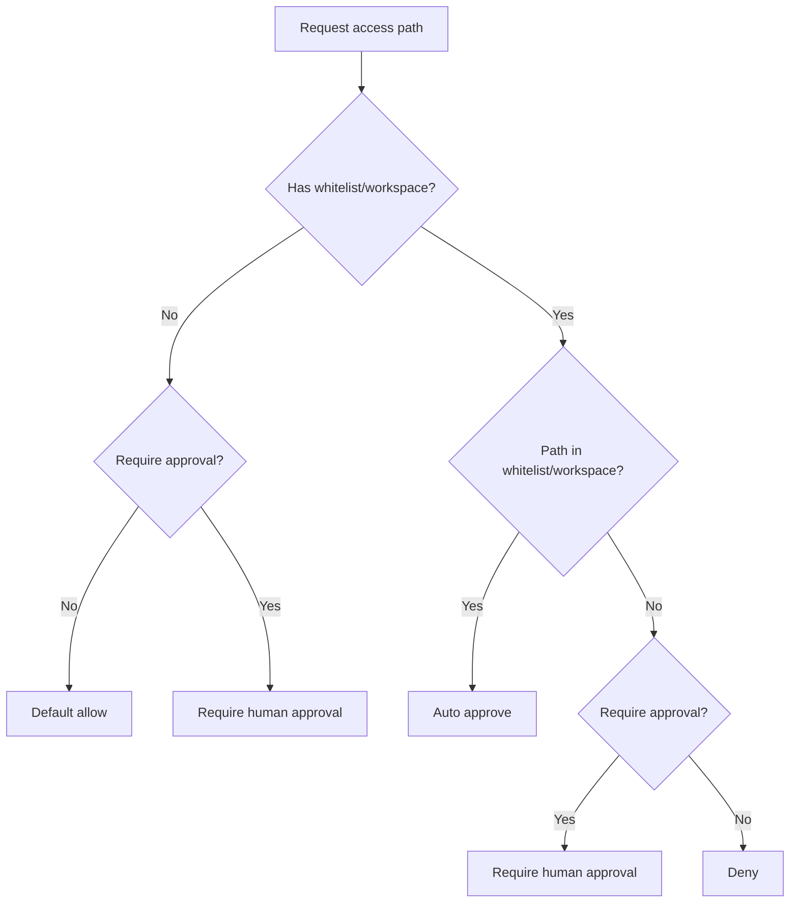

# Built-in Ability Reference

ghrah provides a set of built-in Abilities covering common conversation, file system operation, command execution, and cluster communication scenarios.

## Overview

| Ability | name | bind_tool | Hooks | Description |
|---------|------|-----------|-------|-------------|
| [`ConversationAbility`](../src/ghrah/abilities/builtin/conversation.py) | `conversation` | None | `ConversationDoneHook` | Pure LLM conversation |
| [`EndTaskAbility`](../src/ghrah/abilities/builtin/end_task.py) | `end_task` | mode=toolcall | None | Terminate loop |
| [`ReadFileAbility`](../src/ghrah/abilities/builtin/read_file.py) | `read_file` | ✅ | FSPermissionHook | File reading |
| [`WriteFileAbility`](../src/ghrah/abilities/builtin/write_file.py) | `write_file` | ✅ | FSPermissionHook + WriteApprovalHook | File writing |
| [`EditFileAbility`](../src/ghrah/abilities/builtin/edit_file.py) | `edit_file` | ✅ | FSPermissionHook + WriteApprovalHook | File editing |
| [`MoveFileAbility`](../src/ghrah/abilities/builtin/move_file.py) | `move_file` | ✅ | FSPermissionHook | File move/rename |
| [`DeleteFileAbility`](../src/ghrah/abilities/builtin/delete_file.py) | `delete_file` | ✅ | FSPermissionHook | File deletion |
| [`ListDirectoryAbility`](../src/ghrah/abilities/builtin/list_directory.py) | `list_directory` | ✅ | FSPermissionHook | Directory listing |
| [`ExecuteCommandAbility`](../src/ghrah/abilities/builtin/execute_command.py) | `execute_command` | ✅ | CommandApprovalHook | Command execution |
| [`QueryAgentsAbility`](../src/ghrah/abilities/builtin/cluster.py) | `query_agents` | ✅ | None | Query cluster agents |
| [`SendMessageAbility`](../src/ghrah/abilities/builtin/cluster.py) | `send_message` | ✅ | None | Inter-agent messaging |
| [`BroadcastMessageAbility`](../src/ghrah/abilities/builtin/cluster.py) | `broadcast_message` | ✅ | None | Cluster broadcast |
| [`SpawnAgentAbility`](../src/ghrah/abilities/builtin/cluster.py) | `spawn_agent` | ✅ | None | Dynamic agent creation |

## ConversationAbility

**File**: [`conversation.py`](../src/ghrah/abilities/builtin/conversation.py)

Pure LLM conversation capability, automatically used when the LLM returns plain text (no tool call).

### Features

- No `bind_tool()` — not exposed to LLM function calling
- Framework auto-routing: when LLM returns plain text, it's marked as using the `conversation` capability
- Built-in `ConversationDoneHook`: terminates loop after execution

### Usage

```python
from ghrah.abilities.builtin.conversation import ConversationAbility

ability = ConversationAbility()
agent.register_ability(ability)
```

### Built-in Hook

`ConversationDoneHook` triggers at `AFTER_ACTION`, pure conversation only needs one LLM call.

## EndTaskAbility

**File**: [`end_task.py`](../src/ghrah/abilities/builtin/end_task.py)

Terminates the Agent's execution loop and generates a final reply.

### Features

- `mode` parameter supports three modes:
  - `auto`: Triggered by Hook (default, currently the only implemented mode)
  - `toolcall`: Triggered via function call
  - `verified`: Requires verifier confirmation before termination
- `next_action_hint` is `None`, explicitly indicating task completion
- Collects accumulated data from context to generate final reply

### Usage

```python
from ghrah.abilities.builtin.end_task import EndTaskAbility

# Default auto mode
ability = EndTaskAbility()

# Toolcall mode (LLM can terminate via function call)
ability = EndTaskAbility(mode="toolcall")

agent.register_ability(ability)
```

## ReadFileAbility

**File**: [`read_file.py`](../src/ghrah/abilities/builtin/read_file.py)

Reads file contents at the specified path.

### bind_tool schema

```json
{
  "type": "function",
  "function": {
    "name": "read_file",
    "description": "Read the content of a file at the specified path",
    "parameters": {
      "type": "object",
      "properties": {
        "file_path": {"type": "string", "description": "Path to the file"},
        "encoding": {"type": "string", "default": "utf-8"}
      },
      "required": ["file_path"]
    }
  }
}
```

### Usage

```python
from ghrah.abilities.builtin.read_file import ReadFileAbility
from ghrah.abilities.builtin.fs_permissions import FSPermissionChecker

# No permission restriction
ability = ReadFileAbility()

# Restrict read directories
checker = FSPermissionChecker(allowed_paths=["/tmp/data", "/home/user/docs"])
ability = ReadFileAbility(permission_checker=checker)

# Backward compatible: use allowed_paths list
ability = ReadFileAbility(allowed_paths=["/tmp/data"])

agent.register_ability(ability)
```

### ActionResult

| outcome | data | Description |
|---------|------|-------------|
| `SUCCESS` | `{"content": str, "file_path": str}` | File contents |
| `FAILURE` | `{"error": str}` | Error message |

## WriteFileAbility

**File**: [`write_file.py`](../src/ghrah/abilities/builtin/write_file.py)

Creates new files or overwrites existing ones, with automatic parent directory creation.

### bind_tool schema

```json
{
  "type": "function",
  "function": {
    "name": "write_file",
    "description": "Write content to a file. Creates the file and parent directories if they do not exist.",
    "parameters": {
      "type": "object",
      "properties": {
        "file_path": {"type": "string"},
        "content": {"type": "string"},
        "create_dirs": {"type": "boolean", "default": true},
        "encoding": {"type": "string", "default": "utf-8"}
      },
      "required": ["file_path", "content"]
    }
  }
}
```

### Usage

```python
from ghrah.abilities.builtin.write_file import WriteFileAbility
from ghrah.abilities.builtin.fs_permissions import FSPermissionChecker, WriteApprovalHook

# No permission restriction
ability = WriteFileAbility()

# Restrict write directory
checker = FSPermissionChecker(allowed_paths=["/tmp/data"])
ability = WriteFileAbility(permission_checker=checker)

# With human approval Hook
hook = WriteApprovalHook(checker)
ability = WriteFileAbility(permission_checker=checker, hooks=[hook])

agent.register_ability(ability)
```

### ActionResult

| outcome | data | Description |
|---------|------|-------------|
| `SUCCESS` | `{"file_path": str, "bytes_written": int}` | Write successful |
| `FAILURE` | `{"error": str}` | Error message |

## EditFileAbility

**File**: [`edit_file.py`](../src/ghrah/abilities/builtin/edit_file.py)

Edit files by replacing exact string matches.

### bind_tool schema

```json
{
  "type": "function",
  "function": {
    "name": "edit_file",
    "description": "Edit a file by replacing exact string matches",
    "parameters": {
      "type": "object",
      "properties": {
        "file_path": {"type": "string"},
        "old_string": {"type": "string", "description": "Exact text to find"},
        "new_string": {"type": "string", "description": "Replacement text"}
      },
      "required": ["file_path", "old_string", "new_string"]
    }
  }
}
```

### Usage

```python
from ghrah.abilities.builtin.edit_file import EditFileAbility
from ghrah.abilities.builtin.fs_permissions import FSPermissionChecker

checker = FSPermissionChecker(allowed_paths=["/tmp/workspace"])
ability = EditFileAbility(permission_checker=checker)
agent.register_ability(ability)
```

### ActionResult

| outcome | data | Description |
|---------|------|-------------|
| `SUCCESS` | `{"file_path": str, "replacements": int}` | Number of replacements |
| `FAILURE` | `{"error": str}` | Error message |

## MoveFileAbility

**File**: [`move_file.py`](../src/ghrah/abilities/builtin/move_file.py)

Move or rename a file.

### bind_tool schema

```json
{
  "type": "function",
  "function": {
    "name": "move_file",
    "description": "Move or rename a file",
    "parameters": {
      "type": "object",
      "properties": {
        "source_path": {"type": "string"},
        "destination_path": {"type": "string"}
      },
      "required": ["source_path", "destination_path"]
    }
  }
}
```

### Usage

```python
from ghrah.abilities.builtin.move_file import MoveFileAbility

ability = MoveFileAbility()
agent.register_ability(ability)
```

## DeleteFileAbility

**File**: [`delete_file.py`](../src/ghrah/abilities/builtin/delete_file.py)

Delete a file.

### bind_tool schema

```json
{
  "type": "function",
  "function": {
    "name": "delete_file",
    "description": "Delete a file at the specified path",
    "parameters": {
      "type": "object",
      "properties": {
        "file_path": {"type": "string"}
      },
      "required": ["file_path"]
    }
  }
}
```

### Usage

```python
from ghrah.abilities.builtin.delete_file import DeleteFileAbility

ability = DeleteFileAbility()
agent.register_ability(ability)
```

## ListDirectoryAbility

**File**: [`list_directory.py`](../src/ghrah/abilities/builtin/list_directory.py)

List directory contents.

### bind_tool schema

```json
{
  "type": "function",
  "function": {
    "name": "list_directory",
    "description": "List contents of a directory",
    "parameters": {
      "type": "object",
      "properties": {
        "dir_path": {"type": "string"},
        "recursive": {"type": "boolean", "default": false}
      },
      "required": ["dir_path"]
    }
  }
}
```

### Usage

```python
from ghrah.abilities.builtin.list_directory import ListDirectoryAbility

ability = ListDirectoryAbility()
agent.register_ability(ability)
```

## ExecuteCommandAbility

**File**: [`execute_command.py`](../src/ghrah/abilities/builtin/execute_command.py)

Execute shell commands and return output, supporting both standalone and Subject modes.

### Features

- Dual-mode execution:
  - Standalone mode (`command_runner=None`): uses `asyncio.create_subprocess_shell` for local execution
  - Subject mode (`command_runner=SandboxExecutor`): delegates to a CommandRunner
- Security check: command classification via `CommandSafetyChecker`
- Output truncation: output exceeding 1MB is automatically truncated
- Timeout control: default 300 seconds

### bind_tool schema

```json
{
  "type": "function",
  "function": {
    "name": "execute_command",
    "description": "Execute a shell command and return its output. Use for running tests, linters, build commands, and other development tasks. Read-only commands are auto-approved. Dangerous commands are blocked. Other commands require human approval.",
    "parameters": {
      "type": "object",
      "properties": {
        "command": {"type": "string"},
        "working_dir": {"type": "string"}
      },
      "required": ["command"]
    }
  }
}
```

### Usage

```python
from ghrah.abilities.builtin.execute_command import ExecuteCommandAbility
from ghrah.abilities.builtin.command_safety import CommandSafetyChecker, CommandApprovalHook

# Standalone mode (local execution)
ability = ExecuteCommandAbility()

# With command safety check
checker = CommandSafetyChecker()
hook = CommandApprovalHook(checker)
ability = ExecuteCommandAbility(command_checker=checker, hooks=[hook])

# Subject mode (delegate to SandboxExecutor)
ability = ExecuteCommandAbility(command_runner=sandbox_executor)
```

### ActionResult

| outcome | data | Description |
|---------|------|-------------|
| `SUCCESS` | `{"exit_code": int, "stdout": str, "stderr": str, "timed_out": bool, "command": str, "working_dir": str}` | Command executed successfully |
| `FAILURE` | `{"error": str}` | Error message (including commands blocked by safety check) |

### Constructor Parameters

| Parameter | Type | Default | Description |
|------------|------|---------|-------------|
| `hooks` | `list[Hook] \| None` | `None` | Hook list |
| `command_checker` | `CommandSafetyChecker \| None` | `CommandSafetyChecker()` | Command safety classifier |
| `command_runner` | `CommandRunner \| None` | `None` | Command runner (None for local subprocess) |
| `timeout` | `float` | `300.0` | Command timeout in seconds |

## CommandSafetyChecker

**File**: [`command_safety.py`](../src/ghrah/abilities/builtin/command_safety.py)

Command safety classifier providing three-level safety classification for `ExecuteCommandAbility`.

### Classification Model

| Category | Description | Result |
|----------|-------------|--------|
| `SAFE` | Read-only commands (ls, cat, git status, etc.) | Auto-approve |
| `DANGEROUS` | Irreversible destructive commands (rm, chmod, kill, etc.) | Auto-reject |
| `REQUIRE_HITL` | Commands with side effects that aren't necessarily dangerous (curl, git commit, etc.) | Require human approval |

### Sub-command Routing

Multi-faceted commands (git, npm, pip, etc.) support sub-command level classification:

```python
# Sub-command classification examples
checker.check_command("git status")   # → SAFE
checker.check_command("git clean")    # → DANGEROUS
checker.check_command("git commit")   # → REQUIRE_HITL
checker.check_command("npm test")     # → SAFE
checker.check_command("npm publish")   # → DANGEROUS
```

Classification priority:

1. Base command in `DANGEROUS_COMMANDS` → DANGEROUS (sub-commands not considered)
2. Base command has sub-command routing table:
   - Sub-command in `DANGEROUS_SUB_COMMANDS` → DANGEROUS
   - Sub-command in `SAFE_SUB_COMMANDS` → SAFE
   - Other sub-commands → REQUIRE_HITL
3. Base command in `SAFE_COMMANDS` → SAFE
4. Default → REQUIRE_HITL (when `require_approval=True`)

### Usage

```python
from ghrah.abilities.builtin.command_safety import CommandSafetyChecker

# Default classifier
checker = CommandSafetyChecker()

# Custom safe/dangerous command sets
checker = CommandSafetyChecker(
    safe_commands={"ls", "cat", "echo"},
    dangerous_commands={"rm", "sudo"},
    require_approval=True,
)

# Check a command
verdict = checker.check_command("git status")
# → CommandSafetyVerdict(category=SAFE, base_command="git", sub_command="status", reason="Safe sub-command: git status")
```

### Constructor Parameters

| Parameter | Type | Default | Description |
|-----------|------|---------|-------------|
| `safe_commands` | `set[str] \| None` | `DEFAULT_SAFE_COMMANDS` | Safe command set |
| `dangerous_commands` | `set[str] \| None` | `DEFAULT_DANGEROUS_COMMANDS` | Dangerous command set |
| `safe_sub_commands` | `dict[str, set[str]] \| None` | `DEFAULT_SAFE_SUB_COMMANDS` | Safe sub-command mapping |
| `dangerous_sub_commands` | `dict[str, set[str]] \| None` | `DEFAULT_DANGEROUS_SUB_COMMANDS` | Dangerous sub-command mapping |
| `require_approval` | `bool` | `True` | Whether unknown commands require human approval |

### CommandSafetyVerdict

| Field | Type | Description |
|-------|------|-------------|
| `category` | `CommandSafetyCategory` | Classification result: `SAFE` / `DANGEROUS` / `REQUIRE_HITL` |
| `base_command` | `str` | Base command name |
| `sub_command` | `str \| None` | Sub-command name |
| `reason` | `str` | Classification reason |

## CommandApprovalHook

**File**: [`command_safety.py`](../src/ghrah/abilities/builtin/command_safety.py)

Command execution approval Hook, intercepting `execute_command` Ability at the `PRE_EXECUTE` trigger point.

### Processing Logic

| Category | Hook Result | Description |
|----------|-------------|-------------|
| `SAFE` | `HookResult.continue_()` | Auto-approve |
| `DANGEROUS` | `HookResult.stop(message=...)` | Auto-reject |
| `REQUIRE_HITL` | `HookResult.hitl(message=...)` | Require human approval |

### Usage

```python
from ghrah.abilities.builtin.command_safety import CommandSafetyChecker, CommandApprovalHook

checker = CommandSafetyChecker()
hook = CommandApprovalHook(checker)

ability = ExecuteCommandAbility(command_checker=checker, hooks=[hook])
agent.register_ability(ability)
```

## FSPermissionChecker

**File**: [`fs_permissions.py`](../src/ghrah/abilities/builtin/fs_permissions.py)

File system path permission checker, providing unified permission control for all file system Abilities.

### Permission Model



### Usage

```python
from ghrah.abilities.builtin.fs_permissions import FSPermissionChecker

# Whitelist mode
checker = FSPermissionChecker(
    allowed_paths=["/tmp/data", "/home/user/docs"],
    workspace_root="/home/user/project",
)

# Read permission check
allowed, reason = checker.check_read_path("/tmp/data/file.txt")
# → (True, "")

# Write permission check
allowed, approval = checker.check_write_path("/tmp/data/output.txt")
# → (True, None)  — Auto-approved

allowed, approval = checker.check_write_path("/etc/config.ini")
# → (True, "pending")  — Requires human approval
```

### Constructor Parameters

| Parameter | Type | Default | Description |
|-----------|------|---------|-------------|
| `allowed_paths` | `list[str] \| None` | `None` | Allowed paths whitelist |
| `workspace_root` | `str \| None` | `None` | Workspace root directory |
| `require_approval` | `bool` | `True` | Whether to require human approval for paths not in whitelist |

## WriteApprovalHook

**File**: [`fs_permissions.py`](../src/ghrah/abilities/builtin/fs_permissions.py:144)

Human approval Hook for write operations, intercepting write Abilities at the `PRE_EXECUTE` trigger point.

### Covered Abilities

- `write_file`
- `edit_file`
- `move_file`
- `delete_file`

### Usage

```python
from ghrah.abilities.builtin.fs_permissions import FSPermissionChecker, WriteApprovalHook

checker = FSPermissionChecker(
    allowed_paths=["/tmp/workspace"],
    require_approval=True,
)
hook = WriteApprovalHook(checker)

# Attach Hook to write Abilities
ability = WriteFileAbility(permission_checker=checker, hooks=[hook])
```

### Approval Flow

1. Extract target path from `tool_args`
2. Check permissions via `FSPermissionChecker.check_write_path()`
3. If auto-approved → allow
4. If human approval required → return pause signal
5. If denied → return stop signal

## Cluster Communication Abilities

Four cluster communication Abilities enable Agents to discover and communicate with other Agents in a cluster:

- **QueryAgentsAbility** — Query information about registered Agents in the cluster
- **SendMessageAbility** — Send a message to a specific Agent and wait for a response
- **BroadcastMessageAbility** — Broadcast a message to all Agents in the cluster
- **SpawnAgentAbility** — Dynamically create a new peer Agent

These Abilities depend on `SupervisorActor` for routing and lifecycle management, injected via `AbilityExecutionContext.supervisor`. Without a Supervisor, all cluster Abilities return `FAILURE`.

### QueryAgentsAbility

**File**: [`cluster.py`](../src/ghrah/abilities/builtin/cluster.py)

Query information about registered Agents in the cluster, with optional name substring filtering.

#### bind_tool schema

```json
{
  "type": "function",
  "function": {
    "name": "query_agents",
    "description": "Query registered agents in the cluster. Returns a list of agent names and descriptions. Optionally filter by a substring match on agent name.",
    "parameters": {
      "type": "object",
      "properties": {
        "filter": {"type": "string", "description": "Optional substring to filter agent names"}
      }
    }
  }
}
```

#### Usage

```python
from ghrah.abilities.builtin.cluster import QueryAgentsAbility

ability = QueryAgentsAbility()
agent.register_ability(ability)
```

#### ActionResult

| outcome | data | Description |
|---------|------|-------------|
| `SUCCESS` | `{"agents": list, "count": int}` | Agent list and count |
| `FAILURE` | `{"error": str}` | Error message |

### SendMessageAbility

**File**: [`cluster.py`](../src/ghrah/abilities/builtin/cluster.py)

Send a message to a specific Agent and wait for a response, used for point-to-point communication between Agents.

#### bind_tool schema

```json
{
  "type": "function",
  "function": {
    "name": "send_message",
    "description": "Send a message to a specific agent in the cluster and wait for its response. Use this for direct point-to-point communication between agents.",
    "parameters": {
      "type": "object",
      "properties": {
        "target": {"type": "string", "description": "Target agent name to send the message to"},
        "content": {"type": "string", "description": "Message content to send"}
      },
      "required": ["target", "content"]
    }
  }
}
```

#### Usage

```python
from ghrah.abilities.builtin.cluster import SendMessageAbility

ability = SendMessageAbility()
agent.register_ability(ability)
```

#### ActionResult

| outcome | data | Description |
|---------|------|-------------|
| `SUCCESS` | `{"response": str, "target": str}` | Target Agent's response |
| `FAILURE` | `{"error": str}` | Error message |

### BroadcastMessageAbility

**File**: [`cluster.py`](../src/ghrah/abilities/builtin/cluster.py)

Broadcast a message to all Agents in the cluster (excluding the sender), collecting all responses.

#### bind_tool schema

```json
{
  "type": "function",
  "function": {
    "name": "broadcast_message",
    "description": "Broadcast a message to all agents in the cluster (excluding the sender) and collect their responses. Use this for cluster-wide announcements or queries.",
    "parameters": {
      "type": "object",
      "properties": {
        "content": {"type": "string", "description": "Message content to broadcast to all agents"}
      },
      "required": ["content"]
    }
  }
}
```

#### Usage

```python
from ghrah.abilities.builtin.cluster import BroadcastMessageAbility

ability = BroadcastMessageAbility()
agent.register_ability(ability)
```

#### ActionResult

| outcome | data | Description |
|---------|------|-------------|
| `SUCCESS` | `{"responses": list, "agent_count": int}` | List of all Agent responses |
| `FAILURE` | `{"error": str}` | Error message |

### SpawnAgentAbility

**File**: [`cluster.py`](../src/ghrah/abilities/builtin/cluster.py)

Dynamically create a new peer Agent. The new Agent is at the same level as the spawner — there is no parent-child hierarchy.

Supports specifying the Agent name, description, system prompt, and initial Ability list.

#### bind_tool schema

```json
{
  "type": "function",
  "function": {
    "name": "spawn_agent",
    "description": "Spawn a new peer agent in the cluster. The new agent is at the same level as the spawner — there is no parent-child hierarchy. Specify the agent's name, optional description, system prompt, and initial abilities.",
    "parameters": {
      "type": "object",
      "properties": {
        "name": {"type": "string", "description": "Unique name for the new agent"},
        "description": {"type": "string", "default": "", "description": "Description of the new agent's role"},
        "system_prompt": {"type": "string", "default": "", "description": "System prompt for the new agent"},
        "abilities": {"type": "array", "items": {"type": "string"}, "description": "List of ability type names to register (e.g. ['conversation', 'read_file'])"}
      },
      "required": ["name"]
    }
  }
}
```

#### Usage

```python
from ghrah.abilities.builtin.cluster import SpawnAgentAbility

ability = SpawnAgentAbility()
agent.register_ability(ability)
```

#### ActionResult

| outcome | data | Description |
|---------|------|-------------|
| `SUCCESS` | `{"agent_name": str, "status": "spawned"}` | Successfully created Agent name |
| `FAILURE` | `{"error": str}` | Error message |

## Common Combinations

### Chat-only Agent

```python
agent.register_ability(ConversationAbility())
agent.register_ability(EndTaskAbility())
```

### File Reading Agent

```python
checker = FSPermissionChecker(allowed_paths=["/tmp/data"])
agent.register_ability(ConversationAbility())
agent.register_ability(EndTaskAbility())
agent.register_ability(ReadFileAbility(permission_checker=checker))
agent.register_ability(ListDirectoryAbility(permission_checker=checker))
```

### Code Writing Agent

```python
checker = FSPermissionChecker(allowed_paths=["/tmp/workspace"])
agent.register_ability(ConversationAbility())
agent.register_ability(EndTaskAbility())
agent.register_ability(ReadFileAbility(permission_checker=checker))
agent.register_ability(WriteFileAbility(permission_checker=checker))
agent.register_ability(EditFileAbility(permission_checker=checker))
agent.register_ability(ListDirectoryAbility(permission_checker=checker))
```

### Agent with Human Approval for Writes

```python
checker = FSPermissionChecker(allowed_paths=["/tmp/workspace"], require_approval=True)
approval_hook = WriteApprovalHook(checker)

agent.register_ability(ConversationAbility())
agent.register_ability(EndTaskAbility())
agent.register_ability(ReadFileAbility(permission_checker=checker))
agent.register_ability(WriteFileAbility(
    permission_checker=checker,
    hooks=[approval_hook],
))
```

### Command Execution Agent

```python
from ghrah.abilities.builtin.command_safety import CommandSafetyChecker, CommandApprovalHook

command_checker = CommandSafetyChecker()
command_hook = CommandApprovalHook(command_checker)
fs_checker = FSPermissionChecker(allowed_paths=["/tmp/workspace"])

agent.register_ability(ConversationAbility())
agent.register_ability(EndTaskAbility())
agent.register_ability(ReadFileAbility(permission_checker=fs_checker))
agent.register_ability(ListDirectoryAbility(permission_checker=fs_checker))
agent.register_ability(ExecuteCommandAbility(
    command_checker=command_checker,
    hooks=[command_hook],
))
```

### Cluster Collaboration Agent

```python
from ghrah.abilities.builtin.cluster import (
    QueryAgentsAbility,
    SendMessageAbility,
    BroadcastMessageAbility,
    SpawnAgentAbility,
)

agent.register_ability(ConversationAbility())
agent.register_ability(EndTaskAbility())
agent.register_ability(QueryAgentsAbility())
agent.register_ability(SendMessageAbility())
agent.register_ability(BroadcastMessageAbility())
agent.register_ability(SpawnAgentAbility())
```

## Next Steps

- [Ability System](ability-system_en.md) — Learn how to create custom Abilities
- [Hook Mechanism](hook-mechanism_en.md) — Deep dive into WriteApprovalHook and other built-in Hooks
- [Configuration Reference](configuration_en.md) — View FSPermissionChecker configuration options