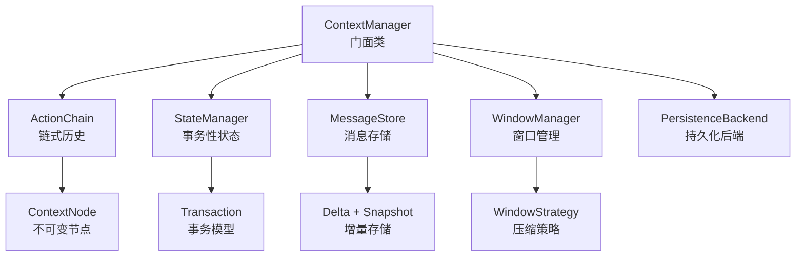
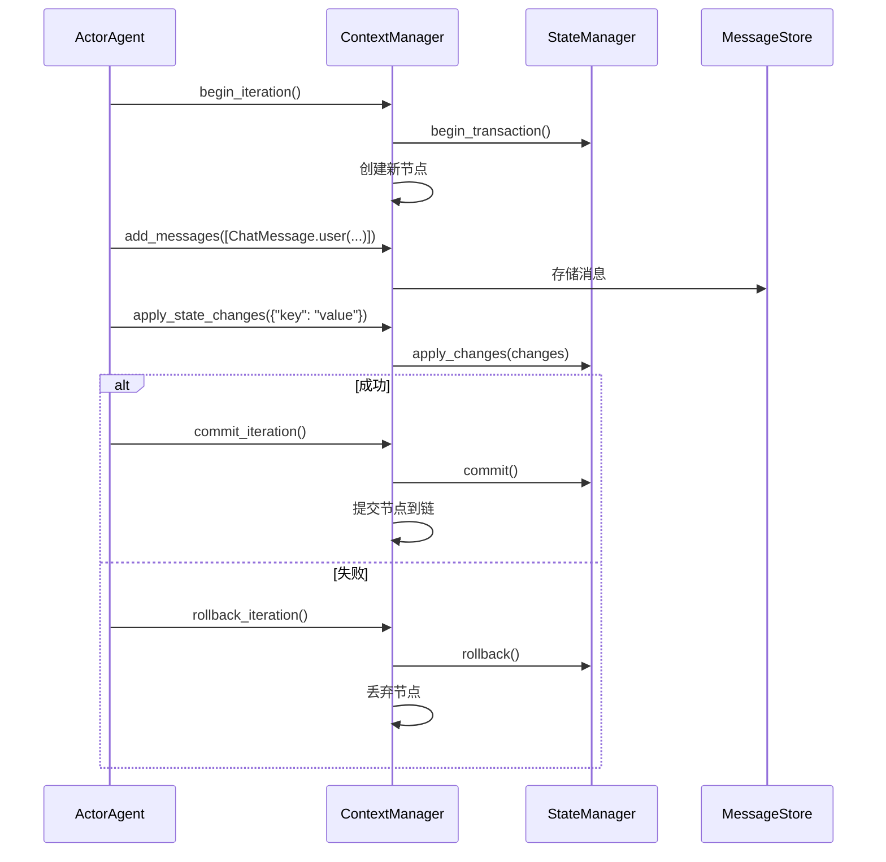
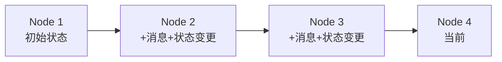
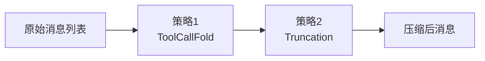

# 上下文管理

[`ContextManager`](../src/ghrah/context/manager.py:38) 是 ghrah 的核心组件，为 ActorAgent 提供统一的上下文管理，整合了链式历史、状态管理、消息存储和窗口管理。

## 架构概览



## ContextManager

[`ContextManager`](../src/ghrah/context/manager.py:38) 是门面类，整合所有上下文子系统的 API：

```python
from ghrah.context.manager import ContextManager

cm = ContextManager(
    agent_name="my-agent",
    initial_state={"key": "value"},    # 初始状态
    snapshot_interval=5,                # 快照间隔
    system_prompt="你是一个助手",        # 系统提示词
    window_manager=wm,                  # 窗口管理器（可选）
    persistence=backend,                # 持久化后端（可选）
    auto_persist=False,                 # 自动持久化
)
```

### 迭代生命周期

ContextManager 为驱动循环提供原子性迭代支持：



### 核心 API

| 方法 | 说明 |
|------|------|
| `begin_iteration()` | 开始新迭代，创建事务 |
| `add_messages(messages)` | 添加消息到当前迭代 |
| `apply_state_changes(changes)` | 应用状态变更 |
| `commit_iteration()` | 提交当前迭代 |
| `rollback_iteration()` | 回滚当前迭代 |
| `get_ability_state(ability_name)` | 获取指定 Ability 的状态 |
| `update_ability_state(ability_name, state)` | 更新指定 Ability 的状态 |
| `persist()` | 手动持久化当前状态 |
| `restore()` | 从持久化后端恢复状态 |

## ActionChain — 链式历史

[`ActionChain`](../src/ghrah/context/chain.py) 实现类似 Git 的不可变链式历史：



每个 [`ContextNode`](../src/ghrah/context/node.py) 是不可变的，包含：

- 迭代信息（节点 ID、父节点 ID）
- 消息增量（delta）
- 状态变更
- action 结果
- 时间戳

### 链式操作

```python
# ActionChain 内部操作
chain = ActionChain(agent_name="my-agent")

# 添加节点
node = chain.add_node(
    messages=[...],           # 消息增量
    state_changes={...},      # 状态变更
    action_result=result,     # action 结果
)

# 获取当前头节点
head = chain.head

# 获取完整历史
nodes = chain.get_history()
```

## StateManager — 事务性状态管理

[`StateManager`](../src/ghrah/context/state.py:27) 提供事务性状态变更，保证原子性：

```python
from ghrah.context.state import StateManager

sm = StateManager(initial_state={"count": 0, "data": {}})

# 开始事务
sm.begin_transaction()

# 应用变更（累积在 pending 区）
sm.apply_changes({"count": 1, "data": {"key": "value"}})

# 提交（变更生效）
sm.commit()

# 或回滚（变更丢弃）
sm.rollback()
```

### 事务生命周期

```
Idle → begin_transaction → InTransaction
InTransaction → apply_changes → InTransaction（累积变更）
InTransaction → commit → Idle（变更生效）
InTransaction → rollback → Idle（变更丢弃）
```

### 状态作用域

每个 Ability 有独立的状态作用域，通过 `ability_name` 隔离：

```python
# 获取 Ability 作用域状态
ability_state = sm.current.get("my_ability", {})

# 更新 Ability 作用域状态
sm.apply_changes({"my_ability": {"count": 1}})
```

### 删除标记

使用 `_DELETE` sentinel 删除特定键：

```python
from ghrah.context.state import _DELETE

sm.apply_changes({"temp_key": _DELETE})  # 删除 temp_key
```

## MessageStore — 消息存储

[`MessageStore`](../src/ghrah/context/message_store.py) 采用 delta + 定期快照策略存储消息：

- **Delta**：每次迭代只存储新增消息
- **Snapshot**：每 N 次迭代存储完整快照（由 `snapshot_interval` 控制）

这种设计在减少存储开销的同时，支持快速恢复。

## WindowManager — 窗口管理

[`WindowManager`](../src/ghrah/context/window.py) 管理 LLM 上下文窗口，通过策略模式压缩对话历史：

```python
from ghrah.context.window import WindowManager, estimate_tokens

# 创建窗口管理器
wm = WindowManager(
    strategies=[truncation, tool_call_fold],
    max_tokens=4096,
)

# 应用窗口管理
compressed_messages = wm.apply(messages)
```

### Token 估算

```python
from ghrah.context.window import estimate_tokens, estimate_message_tokens

# 估算文本 token 数
tokens = estimate_tokens("Hello, world!")  # ≈ 4 tokens

# 估算消息 token 数
msg_tokens = estimate_message_tokens(message)
```

### 策略管道

多个策略按注册顺序依次执行，形成处理管道：



详细策略说明请参考 [持久化与窗口管理](persistence.md)。

## 子 Agent 继承

ContextManager 支持通过 `fork_for_sub_agent()` 创建独立但继承的上下文：

```python
# 为子 Agent 创建继承的上下文
sub_cm = cm.fork_for_sub_agent(
    sub_agent_name="coder",
    messages=[...],  # 继承的消息
)
```

子 Agent 的上下文独立于父 Agent，修改不会互相影响。

## 持久化

ContextManager 支持异步持久化，将链式数据保存到磁盘：

```python
# 手动持久化
await cm.persist()

# 手动恢复
await cm.restore()
```

持久化配置通过 [`ContextConfig`](../src/ghrah/core/config.py:40) 控制：

```python
from ghrah.core.config import AgentConfig, ContextConfig

config = AgentConfig(
    name="my-agent",
    context=ContextConfig(
        persistence_type="json_file",      # 或 "memory"
        persistence_root_dir="/tmp/data",   # JSON 文件存储目录
        persistence_compress=True,          # gzip 压缩
        snapshot_interval=5,                # 快照间隔
        auto_persist=False,                 # 自动持久化
    ),
)
```

详细持久化说明请参考 [持久化与窗口管理](persistence.md)。

## 下一步

- [持久化与窗口管理](persistence.md) — 深入了解持久化后端和窗口策略
- [配置参考](configuration.md) — 查看所有配置选项
- [Ability 系统](ability-system.md) — 了解 Ability 如何使用上下文