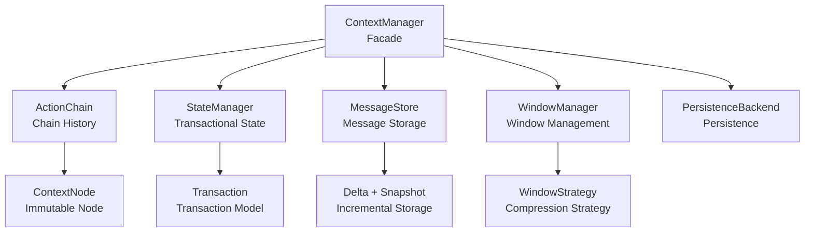
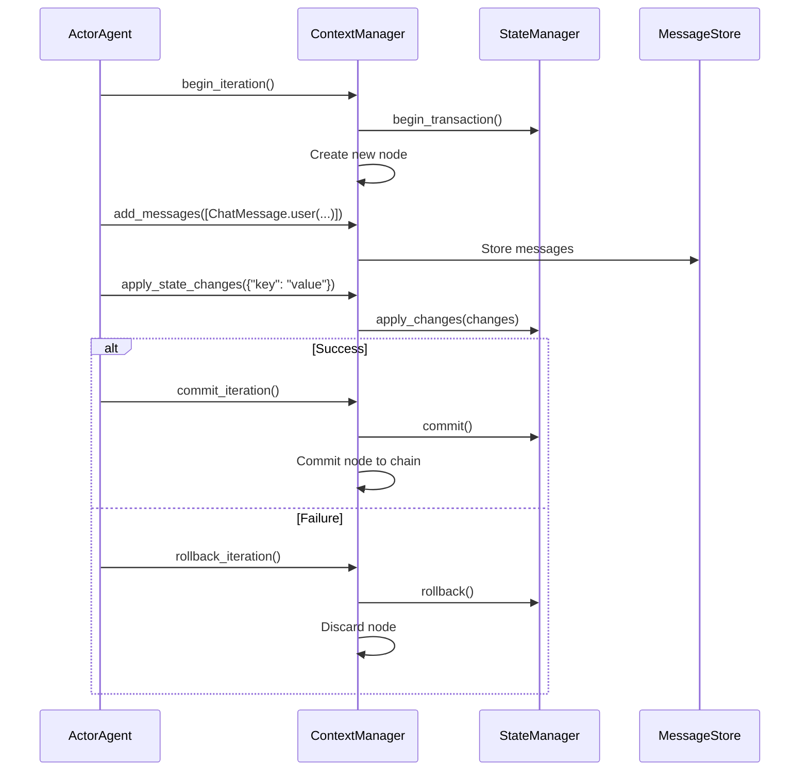
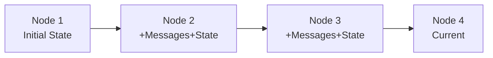
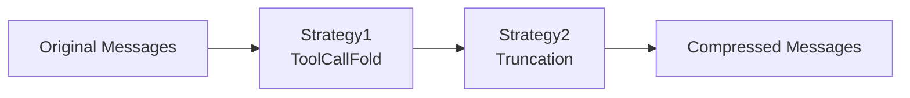

# Context Management

[`ContextManager`](../src/ghrah/context/manager.py:38) is the core component of ghrah, providing unified context management for ActorAgent by integrating chain history, state management, message storage, and window management.

## Architecture Overview



## ContextManager

[`ContextManager`](../src/ghrah/context/manager.py:38) is the facade class, integrating all context subsystem APIs:

```python
from ghrah.context.manager import ContextManager

cm = ContextManager(
    agent_name="my-agent",
    initial_state={"key": "value"},    # Initial state
    snapshot_interval=5,                # Snapshot interval
    system_prompt="You are an assistant",  # System prompt
    window_manager=wm,                  # Window manager (optional)
    persistence=backend,               # Persistence backend (optional)
    auto_persist=False,                 # Auto-persist
)
```

### Iteration Lifecycle

ContextManager provides atomic iteration support for the drive loop:



### Core API

| Method | Description |
|--------|-------------|
| `begin_iteration()` | Start new iteration, create transaction |
| `add_messages(messages)` | Add messages to current iteration |
| `apply_state_changes(changes)` | Apply state changes |
| `commit_iteration()` | Commit current iteration |
| `rollback_iteration()` | Rollback current iteration |
| `get_ability_state(ability_name)` | Get state for specified Ability scope |
| `update_ability_state(ability_name, state)` | Update state for specified Ability scope |
| `persist()` | Manually persist current state |
| `restore()` | Restore state from persistence backend |

## ActionChain — Chain History

[`ActionChain`](../src/ghrah/context/chain.py) implements Git-style immutable chain history:



Each [`ContextNode`](../src/ghrah/context/node.py) is immutable, containing:

- Iteration info (node ID, parent node ID)
- Message delta
- State changes
- Action results
- Timestamp

## StateManager — Transactional State Management

[`StateManager`](../src/ghrah/context/state.py:27) provides transactional state changes with atomicity guarantees:

```python
from ghrah.context.state import StateManager

sm = StateManager(initial_state={"count": 0, "data": {}})

# Begin transaction
sm.begin_transaction()

# Apply changes (accumulated in pending area)
sm.apply_changes({"count": 1, "data": {"key": "value"}})

# Commit (changes take effect)
sm.commit()

# Or rollback (changes discarded)
sm.rollback()
```

### Transaction Lifecycle

```
Idle → begin_transaction → InTransaction
InTransaction → apply_changes → InTransaction (accumulate changes)
InTransaction → commit → Idle (changes take effect)
InTransaction → rollback → Idle (changes discarded)
```

### State Scoping

Each Ability has an independent state scope, isolated by `ability_name`:

```python
# Get Ability scope state
ability_state = sm.current.get("my_ability", {})

# Update Ability scope state
sm.apply_changes({"my_ability": {"count": 1}})
```

### Delete Sentinel

Use the `_DELETE` sentinel to delete specific keys:

```python
from ghrah.context.state import _DELETE

sm.apply_changes({"temp_key": _DELETE})  # Delete temp_key
```

## MessageStore — Message Storage

[`MessageStore`](../src/ghrah/context/message_store.py) uses a delta + periodic snapshot strategy:

- **Delta**: Only new messages are stored each iteration
- **Snapshot**: Full snapshot stored every N iterations (controlled by `snapshot_interval`)

This design reduces storage overhead while supporting fast recovery.

## WindowManager — Window Management

[`WindowManager`](../src/ghrah/context/window.py) manages the LLM context window, compressing conversation history through a strategy pattern:

```python
from ghrah.context.window import WindowManager, estimate_tokens

# Create window manager
wm = WindowManager(
    strategies=[truncation, tool_call_fold],
    max_tokens=4096,
)

# Apply window management
compressed_messages = wm.apply(messages)
```

### Token Estimation

```python
from ghrah.context.window import estimate_tokens, estimate_message_tokens

# Estimate text token count
tokens = estimate_tokens("Hello, world!")  # ≈ 4 tokens

# Estimate message token count (considers ChatMessage tool_calls)
msg_tokens = estimate_message_tokens(message)
```

### Strategy Pipeline

Multiple strategies execute in registration order, forming a processing pipeline:



For detailed strategy descriptions, see [Persistence & Window Management](persistence_en.md).

## Sub-Agent Inheritance

ContextManager supports creating independent but inherited contexts via `fork_for_sub_agent()`:

```python
# Create inherited context for sub-Agent
sub_cm = cm.fork_for_sub_agent(
    sub_agent_name="coder",
    messages=[...],  # Inherited messages
)
```

The sub-Agent's context is independent from the parent Agent; modifications don't affect each other.

## Persistence

ContextManager supports async persistence, saving chain data to disk:

```python
# Manual persist
await cm.persist()

# Manual restore
await cm.restore()
```

Persistence is configured via [`ContextConfig`](../src/ghrah/core/config.py:40):

```python
from ghrah.core.config import AgentConfig, ContextConfig

config = AgentConfig(
    name="my-agent",
    context=ContextConfig(
        persistence_type="json_file",      # Or "memory"
        persistence_root_dir="/tmp/data",   # JSON file storage directory
        persistence_compress=True,          # gzip compression
        snapshot_interval=5,                # Snapshot interval
        auto_persist=False,                 # Auto-persist
    ),
)
```

For detailed persistence documentation, see [Persistence & Window Management](persistence_en.md).

## Next Steps

- [Persistence & Window Management](persistence_en.md) — Deep dive into persistence backends and window strategies
- [Configuration Reference](configuration_en.md) — View all configuration options
- [Ability System](ability-system_en.md) — Understand how Abilities use context