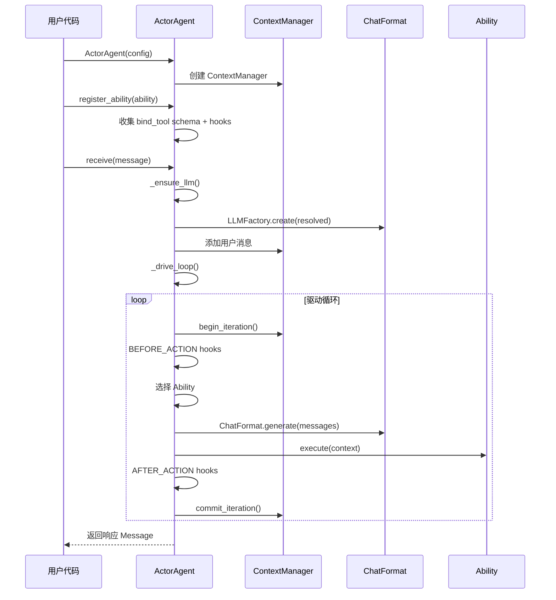
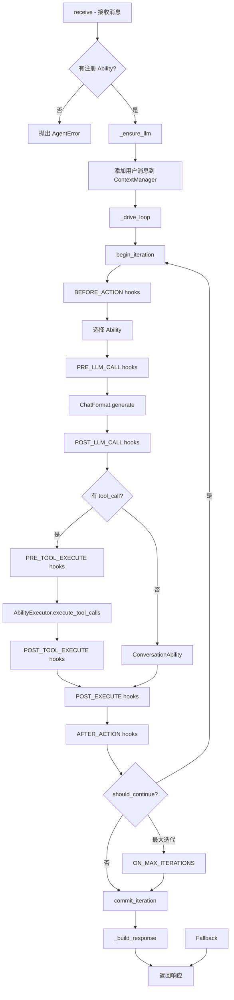

# 核心概念

ghrah 是一个通用的分布式智能体集群框架，使用组合式架构构建灵活的 Agent 系统

## 三大支柱

### ActorAgent = Agent 容器

每个 [`ActorAgent`](../src/ghrah/agents/base.py) 是一个有状态的 Agent 实例，具备：

- **有状态**：通过 [`ContextManager`](../src/ghrah/context/manager.py) 管理对话历史、状态和链式历史
- **可组合**：通过 Ability 组合模式灵活定义 Agent 行为
- **并发安全**：单实例顺序处理消息，避免竞态条件
- **双模式**：支持本地模式和分布式模式

```python
from ghrah.agents.base import ActorAgent
from ghrah.core.config import AgentConfig

# 本地模式
config = AgentConfig(name="my-agent", system_prompt="你是一个助手")
agent = ActorAgent(config)

# 分布式模式（通过 ContextConfig.persistence_type="remote" 启用）
config = AgentConfig(name="my-agent", system_prompt="你是一个助手", context=ContextConfig(persistence_type="remote"))
agent = ActorAgent(config)
```

### ChatFormat = LLM 交互层

通过自建的 [`ChatFormat`](../src/ghrah/chat/format/__init__.py) 格式适配器统一 LLM 交互：

- **OpenAIFormat**：OpenAI/DeepSeek 兼容格式，支持 reasoning_content 和多模态
- **AnthropicFormat**：Anthropic 兼容格式，支持 thinking 块和 tool_use

核心数据模型：

- [`ChatMessage`](../src/ghrah/chat/message.py)：统一消息表示（role + content_blocks + source）
- [`ContentBlock`](../src/ghrah/chat/content.py)：内容块联合类型（文本、推理、图片、工具调用等）
- [`LLMResponse`](../src/ghrah/chat/format/__init__.py)：统一的 LLM 响应

LLM 配置通过 agentconf 管理，框架层无需硬编码 API Key 或模型参数。

### agentconf = 配置管理层

采用 Provider → LLM → Agent 三层继承结构：

```
Provider（服务提供者：API 端点、密钥）
    └── LLM Instance（模型实例：模型名称、参数覆盖）
        └── Agent（智能体：温度、最大 token 等行为参数）
```

Agent 的 `name` 对应 agentconf 中的 agent 标识，[`ActorAgent`](../src/ghrah/agents/base.py) 初始化时调用 `AgentsConfig().resolve_agent(name)` 获取完整 LLM 配置。

## 双模式架构

ghrah 支持两种运行模式：

| 模式 | 执行器 | 事件发布 | 持久化 | HITL | 适用场景 |
|------|--------|----------|--------|------|----------|
| **本地模式** | LocalAbilityExecutor | NullEventPublisher | InMemoryBackend/JsonFileBackend/SqliteBackend | 本地 Future | 单机开发、测试 |
| **分布式模式** | RemoteAbilityExecutor | ServerEventPublisher | RemoteBackend | Subject 处理 | 生产部署、多节点 |

分布式模式下，ActorAgent 通过 CommandSender 与 Subject 通信，配置 RemoteAbilityExecutor 和 ServerEventPublisher。

## ActorAgent 生命周期



### 生命周期阶段

| 阶段 | 说明 |
|------|------|
| **创建** | `ActorAgent(config)` — 创建 Agent 实例 |
| **注册** | `register_ability(ability)` — 注册能力，收集 tool schema 和 hooks |
| **初始化 LLM** | `_ensure_llm()` — 惰性初始化，首次调用时从 agentconf 获取配置 |
| **接收消息** | `receive(message)` — 触发驱动循环 |
| **驱动循环** | `_drive_loop()` — Ability 选择 → Hook 时序 → 执行 → 条件转移 |
| **返回响应** | `_build_response()` — 构建最终回复 |

## 消息协议

[`Message`](../src/ghrah/core/message.py) 是 Agent 间通信的统一消息对象：

```python
from ghrah.core.message import Message, MessageType

# 创建消息
msg = Message(
    sender="user",           # 发送者
    recipient="assistant",   # 接收者（"*" 表示广播）
    content="你好",          # 消息内容
    type=MessageType.CHAT,  # 消息类型
)

# 创建回复
reply = Message.create_reply(msg, "你好！我是 AI 助手。")
```

### MessageType 枚举

| 类型 | 说明 |
|------|------|
| `CHAT` | 普通对话消息 |
| `COMMAND` | 命令消息（要求执行操作） |
| `TOOL_CALL` | 工具调用请求 |
| `TOOL_RESULT` | 工具调用结果 |
| `RESULT` | 最终结果 |
| `ERROR` | 错误消息 |
| `BROADCAST` | 广播消息 |

## ChatMessage 与 ContentBlock

[`ChatMessage`](../src/ghrah/chat/message.py) 是与 LLM 交互时使用的消息类型，与框架层的 `Message` 不同：

```python
from ghrah.chat import ChatMessage, TextBlock, ToolCallBlock

# 创建系统消息
sys_msg = ChatMessage.system("你是一个助手")

# 创建用户消息
user_msg = ChatMessage.user("你好")

# 创建 AI 消息（含工具调用）
ai_msg = ChatMessage.ai(
    text="我来帮你查看文件",
    tool_calls=[ToolCallBlock(id="call_1", name="read_file", arguments={"path": "/tmp/test.txt"})],
)
```

### ContentBlock 类型

| 类型 | 说明 |
|------|------|
| `TextBlock` | 文本内容 |
| `ReasoningBlock` | 推理内容（DeepSeek/Claude thinking） |
| `ImageBlock` | 图片（URL 或 base64） |
| `AudioBlock` | 音频数据 |
| `FileBlock` | 文件（PDF、代码等） |
| `ToolCallBlock` | 工具调用请求 |
| `ToolResultBlock` | 工具调用结果 |
| `ErrorBlock` | 错误信息 |

详见 [Chat 交互层](chat-module.md)。

## 组合优于继承

ghrah 采用 **Ability 组合模式** 而非传统 Agent 类型继承：

```python
# ❌ 传统继承方式（不推荐）
# class CodeReviewAgent(ActorAgent):
#     ...

# ✅ 组合方式（推荐）
agent = ActorAgent(config)
agent.register_ability(ConversationAbility())
agent.register_ability(ReadFileAbility())
agent.register_ability(EndTaskAbility())
```

**优势**：

- **灵活组合**：不同 Agent 可以自由组合不同的 Ability
- **独立演进**：Ability 可以独立开发和测试
- **运行时注册**：可以在运行时动态注册/注销 Ability
- **统一接口**：所有 Ability 遵循相同的接口契约

## 驱动循环

[`_drive_loop()`](../src/ghrah/agents/base.py) 是 ActorAgent 的核心执行循环：



### 循环控制

- **`max_iterations`**：[`AgentConfig`](../src/ghrah/core/config.py) 中的安全阀，防止死循环
- **`should_continue`**：由 Hook 或 Ability 结果控制是否继续循环
- **`EndTaskAbility`**：显式终止循环
- **`ConversationAbility`**：纯对话后自动终止（通过 `ConversationDoneHook`）

## 下一步

- [Chat 交互层](chat-module.md) — 了解 ChatMessage、ContentBlock 和 ChatFormat
- [Ability 系统](ability-system.md) — 深入了解 Ability 接口和自定义开发
- [Hook 机制](hook-mechanism.md) — 学习三层 Hook 架构和控制流
- [上下文管理](context-management.md) — 理解 ContextManager 的链式历史和状态管理
- [双模式架构](distributed-mode.md) — 了解本地模式和分布式模式的差异
- [HITL 人机协作](hitl.md) — 了解人机协作审批流程
