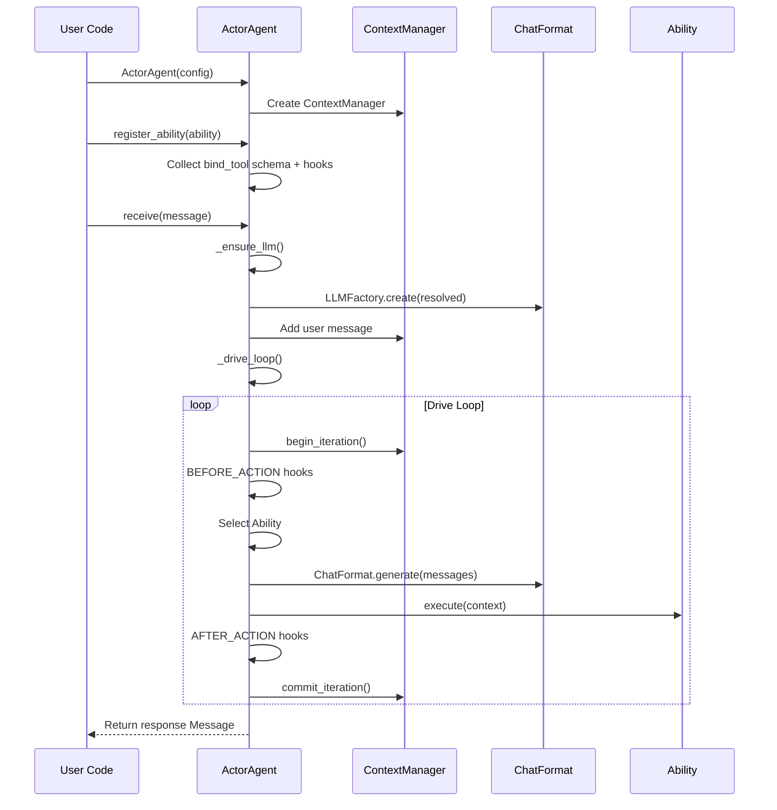
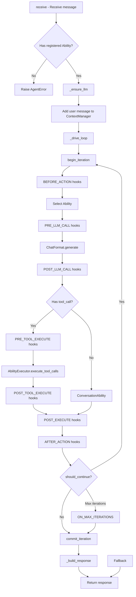

# Core Concepts

ghrah is an Actor-Agent platform built on a self-contained ChatFormat interaction layer. The core philosophy combines the Actor model with LLM interaction capabilities through a compositional architecture.

## Three Pillars

### ActorAgent = Agent Container

Each [`ActorAgent`](../src/ghrah/agents/base.py) is a stateful Agent instance with:

- **Stateful**: Manages conversation history, state, and chain history via [`ContextManager`](../src/ghrah/context/manager.py)
- **Composable**: Flexibly defines Agent behavior through the Ability composition pattern
- **Concurrency-safe**: Sequential message processing per instance, avoiding race conditions
- **Dual-mode**: Supports local and distributed modes

```python
from ghrah.agents.base import ActorAgent
from ghrah.core.config import AgentConfig

# Local mode
config = AgentConfig(name="my-agent", system_prompt="You are an assistant")
agent = ActorAgent(config)

# Distributed mode (enabled via ContextConfig.persistence_type="remote")
config = AgentConfig(name="my-agent", system_prompt="You are an assistant", context=ContextConfig(persistence_type="remote"))
agent = ActorAgent(config)
```

### ChatFormat = LLM Interaction Layer

The self-built [`ChatFormat`](../src/ghrah/chat/format/__init__.py) format adapters unify LLM interaction, replacing the LangChain dependency:

- **OpenAIFormat**: OpenAI/DeepSeek compatible format, supports reasoning_content and multimodal
- **AnthropicFormat**: Anthropic compatible format, supports thinking blocks and tool_use

Core data models:

- [`ChatMessage`](../src/ghrah/chat/message.py): Unified message representation (role + content_blocks + source)
- [`ContentBlock`](../src/ghrah/chat/content.py): Content block union type (text, reasoning, images, tool calls, etc.)
- [`LLMResponse`](../src/ghrah/chat/format/__init__.py): Unified LLM response

LLM configuration is managed through agentconf — no hardcoded API keys or model parameters in the framework.

### agentconf = Configuration Management Layer

Three-tier inheritance structure: Provider → LLM → Agent:

```
Provider (service provider: API endpoint, key)
    └── LLM Instance (model instance: model name, parameter overrides)
        └── Agent (agent: temperature, max tokens, etc.)
```

The Agent's `name` corresponds to the agent identifier in agentconf. [`ActorAgent`](../src/ghrah/agents/base.py) calls `AgentsConfig().resolve_agent(name)` during initialization to get the full LLM configuration.

## Dual-Mode Architecture

ghrah supports two runtime modes:

| Mode | Executor | Event Publisher | Persistence | HITL | Use Case |
|------|----------|-----------------|-------------|------|----------|
| **Local** | LocalAbilityExecutor | NullEventPublisher | InMemoryBackend/JsonFileBackend/SqliteBackend | Local Future | Single-node dev, testing |
| **Distributed** | RemoteAbilityExecutor | ServerEventPublisher | RemoteBackend | Subject-side | Production, multi-node |

In distributed mode, ActorAgent communicates with Subject via CommandSender, configuring RemoteAbilityExecutor and ServerEventPublisher.

## ActorAgent Lifecycle



### Lifecycle Stages

| Stage | Description |
|-------|-------------|
| **Creation** | `ActorAgent(config)` — Creates an Agent instance |
| **Registration** | `register_ability(ability)` — Register capabilities, collect tool schemas and hooks |
| **LLM Initialization** | `_ensure_llm()` — Lazy initialization, fetches config from agentconf on first call |
| **Message Reception** | `receive(message)` — Triggers the drive loop |
| **Drive Loop** | `_drive_loop()` — Ability selection → Hook timing → Execution → Conditional routing |
| **Response** | `_build_response()` — Constructs the final reply |

## Message Protocol

[`Message`](../src/ghrah/core/message.py) is the unified message object for inter-Agent communication:

```python
from ghrah.core.message import Message, MessageType

# Create a message
msg = Message(
    sender="user",           # Sender
    recipient="assistant",   # Recipient ("*" for broadcast)
    content="Hello",         # Message content
    type=MessageType.CHAT,  # Message type
)

# Create a reply
reply = Message.create_reply(msg, "Hello! I'm an AI assistant.")
```

### MessageType Enum

| Type | Description |
|------|-------------|
| `CHAT` | Regular chat message |
| `COMMAND` | Command message (requesting an action) |
| `TOOL_CALL` | Tool call request |
| `TOOL_RESULT` | Tool call result |
| `RESULT` | Final result |
| `ERROR` | Error message |
| `BROADCAST` | Broadcast message |

## ChatMessage & ContentBlock

[`ChatMessage`](../src/ghrah/chat/message.py) is the message type used for LLM interaction, distinct from the framework-level `Message`:

```python
from ghrah.chat import ChatMessage, TextBlock, ToolCallBlock

# Create system message
sys_msg = ChatMessage.system("You are an assistant")

# Create user message
user_msg = ChatMessage.user("Hello")

# Create AI message (with tool calls)
ai_msg = ChatMessage.ai(
    text="Let me check that file for you",
    tool_calls=[ToolCallBlock(id="call_1", name="read_file", arguments={"path": "/tmp/test.txt"})],
)
```

### ContentBlock Types

| Type | Description |
|------|-------------|
| `TextBlock` | Text content |
| `ReasoningBlock` | Reasoning content (DeepSeek/Claude thinking) |
| `ImageBlock` | Image (URL or base64) |
| `AudioBlock` | Audio data |
| `FileBlock` | File (PDF, code, etc.) |
| `ToolCallBlock` | Tool call request |
| `ToolResultBlock` | Tool call result |
| `ErrorBlock` | Error information |

See [Chat Module](chat-module_en.md) for details.

## Composition over Inheritance

ghrah uses the **Ability composition pattern** rather than traditional Agent type inheritance:

```python
# ❌ Traditional inheritance (not recommended)
# class CodeReviewAgent(ActorAgent):
#     ...

# ✅ Composition (recommended)
agent = ActorAgent(config)
agent.register_ability(ConversationAbility())
agent.register_ability(ReadFileAbility())
agent.register_ability(EndTaskAbility())
```

**Advantages**:

- **Flexible composition**: Different Agents can freely combine different Abilities
- **Independent evolution**: Abilities can be developed and tested independently
- **Runtime registration**: Abilities can be dynamically registered/unregistered at runtime
- **Unified interface**: All Abilities follow the same interface contract

## Drive Loop

[`_drive_loop()`](../src/ghrah/agents/base.py) is the core execution loop of ActorAgent:



### Loop Control

- **`max_iterations`**: Safety valve in [`AgentConfig`](../src/ghrah/core/config.py) to prevent infinite loops
- **`should_continue`**: Controlled by Hooks or Ability results
- **`EndTaskAbility`**: Explicitly terminates the loop
- **`ConversationAbility`**: Auto-terminates after pure conversation (via `ConversationDoneHook`)

## Next Steps

- [Chat Module](chat-module_en.md) — Learn about ChatMessage, ContentBlock, and ChatFormat
- [Ability System](ability-system_en.md) — Deep dive into the Ability interface and custom development
- [Hook Mechanism](hook-mechanism_en.md) — Learn about the three-layer Hook architecture and control flow
- [Context Management](context-management_en.md) — Understand ContextManager's chain history and state management
- [Dual-Mode Architecture](distributed-mode_en.md) — Understand the differences between local and distributed modes
- [HITL](hitl_en.md) — Learn about the Human-in-the-Loop approval process
