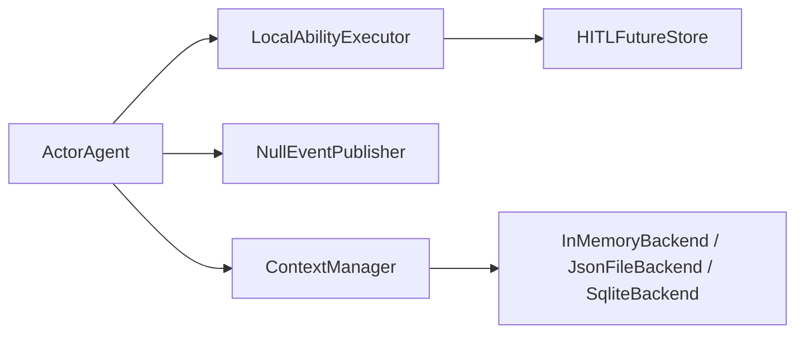
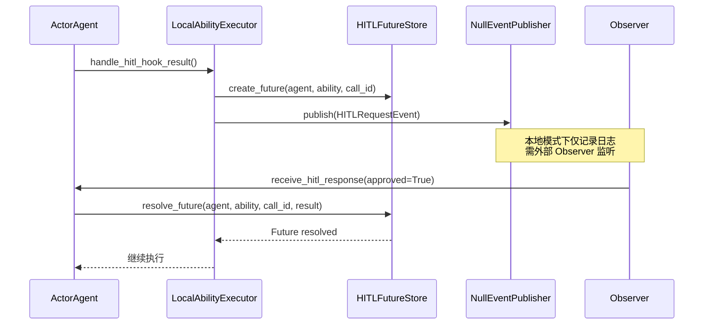
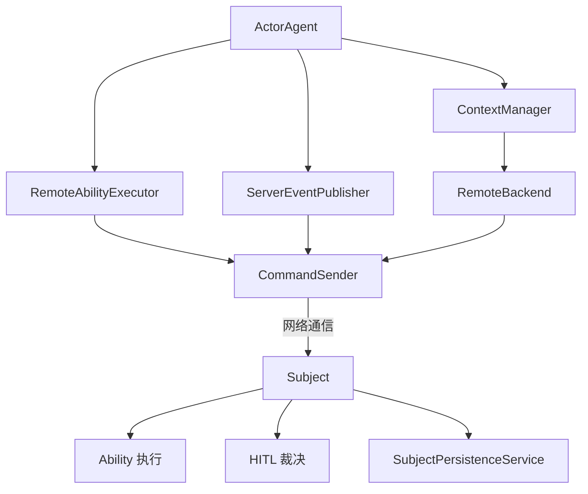
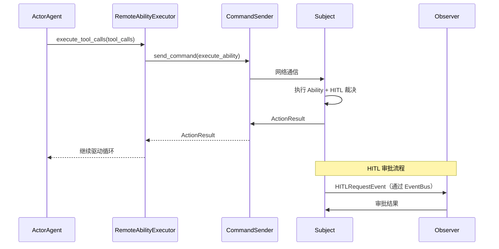

# 双模式架构

ghrah 支持本地（Local）和分布式（Distributed）两种运行模式。分布式模式下，Core 与 Subject 通过 CommandSender 通信，构成两层架构：core-server + subject-server。

## 模式对比

| 维度 | 本地模式 | 分布式模式 |
|------|----------|------------|
| **Ability 执行** | LocalAbilityExecutor（进程内） | RemoteAbilityExecutor（委托 Subject） |
| **事件发布** | NullEventPublisher（仅日志） | ServerEventPublisher（事件推送） |
| **持久化** | InMemoryBackend / JsonFileBackend / SqliteBackend | RemoteBackend（委托 Subject） |
| **HITL** | HITLFutureStore（本地 Future 审批） | Subject 处理 |
| **Hook 执行** | 全部本地执行 | drive_loop/action 级本地，ability 级委托执行器 |
| **适用场景** | 单机开发、测试、原型 | 生产部署、多节点、需要人机审批 |

## 本地模式

本地模式是默认模式，所有组件在单个进程中运行：

```python
from ghrah.core.config import AgentConfig

config = AgentConfig(name="my-agent", system_prompt="你是一个助手")
agent = ActorAgent(config)
# 使用 LocalAbilityExecutor + NullEventPublisher + 本地持久化
```

### 组件链路



### HITL 流程（本地模式）



## 分布式模式

分布式模式下，Core 通过 CommandSender 将 Ability 执行和持久化委托给 Subject：

```python
from ghrah.core.config import AgentConfig

config = AgentConfig(
    name="my-agent",
    system_prompt="你是一个助手",
    context=ContextConfig(persistence_type="remote"),
)
agent = ActorAgent(config)
# 使用 RemoteAbilityExecutor + ServerEventPublisher + RemoteBackend
```

### 组件链路



### CommandSender

[`CommandSender`](../src/ghrah/core/command_sender.py) 是与 Subject 通信的客户端：

- **命令请求**：`send_command()` — 请求-响应模式
- **事件推送**：`send_event()` — 即发即忘模式
- **心跳**：定时发送心跳保持连接

### HITL 流程（分布式模式）



## 自动模式切换

ActorAgent 在初始化阶段根据配置自动选择分布式组件：

```python
# ActorAgent 中的逻辑（简化）
if context_config.persistence_type == "remote":
    self._command_sender = CommandSender(...)
    self._ability_executor = RemoteAbilityExecutor(command_sender=self._command_sender)
    self._event_publisher = ServerEventPublisher(command_sender=self._command_sender)
else:
    self._ability_executor = LocalAbilityExecutor(...)
    self._event_publisher = NullEventPublisher()
```

## AbilityRegistry 远程注册

在分布式模式下，Core 需要将 Ability 的类型信息注册到 Subject，使 Subject 能够实例化对应的 Ability 执行：

```python
from ghrah.abilities.registry import AbilityRegistry

# 注册自定义 Ability 类型
AbilityRegistry.register("my_custom_ability", MyCustomAbility)

# RemoteAbilityExecutor 在连接时自动将已注册的 Ability 类型发送给 Subject
```

## Hook 执行分层

在分布式模式下，Hook 的执行分为两层：

- **本地 Hook**（drive_loop 级 + action 级）：在 Core 端执行
  - `BEFORE_ACTION`、`AFTER_ACTION`、`ON_ERROR`、`ON_MAX_ITERATIONS`
  - `PRE_LLM_CALL`、`POST_LLM_CALL`、`PRE_TOOL_EXECUTE`、`POST_TOOL_EXECUTE`
- **委托 Hook**（ability 级）：由 AbilityExecutor 执行
  - `PRE_EXECUTE`、`POST_EXECUTE`
  - 本地模式下由 LocalAbilityExecutor 执行
  - 分布式模式下由 RemoteAbilityExecutor 委托给 Subject 执行

## 配置示例

### 本地模式 + SQLite 持久化

```python
from ghrah.core.config import AgentConfig, ContextConfig

config = AgentConfig(
    name="coder",
    system_prompt="你是一个代码编写专家。",
    context=ContextConfig(
        persistence_type="sqlite",
        persistence_root_dir="/tmp/agent_data",
    ),
)
```

### 分布式模式

```python
from ghrah.core.config import AgentConfig, ContextConfig

config = AgentConfig(
    name="coder",
    system_prompt="你是一个代码编写专家。",
    context=ContextConfig(
        persistence_type="remote",
    ),
)
```

### SupervisorActor + 分布式

```python
from ghrah.communication import SupervisorActor
from ghrah.core.config import AgentConfig

supervisor = SupervisorActor()

configs = [
    AgentConfig(name="planner", context=ContextConfig(persistence_type="remote"), ...),
    AgentConfig(name="coder", context=ContextConfig(persistence_type="remote"), ...),
]
for config in configs:
    await supervisor.spawn_agent(config)
```

## 下一步

- [HITL 人机协作](hitl.md) — 了解 HITL 的详细流程
- [持久化与窗口管理](persistence.md) — 了解 RemoteBackend 和 SqliteBackend
- [配置参考](configuration.md) — 了解配置选项
- [架构图](architecture.md) — 查看完整的架构图
