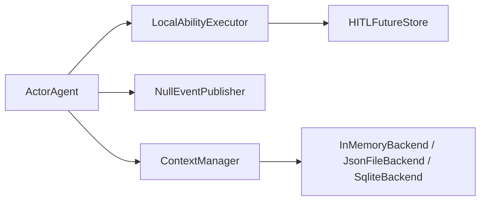
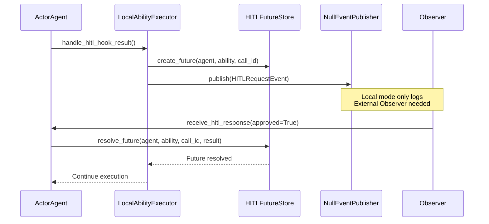
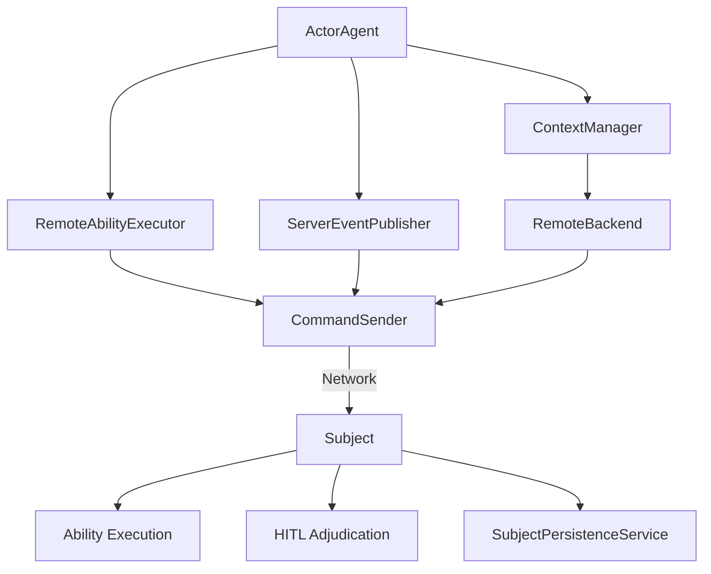
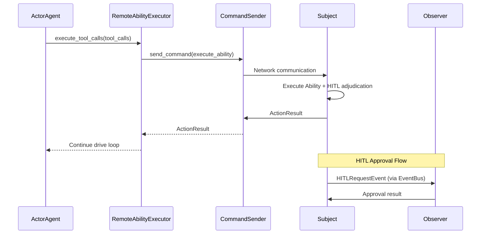

# Dual-Mode Architecture

ghrah supports both Local and Distributed runtime modes. In distributed mode, Core communicates with Subject via CommandSender, forming a two-layer architecture: core-server + subject-server.

## Mode Comparison

| Dimension | Local Mode | Distributed Mode |
|-----------|------------|------------------|
| **Ability Execution** | LocalAbilityExecutor (in-process) | RemoteAbilityExecutor (delegated to Subject) |
| **Event Publishing** | NullEventPublisher (log only) | ServerEventPublisher (event push) |
| **Persistence** | InMemoryBackend / JsonFileBackend / SqliteBackend | RemoteBackend (delegated to Subject) |
| **HITL** | HITLFutureStore (local Future approval) | Subject-side processing |
| **Hook Execution** | All local | drive_loop/action level local, ability level delegated to executor |
| **Use Case** | Single-node dev, testing, prototyping | Production, multi-node, requires human approval |

## Local Mode

Local mode is the default, with all components running in a single process:

```python
from ghrah.core.config import AgentConfig

config = AgentConfig(name="my-agent", system_prompt="You are an assistant")
agent = ActorAgent(config)
# Uses LocalAbilityExecutor + NullEventPublisher + local persistence
```

### Component Chain



### HITL Flow (Local Mode)



## Distributed Mode

Distributed mode delegates Ability execution and persistence to Subject via CommandSender:

```python
from ghrah.core.config import AgentConfig

config = AgentConfig(
    name="my-agent",
    system_prompt="You are an assistant",
    context=ContextConfig(persistence_type="remote"),
)
agent = ActorAgent(config)
# Uses RemoteAbilityExecutor + ServerEventPublisher + RemoteBackend
```

### Component Chain



### CommandSender

[`CommandSender`](../src/ghrah/core/command_sender.py) is the client for communicating with Subject:

- **Command requests**: `send_command()` — request-response pattern
- **Event push**: `send_event()` — fire-and-forget pattern
- **Heartbeat**: Periodic heartbeat to maintain connection

### HITL Flow (Distributed Mode)



## Automatic Mode Switching

ActorAgent automatically selects distributed components during initialization based on configuration:

```python
# Logic in ActorAgent (simplified)
if context_config.persistence_type == "remote":
    self._command_sender = CommandSender(...)
    self._ability_executor = RemoteAbilityExecutor(command_sender=self._command_sender)
    self._event_publisher = ServerEventPublisher(command_sender=self._command_sender)
else:
    self._ability_executor = LocalAbilityExecutor(...)
    self._event_publisher = NullEventPublisher()
```

## AbilityRegistry Remote Registration

In distributed mode, Core needs to register Ability type information with Subject so that Subject can instantiate the corresponding Ability for execution:

```python
from ghrah.abilities.registry import AbilityRegistry

# Register custom Ability type
AbilityRegistry.register("my_custom_ability", MyCustomAbility)

# RemoteAbilityExecutor automatically sends registered Ability types to Subject on connection
```

## Hook Execution Layering

In distributed mode, Hook execution is divided into two layers:

- **Local Hooks** (drive_loop level + action level): Executed on the Core side
  - `BEFORE_ACTION`, `AFTER_ACTION`, `ON_ERROR`, `ON_MAX_ITERATIONS`
  - `PRE_LLM_CALL`, `POST_LLM_CALL`, `PRE_TOOL_EXECUTE`, `POST_TOOL_EXECUTE`
- **Delegated Hooks** (ability level): Executed by AbilityExecutor
  - `PRE_EXECUTE`, `POST_EXECUTE`
  - In local mode: executed by LocalAbilityExecutor
  - In distributed mode: delegated to Subject by RemoteAbilityExecutor

## Configuration Examples

### Local Mode + SQLite Persistence

```python
from ghrah.core.config import AgentConfig, ContextConfig

config = AgentConfig(
    name="coder",
    system_prompt="You are a code writing expert.",
    context=ContextConfig(
        persistence_type="sqlite",
        persistence_root_dir="/tmp/agent_data",
    ),
)
```

### Distributed Mode

```python
from ghrah.core.config import AgentConfig, ContextConfig

config = AgentConfig(
    name="coder",
    system_prompt="You are a code writing expert.",
    context=ContextConfig(
        persistence_type="remote",
    ),
)
```

### SupervisorActor + Distributed

```python
from ghrah.communication import SupervisorActor
from ghrah.core.config import AgentConfig

supervisor = SupervisorActor()

configs = [
    AgentConfig(name="planner", context=ContextConfig(persistence_type="remote"), ...),
    AgentConfig(name="coder", context=ContextConfig(persistence_type="remote"), ...),
]
for config in configs:
    await supervisor.spawn_agent(config)
```

## Next Steps

- [HITL](hitl_en.md) — Learn about the detailed HITL flow
- [Persistence & Window Management](persistence_en.md) — Learn about RemoteBackend and SqliteBackend
- [Configuration Reference](configuration_en.md) — Learn about configuration options
- [Architecture Diagrams](architecture_en.md) — View the full architecture diagrams
