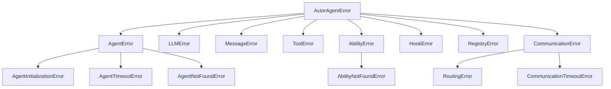

# 异常处理

ghrah 采用层次化的异常体系，所有自定义异常继承自 [`ActorAgentError`](../src/ghrah/core/exceptions.py:4)。

## 异常层次结构



## 异常类型详解

### ActorAgentError

所有框架异常的基类。

```python
from ghrah.core.exceptions import ActorAgentError

try:
    # 框架操作
    pass
except ActorAgentError as e:
    print(f"框架错误: {e}")
```

### AgentError

Agent 运行时错误，包含 `agent_name` 属性。

```python
from ghrah.core.exceptions import AgentError

try:
    # Agent 操作
    pass
except AgentError as e:
    print(f"Agent[{e.agent_name}] 错误: {e}")
```

#### AgentInitializationError

Agent 初始化失败（如 LLM 客户端创建失败）。

```python
from ghrah.core.exceptions import AgentInitializationError

try:
    await agent._ensure_llm()
except AgentInitializationError as e:
    print(f"Agent[{e.agent_name}] 初始化失败: {e}")
```

**常见原因**：
- agentconf 中未配置对应 Agent
- API Key 无效
- 网络连接问题

#### AgentTimeoutError

Agent 处理超时。

```python
from ghrah.core.exceptions import AgentTimeoutError

try:
    response = await asyncio.wait_for(agent.receive(message), timeout=30)
except AgentTimeoutError as e:
    print(f"Agent[{e.agent_name}] 超时 ({e.timeout}s)")
```

#### AgentNotFoundError

指定的 Agent 未注册。

```python
from ghrah.core.exceptions import AgentNotFoundError

try:
    await supervisor.send("unknown_agent", "hello")
except AgentNotFoundError as e:
    print(f"Agent 未找到: {e}")
```

### LLMError

LLM 调用相关错误，包含 `provider` 属性。

```python
from ghrah.core.exceptions import LLMError

try:
    # LLM 调用
    pass
except LLMError as e:
    print(f"LLM[{e.provider}] 错误: {e}")
```

**常见原因**：
- API Key 过期或无效
- 模型名称错误
- API 配额超限
- 网络连接问题

### AbilityError 与 AbilityNotFoundError

Ability 相关错误。

```python
from ghrah.core.exceptions import AbilityError, AbilityNotFoundError

# 注册重复 Ability
try:
    agent.register_ability(ability)
except AbilityError as e:
    print(f"Ability 错误: {e}")

# 注销不存在的 Ability
try:
    agent.unregister_ability("unknown_ability")
except AbilityNotFoundError as e:
    print(f"Ability 未找到: {e}")
```

### HookError

Hook 执行错误。

```python
from ghrah.core.exceptions import HookError

try:
    # Hook 执行
    pass
except HookError as e:
    print(f"Hook 错误: {e}")
```

### RegistryError

Agent 注册中心错误。

```python
from ghrah.core.exceptions import RegistryError

try:
    registry.register(name="agent", config=config, actor_handle=handle)
except RegistryError as e:
    print(f"注册错误: {e}")
```

**常见原因**：
- 注册同名 Agent
- 注销不存在的 Agent

### CommunicationTimeoutError

通信超时错误。

```python
from ghrah.core.exceptions import CommunicationTimeoutError

try:
    response = await router.route(message, timeout=30)
except CommunicationTimeoutError as e:
    print(f"通信超时: {e}")
```

### RoutingError

消息路由错误。

```python
from ghrah.core.exceptions import RoutingError

try:
    response = await router.route(message)
except RoutingError as e:
    print(f"路由错误: {e}")
```

## 错误处理最佳实践

### 1. 分层捕获

```python
from ghrah.core.exceptions import (
    ActorAgentError,
    AgentError,
    AgentInitializationError,
    LLMError,
)

try:
        response = await agent.receive(message)
except AgentInitializationError as e:
    # Agent 初始化失败 — 检查 agentconf 配置
    print(f"初始化失败，请检查配置: {e}")
except LLMError as e:
    # LLM 调用失败 — 检查 API Key 和网络
    print(f"LLM 错误，请检查 API: {e}")
except AgentError as e:
    # 其他 Agent 错误
    print(f"Agent 错误: {e}")
except ActorAgentError as e:
    # 其他框架错误
    print(f"框架错误: {e}")
```

### 2. 超时处理

```python
import asyncio
from ghrah.core.exceptions import AgentTimeoutError, CommunicationTimeoutError

try:
    response = await asyncio.wait_for(
        supervisor.send("planner", "设计一个方案"),
        timeout=60,
    )
except asyncio.TimeoutError:
    print("请求超时，请稍后重试")
except CommunicationTimeoutError as e:
    print(f"通信超时: {e}")
```

### 3. 重试机制

```python
import asyncio
from ghrah.core.exceptions import LLMError

MAX_RETRIES = 3
RETRY_DELAY = 2  # 秒

for attempt in range(MAX_RETRIES):
    try:
    response = await agent.receive(message)
        break
    except LLMError as e:
        if attempt < MAX_RETRIES - 1:
            print(f"LLM 错误 (尝试 {attempt + 1}/{MAX_RETRIES}): {e}")
            await asyncio.sleep(RETRY_DELAY * (attempt + 1))
        else:
            raise
```

### 4. 优雅降级

```python
from ghrah.core.exceptions import AgentNotFoundError, RoutingError

try:
    response = await supervisor.send("expert_agent", message)
except AgentNotFoundError:
    # 降级到通用 Agent
    response = await supervisor.send("general_agent", message)
except RoutingError:
    # 路由失败，直接回复
    response = Message(
        sender="system",
        recipient=message.sender,
        content="抱歉，服务暂时不可用。",
        type=MessageType.ERROR,
    )
```

### 5. Agent 错误回调

[`ActorAgent`](../src/ghrah/agents/base.py:97) 的 `receive()` 方法内置了错误处理：

```python
async def receive(self, message: Message) -> Message:
    try:
        # 驱动循环
        await self._drive_loop()
        return self._build_response(message)
    except AgentError:
        raise  # AgentError 直接抛出
    except Exception as e:
        # 其他错误包装为 ERROR 消息返回
        return Message(
            sender=self.config.name,
            recipient=message.sender,
            content=f"Error: {e}",
            type=MessageType.ERROR,
            reply_to=message.id,
        )
```

## 常见错误与解决方案

| 错误 | 原因 | 解决方案 |
|------|------|----------|
| `AgentInitializationError` | agentconf 未配置 Agent | 运行 `agentconf agent create` |
| `AgentInitializationError` | API Key 无效 | 检查 `.env` 或 agentconf 配置 |
| `AgentNotFoundError` | Agent 未注册 | 先调用 `spawn_agent()` |
| `AbilityNotFoundError` | Ability 未注册 | 先调用 `register_ability()` |
| `AbilityError` | 同名 Ability 已注册 | 检查是否重复注册 |
| `LLMError` | API 调用失败 | 检查 API Key、网络、配额 |
| `CommunicationTimeoutError` | 通信超时 | 增加超时时间或检查 Agent 状态 |
| `RoutingError` | 消息路由失败 | 检查 recipient 是否正确 |

## 下一步

- [核心概念](core-concepts.md) — 了解 ActorAgent 生命周期和错误处理
- [配置参考](configuration.md) — 查看 max_iterations 等安全配置
- [多 Agent 通信](multi-agent.md) — 了解通信超时配置