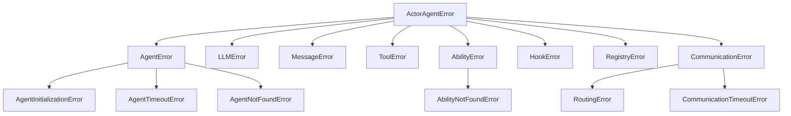

# Error Handling

ghrah adopts a hierarchical exception system where all custom exceptions inherit from [`ActorAgentError`](../src/ghrah/core/exceptions.py:4).

## Exception Hierarchy



## Exception Type Details

### ActorAgentError

Base class for all framework exceptions.

```python
from ghrah.core.exceptions import ActorAgentError

try:
    # Framework operations
    pass
except ActorAgentError as e:
    print(f"Framework error: {e}")
```

### AgentError

Agent runtime error with `agent_name` attribute.

```python
from ghrah.core.exceptions import AgentError

try:
    # Agent operations
    pass
except AgentError as e:
    print(f"Agent[{e.agent_name}] error: {e}")
```

#### AgentInitializationError

Agent initialization failure (e.g., LLM client creation failure).

```python
from ghrah.core.exceptions import AgentInitializationError

try:
    await agent._ensure_llm()
except AgentInitializationError as e:
    print(f"Agent[{e.agent_name}] initialization failed: {e}")
```

**Common causes**:
- Agent not configured in agentconf
- Invalid API Key
- Network connection issues

#### AgentTimeoutError

Agent processing timeout.

```python
from ghrah.core.exceptions import AgentTimeoutError

try:
    response = await asyncio.wait_for(agent.receive(message), timeout=30)
except AgentTimeoutError as e:
    print(f"Agent[{e.agent_name}] timeout ({e.timeout}s)")
```

#### AgentNotFoundError

Specified Agent not registered.

```python
from ghrah.core.exceptions import AgentNotFoundError

try:
    await supervisor.send("unknown_agent", "hello")
except AgentNotFoundError as e:
    print(f"Agent not found: {e}")
```

### LLMError

LLM call-related error with `provider` attribute.

```python
from ghrah.core.exceptions import LLMError

try:
    # LLM call
    pass
except LLMError as e:
    print(f"LLM[{e.provider}] error: {e}")
```

**Common causes**:
- Expired or invalid API Key
- Incorrect model name
- API quota exceeded
- Network connection issues

### AbilityError & AbilityNotFoundError

Ability-related errors.

```python
from ghrah.core.exceptions import AbilityError, AbilityNotFoundError

# Register duplicate Ability
try:
    agent.register_ability(ability)
except AbilityError as e:
    print(f"Ability error: {e}")

# Unregister non-existent Ability
try:
    agent.unregister_ability("unknown_ability")
except AbilityNotFoundError as e:
    print(f"Ability not found: {e}")
```

### HookError

Hook execution error.

```python
from ghrah.core.exceptions import HookError

try:
    # Hook execution
    pass
except HookError as e:
    print(f"Hook error: {e}")
```

### RegistryError

Agent registry error.

```python
from ghrah.core.exceptions import RegistryError

try:
    registry.register(name="agent", config=config, actor_handle=handle)
except RegistryError as e:
    print(f"Registry error: {e}")
```

**Common causes**:
- Registering an Agent with a duplicate name
- Unregistering a non-existent Agent

### CommunicationTimeoutError

Communication timeout error.

```python
from ghrah.core.exceptions import CommunicationTimeoutError

try:
    response = await router.route(message, timeout=30)
except CommunicationTimeoutError as e:
    print(f"Communication timeout: {e}")
```

### RoutingError

Message routing error.

```python
from ghrah.core.exceptions import RoutingError

try:
    response = await router.route(message)
except RoutingError as e:
    print(f"Routing error: {e}")
```

## Error Handling Best Practices

### 1. Layered Catching

```python
from ghrah.core.exceptions import (
    ActorAgentError,
    AgentError,
    AgentInitializationError,
    LLMError,
)

try:
        response = await agent.receive(message)
except AgentInitializationError as e:
    # Agent initialization failed — check agentconf
    print(f"Initialization failed, check configuration: {e}")
except LLMError as e:
    # LLM call failed — check API Key and network
    print(f"LLM error, check API: {e}")
except AgentError as e:
    # Other Agent errors
    print(f"Agent error: {e}")
except ActorAgentError as e:
    # Other framework errors
    print(f"Framework error: {e}")
```

### 2. Timeout Handling

```python
import asyncio
from ghrah.core.exceptions import AgentTimeoutError, CommunicationTimeoutError

try:
    response = await asyncio.wait_for(
        supervisor.send("planner", "Design a solution"),
        timeout=60,
    )
except asyncio.TimeoutError:
    print("Request timeout, please try again later")
except CommunicationTimeoutError as e:
    print(f"Communication timeout: {e}")
```

### 3. Retry Mechanism

```python
import asyncio
from ghrah.core.exceptions import LLMError

MAX_RETRIES = 3
RETRY_DELAY = 2  # seconds

for attempt in range(MAX_RETRIES):
    try:
    response = await agent.receive(message)
        break
    except LLMError as e:
        if attempt < MAX_RETRIES - 1:
            print(f"LLM error (attempt {attempt + 1}/{MAX_RETRIES}): {e}")
            await asyncio.sleep(RETRY_DELAY * (attempt + 1))
        else:
            raise
```

### 4. Graceful Degradation

```python
from ghrah.core.exceptions import AgentNotFoundError, RoutingError

try:
    response = await supervisor.send("expert_agent", message)
except AgentNotFoundError:
    # Fall back to general Agent
    response = await supervisor.send("general_agent", message)
except RoutingError:
    # Routing failure, direct reply
    response = Message(
        sender="system",
        recipient=message.sender,
        content="Sorry, service is temporarily unavailable.",
        type=MessageType.ERROR,
    )
```

### 5. Agent Error Callback

[`ActorAgent`](../src/ghrah/agents/base.py:97)'s `receive()` method has built-in error handling:

```python
async def receive(self, message: Message) -> Message:
    try:
        # Drive loop
        await self._drive_loop()
        return self._build_response(message)
    except AgentError:
        raise  # AgentError propagated directly
    except Exception as e:
        # Other errors wrapped as ERROR message
        return Message(
            sender=self.config.name,
            recipient=message.sender,
            content=f"Error: {e}",
            type=MessageType.ERROR,
            reply_to=message.id,
        )
```

## Common Errors & Solutions

| Error | Cause | Solution |
|-------|-------|----------|
| `AgentInitializationError` | Agent not configured in agentconf | Run `agentconf agent create` |
| `AgentInitializationError` | Invalid API Key | Check `.env` or agentconf configuration |
| `AgentNotFoundError` | Agent not registered | Call `spawn_agent()` first |
| `AbilityNotFoundError` | Ability not registered | Call `register_ability()` first |
| `AbilityError` | Duplicate Ability name registered | Check for duplicate registration |
| `LLMError` | API call failure | Check API Key, network, quota |
| `CommunicationTimeoutError` | Communication timeout | Increase timeout or check Agent status |
| `RoutingError` | Message routing failure | Check if recipient is correct |

## Next Steps

- [Core Concepts](core-concepts_en.md) — Understand ActorAgent lifecycle and error handling
- [Configuration Reference](configuration_en.md) — View safety configurations like max_iterations
- [Multi-Agent Communication](multi-agent_en.md) — Learn about communication timeout configuration