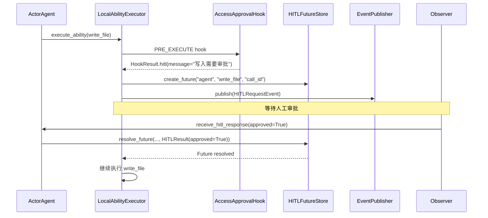
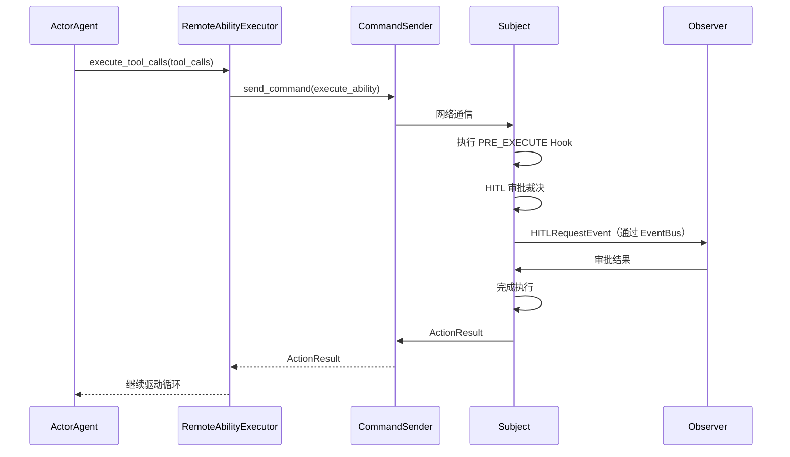

# HITL 人机协作

HITL（Human-in-the-Loop）是 ghrah 中人机协作审批机制的核心组件，允许在 Agent 执行过程中插入人工审批环节。

## 设计理念

在 Agent 执行 Ability 时，某些操作（如写入文件、执行危险命令）需要人工确认后才可继续。HITL 通过 Hook 机制拦截 Ability 执行，等待人工审批后决定是否放行。

核心原则：
- **显式声明**：HITL 通过 `HookResult.hitl()` 显式声明需要审批
- **组合优先**：HITL 逻辑通过 Hook 组合到 Ability 中，而非硬编码
- **双模式支持**：本地模式使用 Future 等待，分布式模式由 Subject 处理

## HITLResult

[`HITLResult`](../src/ghrah/core/hitl.py) 表示 HITL 审批结果：

```python
from ghrah.core.hitl import HITLResult

result = HITLResult(approved=True)             # 批准
result = HITLResult(approved=False)            # 拒绝
result = HITLResult(approved=True, result={"modified_args": ...})  # 批准并附带修改
```

## HITLFutureStore

[`HITLFutureStore`](../src/ghrah/core/hitl.py) 是基于 `asyncio.Future` 的 HITL 等待机制，用于本地模式：

```python
from ghrah.core.hitl import HITLFutureStore, HITLResult

store = HITLFutureStore()

# Agent 侧：创建 Future 等待审批
future = store.create_future("my-agent", "write_file", "call_123")

# Observer 侧：审批后 resolve Future
store.resolve_future("my-agent", "write_file", "call_123", HITLResult(approved=True))

# Agent 侧：Future 被解析，驱动循环继续
result = await future
assert result.approved is True
```

### API

| 方法 | 说明 |
|------|------|
| `create_future(agent_name, ability_name, tool_call_id)` | 创建等待 Future |
| `resolve_future(agent_name, ability_name, tool_call_id, result)` | 解析 Future |
| `get_future(agent_name, ability_name, tool_call_id)` | 获取 Future（不创建） |
| `cancel_future(agent_name, ability_name, tool_call_id)` | 取消 Future |
| `cancel_all(agent_name=None)` | 取消所有/指定 Agent 的 Future |
| `list_pending(agent_name=None)` | 列出等待中的 Future |

## HITL 事件

[`HITLRequestEvent`](../src/ghrah/core/events.py) 是 HITL 审批请求事件：

```python
from ghrah.core.events import HITLRequestEvent

event = HITLRequestEvent(
    agent_name="my-agent",
    ability_name="write_file",
    tool_call={"id": "call_123", "name": "write_file", "arguments": {"path": "/etc/passwd"}},
    context={"tool_call_id": "call_123"},
)
```

事件流方向：
```
Core → EventBus → Subject（确认/记录）→ Observer（渲染/审批）
```

## HITL 工作流程

### 本地模式



### 分布式模式



## 内置 HITL Hook：AccessApprovalHook

[`AccessApprovalHook`](../src/ghrah/abilities/builtin/fs_permissions.py) 是内置的统一访问审批 Hook，覆盖读和写操作：

```python
from ghrah.abilities.builtin import ReadFileAbility, WriteFileAbility, FSPermissionChecker

permission_checker = FSPermissionChecker(
    denied_paths=["/etc/shadow", "/etc/passwd"],  # 优先：黑名单路径直接拒绝
    allowed_paths=["/tmp/workspace"],              # 白名单目录：直接通过
    workspace_root="/home/user/project",           # 工作区根目录
)

ability = WriteFileAbility(permission_checker=permission_checker)
```

`FSPermissionChecker` 提供 `check_access(path, operation)` 方法统一处理读（`operation='read'`）写（`operation='write'`）权限检查。

### 审批逻辑

1. 路径在 `denied_paths` 黑名单中 → 直接拒绝（优先级最高）
2. 路径在 `allowed_paths` 白名单或 `workspace_root` 下 → 自动通过
3. 路径不在白名单中且 `require_approval=True` → 触发 HITL 审批
4. 路径不在白名单中且 `require_approval=False` → 直接拒绝

## 自定义 HITL Hook

实现自定义的 HITL 审批逻辑：

```python
from ghrah.abilities.hooks import Hook, HookPoint, HookResult
from ghrah.abilities.context import AbilityExecutionContext
from ghrah.abilities.base import ActionResult

class DangerousOperationHook(Hook):
    """危险操作审批 Hook"""
    hook_point = HookPoint.PRE_EXECUTE

    async def should_trigger(self, context: AbilityExecutionContext) -> bool:
        return context.current_ability_name in ("delete_file", "execute_command")

    async def execute(
        self, context: AbilityExecutionContext, result: ActionResult | None
    ) -> HookResult:
        return HookResult.hitl(
            message=f"危险操作 {context.current_ability_name} 需要人工审批"
        )

# 注册到 Agent
agent._ability_executor.update_hooks([DangerousOperationHook()])
```

## 事件类型

ghrah-core 定义了四种事件类型：

| 事件 | 类 | 说明 |
|------|-----|------|
| `HITL_REQUEST` | `HITLRequestEvent` | HITL 审批请求 |
| `ACTION_CHAIN_UPDATED` | `ActionChainUpdatedEvent` | ActionChain 节点变更 |
| `AGENT_ERROR` | `AgentErrorEvent` | Agent 错误 |
| `AGENT_RESPONSE` | `AgentResponseEvent` | Agent 最终响应 |

## 下一步

- [双模式架构](distributed-mode.md) — 了解 HITL 在两种模式下的差异
- [Hook 机制](hook-mechanism.md) — 了解 Hook 的三层架构
- [内置 Ability 参考](builtin-abilities.md) — 了解 FSPermissionChecker 配置
