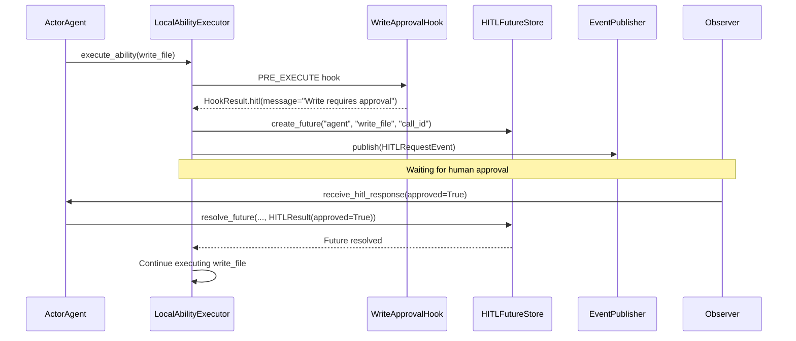
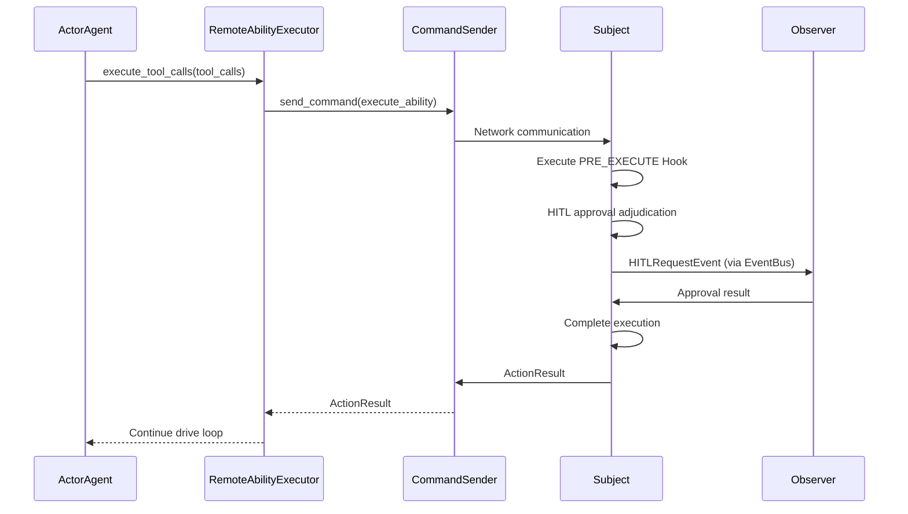

# HITL (Human-in-the-Loop)

HITL is the core component of ghrah's human-AI collaboration approval mechanism, allowing human approval steps to be inserted during Agent execution.

## Design Philosophy

When an Agent executes an Ability, certain operations (such as writing files, executing dangerous commands) require human confirmation before proceeding. HITL intercepts Ability execution through the Hook mechanism and waits for human approval before deciding whether to proceed.

Core principles:
- **Explicit over implicit**: HITL explicitly declares the need for approval via `HookResult.hitl()`
- **Composition over inheritance**: HITL logic is composed into Abilities via Hooks, not hardcoded
- **Dual-mode support**: Local mode uses Future waiting, distributed mode is handled by Subject

## HITLResult

[`HITLResult`](../src/ghrah/core/hitl.py) represents the HITL approval result:

```python
from ghrah.core.hitl import HITLResult

result = HITLResult(approved=True)             # Approved
result = HITLResult(approved=False)            # Rejected
result = HITLResult(approved=True, result={"modified_args": ...})  # Approved with modifications
```

## HITLFutureStore

[`HITLFutureStore`](../src/ghrah/core/hitl.py) is the Future-based HITL waiting mechanism for local mode:

```python
from ghrah.core.hitl import HITLFutureStore, HITLResult

store = HITLFutureStore()

# Agent side: create Future waiting for approval
future = store.create_future("my-agent", "write_file", "call_123")

# Observer side: resolve Future after approval
store.resolve_future("my-agent", "write_file", "call_123", HITLResult(approved=True))

# Agent side: Future resolved, drive loop continues
result = await future
assert result.approved is True
```

### API

| Method | Description |
|--------|-------------|
| `create_future(agent_name, ability_name, tool_call_id)` | Create waiting Future |
| `resolve_future(agent_name, ability_name, tool_call_id, result)` | Resolve Future |
| `get_future(agent_name, ability_name, tool_call_id)` | Get Future (without creating) |
| `cancel_future(agent_name, ability_name, tool_call_id)` | Cancel Future |
| `cancel_all(agent_name=None)` | Cancel all/specified Agent's Futures |
| `list_pending(agent_name=None)` | List pending Futures |

## HITL Events

[`HITLRequestEvent`](../src/ghrah/core/events.py) is the HITL approval request event:

```python
from ghrah.core.events import HITLRequestEvent

event = HITLRequestEvent(
    agent_name="my-agent",
    ability_name="write_file",
    tool_call={"id": "call_123", "name": "write_file", "arguments": {"path": "/etc/passwd"}},
    context={"tool_call_id": "call_123"},
)
```

Event flow direction:
```
Core → EventBus → Subject (confirm/record) → Observer (render/approve)
```

## HITL Workflow

### Local Mode



### Distributed Mode



## Built-in HITL Hook: WriteApprovalHook

[`WriteApprovalHook`](../src/ghrah/abilities/builtin/fs_permissions.py) is the built-in write operation approval Hook:

```python
from ghrah.abilities.builtin import WriteFileAbility, FSPermissionChecker

# Configure write approval: paths not in whitelist require HITL approval
permission_checker = FSPermissionChecker(
    allowed_dirs=["/tmp/workspace"],  # Whitelist directories
    require_approval=True,            # Non-whitelisted paths require approval
)

ability = WriteFileAbility(permission_checker=permission_checker)
```

### Approval Logic

1. Write path is in `allowed_dirs` whitelist → Pass through
2. Write path is not in whitelist and `require_approval=True` → Trigger HITL approval
3. Write path is not in whitelist and `require_approval=False` → Reject

## Custom HITL Hook

Implement custom HITL approval logic:

```python
from ghrah.abilities.hooks import Hook, HookPoint, HookResult
from ghrah.abilities.context import AbilityExecutionContext
from ghrah.abilities.base import ActionResult

class DangerousOperationHook(Hook):
    """Dangerous operation approval Hook"""
    hook_point = HookPoint.PRE_EXECUTE

    async def should_trigger(self, context: AbilityExecutionContext) -> bool:
        return context.current_ability_name in ("delete_file", "execute_command")

    async def execute(
        self, context: AbilityExecutionContext, result: ActionResult | None
    ) -> HookResult:
        return HookResult.hitl(
            message=f"Dangerous operation {context.current_ability_name} requires human approval"
        )

# Register with Agent
agent._ability_executor.update_hooks([DangerousOperationHook()])
```

## Event Types

ghrah-core defines four event types:

| Event | Class | Description |
|-------|-------|-------------|
| `HITL_REQUEST` | `HITLRequestEvent` | HITL approval request |
| `ACTION_CHAIN_UPDATED` | `ActionChainUpdatedEvent` | ActionChain node change |
| `AGENT_ERROR` | `AgentErrorEvent` | Agent error |
| `AGENT_RESPONSE` | `AgentResponseEvent` | Agent final response |

## Next Steps

- [Dual-Mode Architecture](distributed-mode_en.md) — Understand HITL differences in the two modes
- [Hook Mechanism](hook-mechanism_en.md) — Learn about the three-layer Hook architecture
- [Built-in Ability Reference](builtin-abilities_en.md) — Learn about FSPermissionChecker configuration
