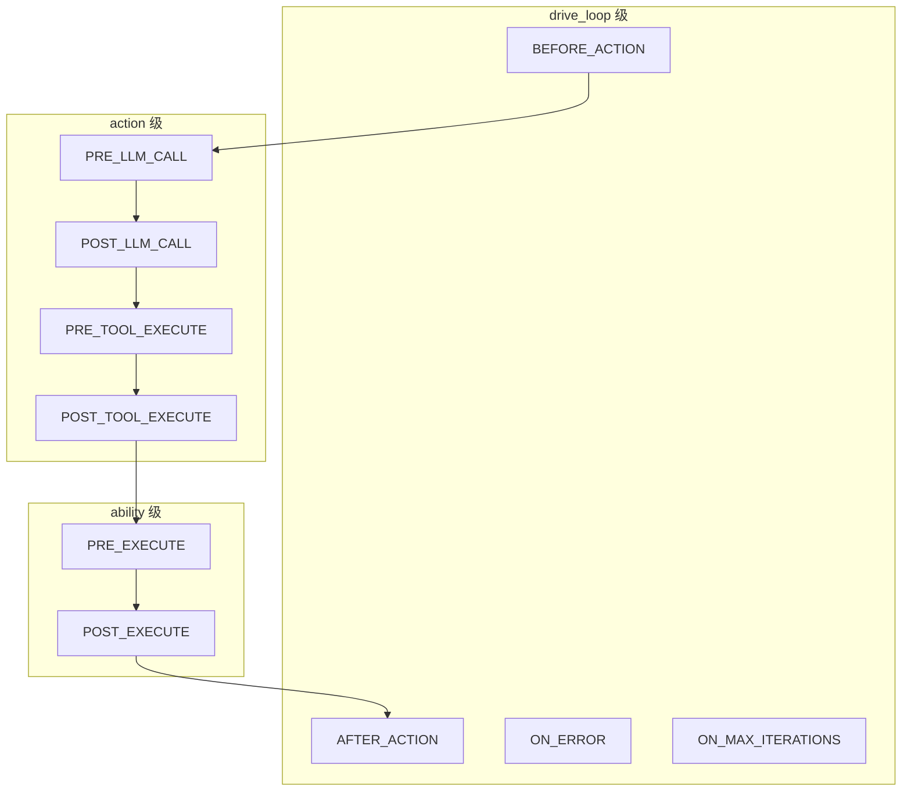

# Hook 机制

Hook 是 ghrah 中实现控制流的核心机制，在 Agent 执行循环的特定触发点执行，用于条件转移、拦截修改、错误恢复等。

## 三层 Hook 架构



### 触发点说明

| 层级 | HookPoint | 触发时机 | 典型用途 |
|------|-----------|----------|----------|
| drive_loop | `BEFORE_ACTION` | action 执行前 | 条件路由、预处理 |
| drive_loop | `AFTER_ACTION` | action 执行后 | 终止循环、后处理 |
| drive_loop | `ON_ERROR` | 异常时 | 错误恢复、日志记录 |
| drive_loop | `ON_MAX_ITERATIONS` | 达到最大迭代时 | 强制终止、摘要生成 |
| action | `PRE_LLM_CALL` | LLM 调用前 | prompt 注入、参数修改 |
| action | `POST_LLM_CALL` | LLM 调用后 | 响应过滤、token 统计 |
| action | `PRE_TOOL_EXECUTE` | 工具执行前 | 权限校验、参数验证 |
| action | `POST_TOOL_EXECUTE` | 工具执行后 | 结果缓存、副作用触发 |
| ability | `PRE_EXECUTE` | ability 执行前 | HITL 批准、状态检查 |
| ability | `POST_EXECUTE` | ability 执行后 | 副作用触发、通知 |

## Hook 基类

[`Hook`](../src/ghrah/abilities/hooks.py) 是所有 Hook 的抽象基类：

```python
from ghrah.abilities.hooks import Hook, HookPoint, HookResult
from ghrah.abilities.context import AbilityExecutionContext

class MyHook(Hook):
    """自定义 Hook 示例"""
    
    hook_point = HookPoint.BEFORE_ACTION  # 指定触发点
    
    async def should_trigger(self, context: AbilityExecutionContext) -> bool:
        """判断是否触发，返回 True 时执行"""
        return context.current_ability_name == "my_ability"
    
    async def execute(
        self, context: AbilityExecutionContext, result: ActionResult | None
    ) -> HookResult:
        """Hook 执行逻辑"""
        # ... 自定义逻辑
        return HookResult.continue_()  # 或 HookResult.stop() / HookResult.route_to("ability_name")
```

### 必须实现的属性/方法

| 属性/方法 | 说明 |
|-----------|------|
| `hook_point` | [`HookPoint`](../src/ghrah/abilities/hooks.py:35) 枚举值，指定触发时机 |
| [`should_trigger(context)`](../src/ghrah/abilities/hooks.py) | 异步方法，判断是否触发 |
| [`execute(context, result)`](../src/ghrah/abilities/hooks.py) | 异步方法，执行 Hook 逻辑 |

## HookResult

[`HookResult`](../src/ghrah/abilities/hooks.py) 是 Hook 执行的返回值，控制后续流程：

```python
# 继续正常流程
HookResult.continue_()

# 停止驱动循环
HookResult.stop()

# 路由到指定 Ability
HookResult.route_to("end_task")
```

| 工厂方法 | 说明 |
|----------|------|
| `HookResult.continue_()` | 继续正常流程 |
| `HookResult.stop()` | 停止驱动循环 |
| `HookResult.route_to(ability_name)` | 跳转到指定 Ability |

## 内置 Hook 示例

### ConversationDoneHook

[`ConversationAbility`](../src/ghrah/abilities/builtin/conversation.py) 内置的 Hook，在纯对话完成后终止循环：

```python
class ConversationDoneHook(Hook):
    """ConversationAbility 执行完成后终止循环"""
    hook_point = HookPoint.AFTER_ACTION
    
    async def should_trigger(self, context: AbilityExecutionContext) -> bool:
        return context.current_ability_name == "conversation"
    
    async def execute(self, context, result) -> HookResult:
        return HookResult.stop()  # 纯对话只需一次 LLM 调用
```

### AccessApprovalHook

[`AccessApprovalHook`](../src/ghrah/abilities/builtin/fs_permissions.py) 在读写操作前请求人工批准（HITL），覆盖 `read_file`、`list_directory`、`write_file`、`edit_file`、`move_file`、`delete_file`：

```python
class AccessApprovalHook(Hook):
    """访问操作人工批准 Hook"""
    hook_point = HookPoint.PRE_EXECUTE
    
    WRITE_ABILITIES = {"write_file", "edit_file", "move_file", "delete_file"}
    READ_ABILITIES = {"read_file", "list_directory"}
    
    async def should_trigger(self, context: AbilityExecutionContext) -> bool:
        # 对读写类 Ability 触发检查
        name = context.current_ability_name
        return name in self.WRITE_ABILITIES or name in self.READ_ABILITIES
    
    async def execute(self, context, result) -> HookResult:
        # 请求人工批准
        tool_args = context.tool_args or context.accumulated_data.get("tool_args", {})
        target_path = tool_args.get("file_path") or tool_args.get("dir_path")
        operation = "write" if context.current_ability_name in self.WRITE_ABILITIES else "read"
        allowed, status = self._checker.check_access(target_path, operation)
        ...
```

`WriteApprovalHook` 是 `AccessApprovalHook` 的向后兼容别名。

### FSPermissionHook

[`FSPermissionChecker`](../src/ghrah/abilities/builtin/fs_permissions.py) 内置的权限校验 Hook：

```python
class FSPermissionChecker:
    """文件系统路径权限检查器"""
    
    def __init__(self, allowed_dirs: list[str] | None = None, ...):
        self._allowed_dirs = [Path(d).resolve() for d in (allowed_dirs or [])]
    
    def create_hook(self) -> Hook:
        """创建权限校验 Hook"""
        # 返回 PRE_EXECUTE Hook，检查路径是否在允许范围内
```

## 自定义 Hook 开发

### 示例：速率限制 Hook

```python
from ghrah.abilities.hooks import Hook, HookPoint, HookResult
from ghrah.abilities.context import AbilityExecutionContext

class RateLimitHook(Hook):
    """限制 Ability 调用次数"""
    hook_point = HookPoint.BEFORE_ACTION
    
    def __init__(self, max_calls: int = 10):
        self._max_calls = max_calls
        self._call_count = 0
    
    async def should_trigger(self, context: AbilityExecutionContext) -> bool:
        return True  # 始终触发
    
    async def execute(self, context, result) -> HookResult:
        self._call_count += 1
        if self._call_count >= self._max_calls:
            return HookResult.route_to("end_task")  # 超限后路由到终止
        return HookResult.continue_()
```

### 示例：日志记录 Hook

```python
import logging

class LoggingHook(Hook):
    """记录每次 action 的执行"""
    hook_point = HookPoint.AFTER_ACTION
    
    async def should_trigger(self, context: AbilityExecutionContext) -> bool:
        return True
    
    async def execute(self, context, result) -> HookResult:
        logging.info(
            f"Ability {context.current_ability_name} executed: "
            f"outcome={result.outcome if result else 'N/A'}"
        )
        return HookResult.continue_()
```

### 示例：条件路由 Hook

```python
class DelegateToExpertHook(Hook):
    """根据内容路由到专业 Agent"""
    hook_point = HookPoint.BEFORE_ACTION
    
    async def should_trigger(self, context: AbilityExecutionContext) -> bool:
        # 检查消息内容是否包含代码相关关键词
        messages = context.context_manager.message_store.get_recent_messages(1)
        if messages:
            content = messages[0].content.lower()
            return "代码" in content or "编程" in content
        return False
    
    async def execute(self, context, result) -> HookResult:
        return HookResult.route_to("coder")  # 路由到编码 Agent
```

## Hook 注册流程

Hook 通过 Ability 的 [`get_hooks()`](../src/ghrah/abilities/base.py:86) 方法注册：

```python
class MyAbility(Ability):
    def get_hooks(self) -> list[Hook]:
        return [
            MyPreExecuteHook(),
            MyPostExecuteHook(),
        ]
```

注册 Ability 时，框架自动收集所有 hooks：

```python
# ActorAgent.register_ability() 内部逻辑
ability_hooks = ability.get_hooks()
self._all_hooks.extend(ability_hooks)
```

注销 Ability 时，对应的 hooks 也会被移除：

```python
# ActorAgent.unregister_ability() 内部逻辑
ability_hooks = ability.get_hooks()
ability_hook_ids = {id(h) for h in ability_hooks}
self._all_hooks = [h for h in self._all_hooks if id(h) not in ability_hook_ids]
```

## Hook 执行顺序

同一触发点的多个 Hook 按注册顺序执行：

1. `BEFORE_ACTION` hooks（按注册顺序）
2. 选择 Ability → `PRE_LLM_CALL` hooks
3. LLM 调用 → `POST_LLM_CALL` hooks
4. 如有 tool_call：`PRE_TOOL_EXECUTE` → 执行 → `POST_TOOL_EXECUTE`
5. `PRE_EXECUTE` → Ability.execute() → `POST_EXECUTE`
6. `AFTER_ACTION` hooks（按注册顺序）

如果任何 Hook 返回 `HookResult.stop()`，循环立即终止。如果返回 `HookResult.route_to(name)`，下一次迭代跳转到指定 Ability。

## 分布式模式下的 Hook 执行

在分布式模式下，Hook 的执行分为两层：

- **本地 Hook**：drive_loop 级和 action 级的 Hook 始终在 Core 端执行
  - `BEFORE_ACTION`、`AFTER_ACTION`、`ON_ERROR`、`ON_MAX_ITERATIONS`
  - `PRE_LLM_CALL`、`POST_LLM_CALL`、`PRE_TOOL_EXECUTE`、`POST_TOOL_EXECUTE`
- **委托 Hook**：ability 级的 Hook 由 AbilityExecutor 执行
  - `PRE_EXECUTE`、`POST_EXECUTE`
  - 本地模式下由 `LocalAbilityExecutor` 在 Core 端执行
  - 分布式模式下由 `RemoteAbilityExecutor` 委托给 Subject 执行

这种分层设计确保了驱动循环的控制逻辑始终在 Core 端，而 Ability 的执行逻辑可以根据模式在 Core 或 Subject 端执行。

## 下一步

- [Ability 系统](ability-system.md) — 了解 Ability 如何使用 Hook
- [内置 Ability 参考](builtin-abilities.md) — 查看内置 Ability 的 Hook 实现
- [上下文管理](context-management.md) — 理解 Hook 中的上下文访问
- [双模式架构](distributed-mode.md) — 了解分布式模式下的 Hook 执行分层
- [HITL 人机协作](hitl.md) — 了解 HITL Hook 的使用