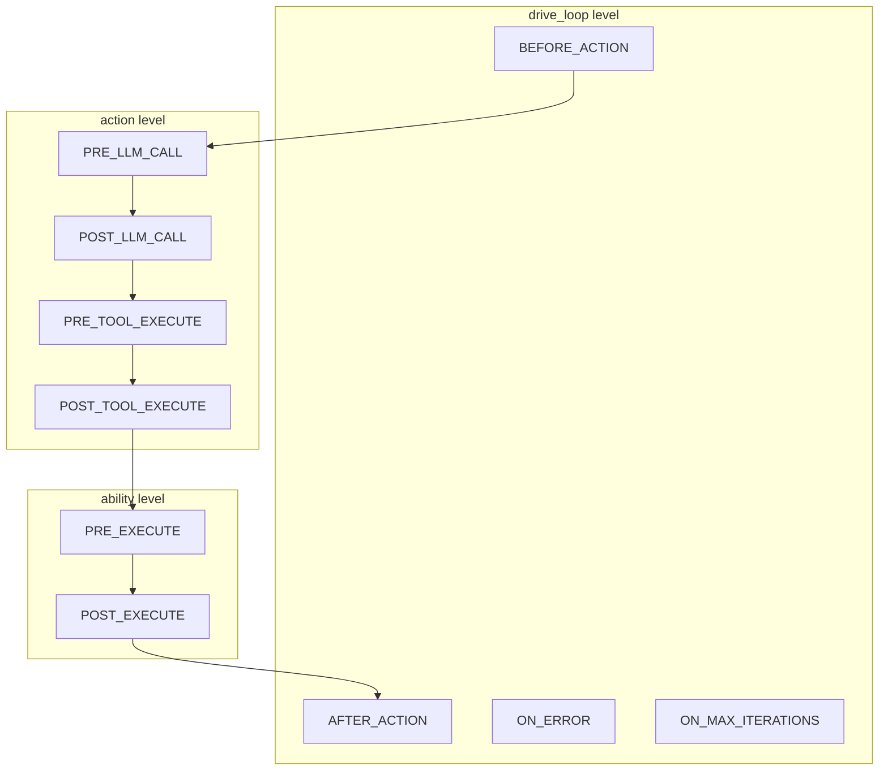

# Hook Mechanism

Hooks are the core control flow mechanism in ghrah, executed at specific trigger points during the Agent execution loop for conditional routing, interception, error recovery, and more.

## Three-Layer Hook Architecture



### Trigger Point Descriptions

| Level | HookPoint | Trigger Timing | Typical Use |
|-------|-----------|----------------|-------------|
| drive_loop | `BEFORE_ACTION` | Before action execution | Conditional routing, preprocessing |
| drive_loop | `AFTER_ACTION` | After action execution | Loop termination, post-processing |
| drive_loop | `ON_ERROR` | On exception | Error recovery, logging |
| drive_loop | `ON_MAX_ITERATIONS` | When max iterations reached | Forced termination, summary generation |
| action | `PRE_LLM_CALL` | Before LLM call | Prompt injection, parameter modification |
| action | `POST_LLM_CALL` | After LLM call | Response filtering, token statistics |
| action | `PRE_TOOL_EXECUTE` | Before tool execution | Permission check, parameter validation |
| action | `POST_TOOL_EXECUTE` | After tool execution | Result caching, side effect triggering |
| ability | `PRE_EXECUTE` | Before ability execution | HITL approval, state check |
| ability | `POST_EXECUTE` | After ability execution | Side effect triggering, notification |

## Hook Base Class

[`Hook`](../src/ghrah/abilities/hooks.py) is the abstract base class for all Hooks:

```python
from ghrah.abilities.hooks import Hook, HookPoint, HookResult
from ghrah.abilities.context import AbilityExecutionContext

class MyHook(Hook):
    """Custom Hook example"""
    
    hook_point = HookPoint.BEFORE_ACTION  # Specify trigger point
    
    async def should_trigger(self, context: AbilityExecutionContext) -> bool:
        """Determine whether to trigger, execute when True"""
        return context.current_ability_name == "my_ability"
    
    async def execute(
        self, context: AbilityExecutionContext, result: ActionResult | None
    ) -> HookResult:
        """Hook execution logic"""
        # ... custom logic
        return HookResult.continue_()  # Or HookResult.stop() / HookResult.route_to("ability_name")
```

### Required Properties/Methods

| Property/Method | Description |
|-----------------|-------------|
| `hook_point` | [`HookPoint`](../src/ghrah/abilities/hooks.py:35) enum value, specifying trigger timing |
| [`should_trigger(context)`](../src/ghrah/abilities/hooks.py) | Async method, determine whether to trigger |
| [`execute(context, result)`](../src/ghrah/abilities/hooks.py) | Async method, execute Hook logic |

## HookResult

[`HookResult`](../src/ghrah/abilities/hooks.py) is the return value of Hook execution, controlling subsequent flow:

```python
# Continue normal flow
HookResult.continue_()

# Stop the drive loop
HookResult.stop()

# Route to a specific Ability
HookResult.route_to("end_task")
```

| Factory Method | Description |
|----------------|-------------|
| `HookResult.continue_()` | Continue normal flow |
| `HookResult.stop()` | Stop the drive loop |
| `HookResult.route_to(ability_name)` | Jump to specified Ability |

## Built-in Hook Examples

### ConversationDoneHook

Built-in Hook of [`ConversationAbility`](../src/ghrah/abilities/builtin/conversation.py), terminates the loop after pure conversation:

```python
class ConversationDoneHook(Hook):
    """Terminate loop after ConversationAbility execution"""
    hook_point = HookPoint.AFTER_ACTION
    
    async def should_trigger(self, context: AbilityExecutionContext) -> bool:
        return context.current_ability_name == "conversation"
    
    async def execute(self, context, result) -> HookResult:
        return HookResult.stop()  # Pure conversation only needs one LLM call
```

### WriteApprovalHook

[`WriteApprovalHook`](../src/ghrah/abilities/builtin/fs_permissions.py) requests human approval before write operations (HITL):

```python
class WriteApprovalHook(Hook):
    """Human approval Hook for write operations"""
    hook_point = HookPoint.PRE_EXECUTE
    
    async def should_trigger(self, context: AbilityExecutionContext) -> bool:
        return context.current_ability_name in ("write_file", "edit_file")
    
    async def execute(self, context, result) -> HookResult:
        approved = input(f"Allow write to {context.tool_args.get('path')}? [y/N] ")
        if approved.lower() != "y":
            return HookResult.stop()
        return HookResult.continue_()
```

### FSPermissionHook

Built-in permission check Hook of [`FSPermissionChecker`](../src/ghrah/abilities/builtin/fs_permissions.py):

```python
class FSPermissionChecker:
    """File system path permission checker"""
    
    def __init__(self, allowed_dirs: list[str] | None = None, ...):
        self._allowed_dirs = [Path(d).resolve() for d in (allowed_dirs or [])]
    
    def create_hook(self) -> Hook:
        """Create permission check Hook"""
        # Returns PRE_EXECUTE Hook, checks if path is within allowed range
```

## Custom Hook Development

### Example: Rate Limit Hook

```python
from ghrah.abilities.hooks import Hook, HookPoint, HookResult
from ghrah.abilities.context import AbilityExecutionContext

class RateLimitHook(Hook):
    """Limit Ability call count"""
    hook_point = HookPoint.BEFORE_ACTION
    
    def __init__(self, max_calls: int = 10):
        self._max_calls = max_calls
        self._call_count = 0
    
    async def should_trigger(self, context: AbilityExecutionContext) -> bool:
        return True  # Always trigger
    
    async def execute(self, context, result) -> HookResult:
        self._call_count += 1
        if self._call_count >= self._max_calls:
            return HookResult.route_to("end_task")
        return HookResult.continue_()
```

### Example: Logging Hook

```python
import logging

class LoggingHook(Hook):
    """Log each action execution"""
    hook_point = HookPoint.AFTER_ACTION
    
    async def should_trigger(self, context: AbilityExecutionContext) -> bool:
        return True
    
    async def execute(self, context, result) -> HookResult:
        logging.info(
            f"Ability {context.current_ability_name} executed: "
            f"outcome={result.outcome if result else 'N/A'}"
        )
        return HookResult.continue_()
```

### Example: Conditional Routing Hook

```python
class DelegateToExpertHook(Hook):
    """Route to expert Agent based on content"""
    hook_point = HookPoint.BEFORE_ACTION
    
    async def should_trigger(self, context: AbilityExecutionContext) -> bool:
        messages = context.context_manager.message_store.get_recent_messages(1)
        if messages:
            content = messages[0].content.lower()
            return "code" in content or "programming" in content
        return False
    
    async def execute(self, context, result) -> HookResult:
        return HookResult.route_to("coder")
```

## Hook Registration Flow

Hooks are registered through the Ability's [`get_hooks()`](../src/ghrah/abilities/base.py:86) method:

```python
class MyAbility(Ability):
    def get_hooks(self) -> list[Hook]:
        return [
            MyPreExecuteHook(),
            MyPostExecuteHook(),
        ]
```

When registering an Ability, the framework automatically collects all hooks:

```python
# ActorAgent.register_ability() internal logic
ability_hooks = ability.get_hooks()
self._all_hooks.extend(ability_hooks)
```

When unregistering an Ability, corresponding hooks are also removed:

```python
# ActorAgent.unregister_ability() internal logic
ability_hooks = ability.get_hooks()
ability_hook_ids = {id(h) for h in ability_hooks}
self._all_hooks = [h for h in self._all_hooks if id(h) not in ability_hook_ids]
```

## Hook Execution Order

Multiple Hooks at the same trigger point execute in registration order:

1. `BEFORE_ACTION` hooks (in registration order)
2. Select Ability → `PRE_LLM_CALL` hooks
3. LLM call → `POST_LLM_CALL` hooks
4. If tool_call: `PRE_TOOL_EXECUTE` → execute → `POST_TOOL_EXECUTE`
5. `PRE_EXECUTE` → Ability.execute() → `POST_EXECUTE`
6. `AFTER_ACTION` hooks (in registration order)

If any Hook returns `HookResult.stop()`, the loop terminates immediately. If it returns `HookResult.route_to(name)`, the next iteration jumps to the specified Ability.

## Hook Execution in Distributed Mode

In distributed mode, Hook execution is divided into two layers:

- **Local Hooks**: drive_loop level and action level Hooks always execute on the Core side
  - `BEFORE_ACTION`, `AFTER_ACTION`, `ON_ERROR`, `ON_MAX_ITERATIONS`
  - `PRE_LLM_CALL`, `POST_LLM_CALL`, `PRE_TOOL_EXECUTE`, `POST_TOOL_EXECUTE`
- **Delegated Hooks**: ability level Hooks are executed by AbilityExecutor
  - `PRE_EXECUTE`, `POST_EXECUTE`
  - In local mode: executed by `LocalAbilityExecutor` on the Core side
  - In distributed mode: delegated to Subject by `RemoteAbilityExecutor`

This layered design ensures that the drive loop's control logic always runs on the Core side, while Ability execution logic can run on either Core or Subject depending on the mode.

## Next Steps

- [Ability System](ability-system_en.md) — Learn how Abilities use Hooks
- [Built-in Ability Reference](builtin-abilities_en.md) — View Hook implementations of built-in Abilities
- [Context Management](context-management_en.md) — Understand context access in Hooks
- [Dual-Mode Architecture](distributed-mode_en.md) — Learn about Hook execution layering in distributed mode
- [HITL](hitl_en.md) — Learn about HITL Hook usage