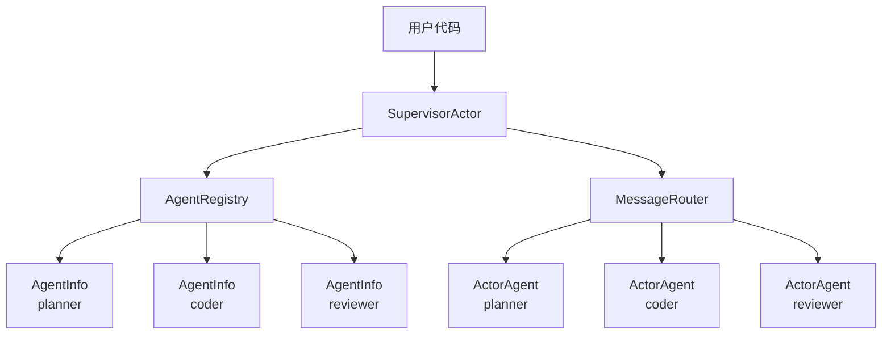

# 多 Agent 通信

ghrah 通过 [`SupervisorActor`](../src/ghrah/communication/supervisor.py:34) 提供多 Agent 通信能力，包括 Agent 注册、消息路由和广播。

## 架构概览



## SupervisorActor

[`SupervisorActor`](../src/ghrah/communication/supervisor.py:34) 是整个多 Agent 系统的中心编排者：

- 持有 [`AgentRegistry`](../src/ghrah/communication/registry.py:47) 和 [`MessageRouter`](../src/ghrah/communication/router.py:26)
- 管理 Agent 的创建和销毁
- 提供消息路由和广播的入口
- 支持显式 Ability 注册

### 创建 Supervisor

```python
from ghrah.communication import SupervisorActor

supervisor = SupervisorActor()
```

### 注册 Agent

```python
from ghrah.core.config import AgentConfig

# 定义 Agent 配置
configs = [
    AgentConfig(
        name="planner",
        description="任务规划专家，负责分解复杂任务",
        system_prompt="你是一个任务规划专家。请将复杂任务分解为清晰的步骤。",
    ),
    AgentConfig(
        name="coder",
        description="代码编写专家",
        system_prompt="你是一个代码编写专家。请根据设计编写高质量的代码。",
    ),
    AgentConfig(
        name="reviewer",
        description="代码审查专家",
        system_prompt="你是一个代码审查专家。请审查代码并给出改进建议。",
    ),
]

# 注册 Agent
for config in configs:
    await supervisor.spawn_agent(config)
```

### 注册带 Ability 的 Agent

```python
from ghrah.abilities.builtin import (
    ConversationAbility,
    EndTaskAbility,
    ReadFileAbility,
    WriteFileAbility,
)

# 注册 Agent 并添加 Ability
abilities_map = {
    "planner": [ConversationAbility(), EndTaskAbility()],
    "coder": [ConversationAbility(), EndTaskAbility(), ReadFileAbility(), WriteFileAbility()],
    "reviewer": [ConversationAbility(), EndTaskAbility(), ReadFileAbility()],
}

for name, abilities in abilities_map.items():
    for ability in abilities:
        await supervisor.register_ability_for_agent(name, ability)
```

### 发送消息

```python
# 点对点消息
response = await supervisor.send("planner", "设计一个 Web 服务器架构")
print(f"Planner 回复: {response.content}")

# Agent 间通信
coder_response = await supervisor.send("coder", "根据以下设计编写代码：...")
```

### 广播消息

```python
# 广播到所有已注册 Agent
responses = await supervisor.broadcast("大家好，项目开始！")
for resp in responses:
    print(f"{resp.sender}: {resp.content}")
```

### 健康检查

```python
# 检查所有 Agent 状态
status = await supervisor.health_check()
for name, info in status.items():
    print(f"{name}: {info}")
```

### 销毁 Agent

```python
# 销毁指定 Agent
await supervisor.terminate_agent("reviewer")

# 销毁所有 Agent
await supervisor.terminate_all()
```

## AgentRegistry

[`AgentRegistry`](../src/ghrah/communication/registry.py:47) 维护 Agent 名称到 actor handle 的映射：

```python
from ghrah.communication.registry import AgentRegistry

registry = AgentRegistry()

# 注册 Agent
registry.register(name="planner", config=config, actor_handle=handle)

# 查询 Agent
info = registry.get("planner")  # 返回 AgentInfo

# 列出所有 Agent
agents = registry.list_all()

# 注销 Agent
registry.unregister("planner")
```

### AgentInfo

[`AgentInfo`](../src/ghrah/communication/registry.py:23) 包含注册的 Agent 信息：

| 属性 | 类型 | 说明 |
|------|------|------|
| `name` | `str` | Agent 唯一名称 |
| `config` | `AgentConfig` | Agent 框架层配置 |
| `actor_handle` | `Any` | actor handle 引用 |
| `created_at` | `float` | 注册时间戳 |

## MessageRouter

[`MessageRouter`](../src/ghrah/communication/router.py:26) 根据消息的 `recipient` 字段路由到目标 Agent：

```python
from ghrah.communication.router import MessageRouter

router = MessageRouter(registry)

# 路由到指定 Agent
response = await router.route(message)

# 广播到所有 Agent
responses = await router.broadcast(message)

# 带超时的路由
response = await router.route(message, timeout=60.0)
```

### 路由规则

| recipient | 行为 |
|-----------|------|
| 具体名称 | 路由到单个 Agent 并等待响应 |
| `"*"` | 广播到所有已注册 Agent |

### 超时机制

```python
# 默认超时 300 秒
router = MessageRouter(registry, default_timeout=300.0)

# 单次路由超时
response = await router.route(message, timeout=60.0)
```

超时后抛出 [`CommunicationTimeoutError`](../src/ghrah/core/exceptions.py)。

## 完整示例

### 多 Agent 串行协作

```python
from ghrah.communication import SupervisorActor
from ghrah.core.config import AgentConfig

supervisor = SupervisorActor()

# 注册 Agent
configs = [
    AgentConfig(name="planner", description="任务规划", system_prompt="..."),
    AgentConfig(name="coder", description="代码编写", system_prompt="..."),
    AgentConfig(name="reviewer", description="代码审查", system_prompt="..."),
]
for config in configs:
    await supervisor.spawn_agent(config)

# 串行工作流：规划 → 编码 → 审查
plan = await supervisor.send("planner", "设计一个 REST API")
code = await supervisor.send("coder", f"根据以下设计编写代码：{plan.content}")
review = await supervisor.send("reviewer", f"审查以下代码：{code.content}")

print(f"审查结果: {review.content}")
```

### 多 Agent 并行协作

参考 [`examples/multi_agent_parallel.py`](../examples/multi_agent_parallel.py)，展示了带文件系统权限和 JSON 持久化的完整并行协作示例。

关键步骤：

1. 创建工作区目录结构
2. 配置 `FSPermissionChecker` 限制文件访问范围
3. 配置 `ContextConfig` 启用 JSON 持久化
4. 使用 `asyncio.gather()` 并行执行多个 Agent 任务

```python
import asyncio

# 并行执行
results = await asyncio.gather(
    supervisor.send("planner", "设计项目结构"),
    supervisor.send("coder", "编写核心模块"),
)
```

## 消息协议

Agent 间通信使用 [`Message`](../src/ghrah/core/message.py:56) 对象：

```python
from ghrah.core.message import Message, MessageType

# 创建点对点消息
msg = Message(
    sender="planner",
    recipient="coder",
    content="请根据设计编写代码",
    type=MessageType.COMMAND,
)

# 创建回复
reply = Message.create_reply(msg, "代码已编写完成")

# 创建广播消息
broadcast = Message(
    sender="supervisor",
    recipient="*",
    content="项目开始",
    type=MessageType.BROADCAST,
)
```

## 下一步

- [核心概念](core-concepts.md) — 理解 ActorAgent 和消息协议
- [配置参考](configuration.md) — 查看 AgentConfig 和 ContextConfig 配置
- [持久化与窗口管理](persistence.md) — 了解如何持久化 Agent 状态