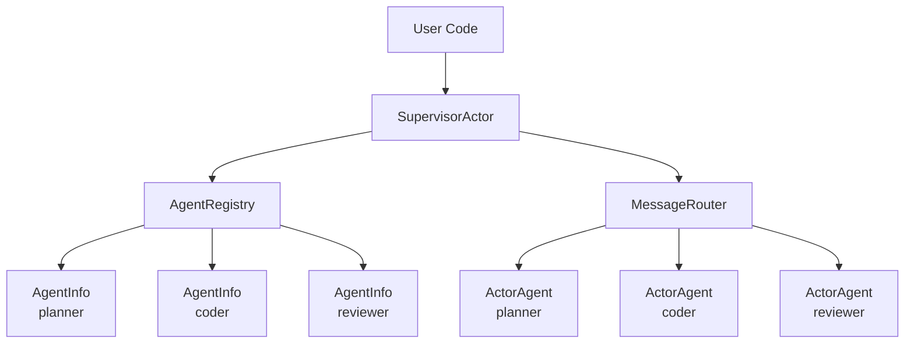

# Multi-Agent Communication

ghrah provides multi-Agent communication capabilities through [`SupervisorActor`](../src/ghrah/communication/supervisor.py:34), including Agent registration, message routing, and broadcasting.

## Architecture Overview



## SupervisorActor

[`SupervisorActor`](../src/ghrah/communication/supervisor.py:34) is the central orchestrator of the multi-Agent system:

- Holds [`AgentRegistry`](../src/ghrah/communication/registry.py:47) and [`MessageRouter`](../src/ghrah/communication/router.py:26)
- Manages Agent creation and destruction
- Provides message routing and broadcasting entry points
- Supports explicit Ability registration

### Create Supervisor

```python
from ghrah.communication import SupervisorActor

supervisor = SupervisorActor()
```

### Register Agents

```python
from ghrah.core.config import AgentConfig

configs = [
    AgentConfig(
        name="planner",
        description="Task planning expert, responsible for breaking down complex tasks",
        system_prompt="You are a task planning expert. Break down complex tasks into clear steps.",
    ),
    AgentConfig(
        name="coder",
        description="Code writing expert",
        system_prompt="You are a code writing expert. Write high-quality code based on designs.",
    ),
    AgentConfig(
        name="reviewer",
        description="Code review expert",
        system_prompt="You are a code review expert. Review code and provide improvement suggestions.",
    ),
]

for config in configs:
    await supervisor.spawn_agent(config)
```

### Register Agents with Abilities

```python
from ghrah.abilities.builtin import (
    ConversationAbility,
    EndTaskAbility,
    ReadFileAbility,
    WriteFileAbility,
)

abilities_map = {
    "planner": [ConversationAbility(), EndTaskAbility()],
    "coder": [ConversationAbility(), EndTaskAbility(), ReadFileAbility(), WriteFileAbility()],
    "reviewer": [ConversationAbility(), EndTaskAbility(), ReadFileAbility()],
}

for name, abilities in abilities_map.items():
    for ability in abilities:
        await supervisor.register_ability_for_agent(name, ability)
```

### Send Messages

```python
# Point-to-point message
response = await supervisor.send("planner", "Design a web server architecture")
print(f"Planner response: {response.content}")

# Inter-Agent communication
coder_response = await supervisor.send("coder", "Write code based on the following design: ...")
```

### Broadcast Messages

```python
# Broadcast to all registered Agents
responses = await supervisor.broadcast("Hello everyone, project starts!")
for resp in responses:
    print(f"{resp.sender}: {resp.content}")
```

### Health Check

```python
# Check all Agent statuses
status = await supervisor.health_check()
for name, info in status.items():
    print(f"{name}: {info}")
```

### Terminate Agents

```python
# Terminate a specific Agent
await supervisor.terminate_agent("reviewer")

# Terminate all Agents
await supervisor.terminate_all()
```

## AgentRegistry

[`AgentRegistry`](../src/ghrah/communication/registry.py:47) maintains the mapping from Agent names to actor handles:

```python
from ghrah.communication.registry import AgentRegistry

registry = AgentRegistry()

# Register Agent
registry.register(name="planner", config=config, actor_handle=handle)

# Query Agent
info = registry.get("planner")  # Returns AgentInfo

# List all Agents
agents = registry.list_all()

# Unregister Agent
registry.unregister("planner")
```

### AgentInfo

[`AgentInfo`](../src/ghrah/communication/registry.py:23) contains registered Agent information:

| Attribute | Type | Description |
|-----------|------|-------------|
| `name` | `str` | Agent unique name |
| `config` | `AgentConfig` | Agent framework configuration |
| `actor_handle` | `Any` | actor handle reference |
| `created_at` | `float` | Registration timestamp |

## MessageRouter

[`MessageRouter`](../src/ghrah/communication/router.py:26) routes messages to target Agents based on the `recipient` field:

```python
from ghrah.communication.router import MessageRouter

router = MessageRouter(registry)

# Route to specific Agent
response = await router.route(message)

# Broadcast to all Agents
responses = await router.broadcast(message)

# Route with timeout
response = await router.route(message, timeout=60.0)
```

### Routing Rules

| recipient | Behavior |
|-----------|----------|
| Specific name | Route to single Agent and wait for response |
| `"*"` | Broadcast to all registered Agents |

### Timeout Mechanism

```python
# Default timeout 300 seconds
router = MessageRouter(registry, default_timeout=300.0)

# Single route timeout
response = await router.route(message, timeout=60.0)
```

Raises [`CommunicationTimeoutError`](../src/ghrah/core/exceptions.py) on timeout.

## Complete Example

### Multi-Agent Serial Collaboration

```python
from ghrah.communication import SupervisorActor
from ghrah.core.config import AgentConfig

supervisor = SupervisorActor()

# Register Agents
configs = [
    AgentConfig(name="planner", description="Task planning", system_prompt="..."),
    AgentConfig(name="coder", description="Code writing", system_prompt="..."),
    AgentConfig(name="reviewer", description="Code review", system_prompt="..."),
]
for config in configs:
    await supervisor.spawn_agent(config)

# Serial workflow: Plan → Code → Review
plan = await supervisor.send("planner", "Design a REST API")
code = await supervisor.send("coder", f"Write code based on this design: {plan.content}")
review = await supervisor.send("reviewer", f"Review this code: {code.content}")

print(f"Review result: {review.content}")
```

### Multi-Agent Parallel Collaboration

See [`examples/multi_agent_parallel.py`](../examples/multi_agent_parallel.py) for a complete parallel collaboration example with file system permissions and JSON persistence.

Key steps:

1. Create workspace directory structure
2. Configure `FSPermissionChecker` to limit file access scope
3. Configure `ContextConfig` to enable JSON persistence
4. Use `asyncio.gather()` for parallel Agent task execution

```python
import asyncio

# Parallel execution
results = await asyncio.gather(
    supervisor.send("planner", "Design project structure"),
    supervisor.send("coder", "Write core modules"),
)
```

## Message Protocol

Inter-Agent communication uses [`Message`](../src/ghrah/core/message.py:56) objects:

```python
from ghrah.core.message import Message, MessageType

# Create point-to-point message
msg = Message(
    sender="planner",
    recipient="coder",
    content="Please write code based on the design",
    type=MessageType.COMMAND,
)

# Create reply
reply = Message.create_reply(msg, "Code has been written")

# Create broadcast message
broadcast = Message(
    sender="supervisor",
    recipient="*",
    content="Project starts",
    type=MessageType.BROADCAST,
)
```

## Next Steps

- [Core Concepts](core-concepts_en.md) — Understand ActorAgent and message protocol
- [Configuration Reference](configuration_en.md) — View AgentConfig and ContextConfig settings
- [Persistence & Window Management](persistence_en.md) — Learn how to persist Agent state