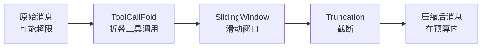

# 持久化与窗口管理

ghrah 提供了灵活的持久化后端和窗口管理策略，用于保存 Agent 状态和压缩对话历史。

## 持久化后端

### PersistenceBackend 抽象基类

[`PersistenceBackend`](../src/ghrah/context/persistence/backend.py:22) 定义了统一的存储接口：

```python
from ghrah.context.persistence import PersistenceBackend

class MyBackend(PersistenceBackend):
    async def save_node(self, node: ContextNode) -> None:
        """保存单个节点"""
        ...
    
    async def load_node(self, node_id: str) -> ContextNode | None:
        """加载单个节点"""
        ...
    
    async def save_chain_meta(self, agent_name: str, meta: dict) -> None:
        """保存链元信息"""
        ...
    
    async def load_chain_meta(self, agent_name: str) -> dict | None:
        """加载链元信息"""
        ...
    
    async def save_messages(self, agent_name: str, messages: list) -> None:
        """保存消息列表"""
        ...
    
    async def load_messages(self, agent_name: str) -> list:
        """加载消息列表"""
        ...
```

### InMemoryBackend

[`InMemoryBackend`](../src/ghrah/context/persistence/memory.py) 纯内存存储，不持久化到磁盘：

```python
from ghrah.context.persistence import InMemoryBackend

backend = InMemoryBackend()
```

**适用场景**：测试、临时会话、不需要持久化的短任务。

### JsonFileBackend

[`JsonFileBackend`](../src/ghrah/context/persistence/json_file.py) 基于 JSON 文件的持久化，支持 gzip 压缩：

```python
from ghrah.context.persistence import JsonFileBackend

backend = JsonFileBackend(
    root_dir="/tmp/agent_data",    # 存储根目录
    compress=True,                  # 启用 gzip 压缩
    session_id="session_20260422",  # 会话 ID（可选，自动生成）
)
```

**目录结构**：

```
/root_dir/
└── {agent_name}/
    ├── chain_meta.json.gz     # 链元信息
    ├── messages.json.gz       # 消息快照
    └── nodes/
        ├── {node_id}.json.gz  # 节点数据
        └── ...
```

**适用场景**：需要持久化的生产环境、调试分析、会话恢复。

### SqliteBackend

[`SqliteBackend`](../src/ghrah/context/persistence/sqlite_backend.py) 基于 SQLite 的持久化，使用 aiosqlite 异步操作，WAL 模式支持并发读：

```python
from ghrah.context.persistence.sqlite_backend import SqliteBackend

backend = SqliteBackend(
    db_path="/tmp/agent_data/ghrah.db",  # 数据库文件路径
    session_id="session_20260428",        # 会话 ID（可选，自动生成）
)
```

**数据库表结构**：

| 表 | 说明 |
|-----|------|
| `sessions` | 会话元信息 |
| `agents` | Agent 注册信息 |
| `nodes` | ActionChain 节点数据 |
| `chain_meta` | 链元信息（分支、当前状态） |

**特性**：
- **WAL 模式**：支持并发读写，适合 Subject 单写多读场景
- **事务保证**：批量操作使用显式事务
- **Session-scoped**：自动生成 `session_{ISO8601}` 格式的会话 ID

**适用场景**：需要持久化且需要查询能力的生产环境。

### RemoteBackend

[`RemoteBackend`](../src/ghrah/context/persistence/remote_backend.py) 通过 CommandSender 将持久化操作委托给 Subject：

```python
from ghrah.context.persistence.remote_backend import RemoteBackend
from ghrah.core.command_sender import CommandSender

command_sender = CommandSender(...)
backend = RemoteBackend(
    command_sender=command_sender,
    agent_name="my-agent",
    request_timeout=30.0,
)
```

**命令协议**：

| 本地方法 | 发送命令 | 说明 |
|----------|----------|------|
| `save_node()` | `persist_save_node` | 保存节点 |
| `load_node()` | `persist_load_node` | 加载节点 |
| `save_chain_meta()` | `persist_save_chain_meta` | 保存链元信息 |
| `load_chain_meta()` | `persist_load_chain_meta` | 加载链元信息 |
| `save_messages()` | `persist_save_messages` | 保存消息 |
| `load_messages()` | `persist_load_messages` | 加载消息 |

**懒连接**：如果 CommandSender 尚未连接，首次操作时会自动连接。这解决了 `ContextConfig.create_persistence()` 是同步方法、无法异步连接的问题。

**适用场景**：分布式模式下 Core 不直接碰 I/O，所有持久化操作委托给 Subject。

### 配置持久化

通过 [`ContextConfig`](../src/ghrah/core/config.py:40) 配置持久化：

```python
from ghrah.core.config import AgentConfig, ContextConfig

config = AgentConfig(
    name="my-agent",
    context=ContextConfig(
        # 持久化后端类型
        persistence_type="json_file",  # "json_file" | "memory" | "sqlite" | "remote" | None
        
        # JSON 文件后端配置
        persistence_root_dir="/tmp/agent_data",  # 存储根目录
        persistence_compress=True,                 # gzip 压缩
        persistence_run_id="my_session",       # 会话 ID
        
        # 快照和自动持久化
        snapshot_interval=5,    # 每 5 次迭代存储一次快照
        auto_persist=False,    # 是否在每次 commit/rollback 后自动持久化
    ),
)
```

### 手动持久化与恢复

```python
# 通过 ContextManager 手动持久化
await agent._context_manager.persist()

# 从持久化后端恢复
await agent._context_manager.restore()
```

### 序列化工具

[`ghrah.context.persistence`](../src/ghrah/context/persistence/__init__.py) 提供了序列化/反序列化工具：

```python
from ghrah.context.persistence import (
    serialize_node,
    deserialize_node,
    serialize_action_result,
    deserialize_action_result,
    serialize_action_results,
    deserialize_action_results,
    serialize_messages,
    deserialize_messages,
)

# 序列化 ContextNode
data = serialize_node(node)
node = deserialize_node(data)

# 序列化消息列表
msg_data = serialize_messages(messages)
messages = deserialize_messages(msg_data)
```

## 窗口管理

[`WindowManager`](../src/ghrah/context/window.py) 管理 LLM 上下文窗口，通过策略模式压缩对话历史到 token 预算内。

### 设计原理

LLM 有上下文窗口限制（如 GPT-4o 的 128K tokens），当对话历史超过限制时，需要压缩历史消息。WindowManager 通过组合多个策略，按顺序执行压缩管道。

### 配置窗口管理

通过 [`WindowConfig`](../src/ghrah/core/config.py:20) 配置：

```python
from ghrah.core.config import AgentConfig, WindowConfig

config = AgentConfig(
    name="my-agent",
    window=WindowConfig(
        max_tokens=4096,                                       # token 预算
        strategies=["tool_call_fold", "truncation"],           # 策略列表
        tool_call_max_length=500,                               # ToolCall 折叠最大长度
        sliding_window_size=20,                                 # 滑动窗口大小
    ),
)
```

### 策略列表

按 `strategies` 列表的顺序依次执行：



### TruncationStrategy

[`TruncationStrategy`](../src/ghrah/context/strategies/truncation.py) — 最简单的截断策略：

- 从最早的消息开始截断
- 始终保留 SystemMessage
- 当总 token 数超过 `max_tokens` 时截断

```python
from ghrah.context.strategies.truncation import TruncationStrategy

strategy = TruncationStrategy()
```

### SlidingWindowStrategy

[`SlidingWindowStrategy`](../src/ghrah/context/strategies/sliding_window.py) — 滑动窗口策略：

- 保留最近 `window_size` 条消息
- 始终保留 SystemMessage

```python
from ghrah.context.strategies.sliding_window import SlidingWindowStrategy

strategy = SlidingWindowStrategy(window_size=20)
```

### ToolCallFoldStrategy

[`ToolCallFoldStrategy`](../src/ghrah/context/strategies/tool_call_fold.py) — ToolCall 折叠策略：

- 将长的 tool_call 结果折叠为摘要
- 保留 tool_call 结构，但截断过长的内容
- `max_content_length` 控制折叠后的最大内容长度

```python
from ghrah.context.strategies.tool_call_fold import ToolCallFoldStrategy

strategy = ToolCallFoldStrategy(max_content_length=500)
```

### LLMSummaryStrategy

[`LLMSummaryStrategy`](../src/ghrah/context/strategies/llm_summary.py) — LLM 摘要策略：

- 使用 LLM 对历史消息生成摘要
- 需要后续注入 LLM 实例
- 最智能但最耗时的策略

```python
from ghrah.context.strategies.llm_summary import LLMSummaryStrategy

strategy = LLMSummaryStrategy()  # 需要后续注入 LLM
```

### Token 估算

WindowManager 使用字符近似法估算 token 数：

```python
from ghrah.context.window import estimate_tokens, estimate_message_tokens

# 1 token ≈ 4 个字符
tokens = estimate_tokens("Hello, world!")  # ≈ 4 tokens

# 估算消息 token 数（考虑 AIMessage 的 tool_calls）
msg_tokens = estimate_message_tokens(message)
```

### 自定义策略

实现 [`WindowStrategy`](../src/ghrah/context/window.py) 接口：

```python
from ghrah.context.window import WindowStrategy
from ghrah.chat.message import ChatMessage

class MyStrategy(WindowStrategy):
    """自定义窗口策略"""
    
    def apply(self, messages: list[ChatMessage], max_tokens: int) -> list[ChatMessage]:
        # 实现压缩逻辑
        # 返回压缩后的消息列表，总 token 数不超过 max_tokens
        return compressed_messages
    
    @property
    def name(self) -> str:
        return "my_strategy"
```

然后在配置中使用：

```python
from ghrah.context.window import WindowManager

wm = WindowManager(
    strategies=[my_strategy, TruncationStrategy()],
    max_tokens=4096,
)
```

## 完整配置示例

```python
from ghrah.core.config import AgentConfig, WindowConfig, ContextConfig

config = AgentConfig(
    name="coder",
    description="代码编写助手",
    system_prompt="你是一个代码编写专家。",
    max_iterations=15,
    
    # 窗口管理配置
    window=WindowConfig(
        max_tokens=8192,
        strategies=["tool_call_fold", "sliding_window", "truncation"],
        tool_call_max_length=500,
        sliding_window_size=30,
    ),
    
    # 上下文管理配置
    context=ContextConfig(
        persistence_type="json_file",
        persistence_root_dir="/tmp/agent_data",
        persistence_compress=True,
        snapshot_interval=10,
        auto_persist=True,
    ),
)
```

## 下一步

- [上下文管理](context-management.md) — 了解 ContextManager 如何使用持久化和窗口管理
- [配置参考](configuration.md) — 查看所有配置选项的详细说明
- [内置 Ability 参考](builtin-abilities.md) — 了解文件系统 Ability 的权限配置