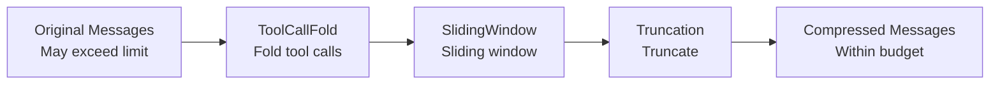

# Persistence & Window Management

ghrah provides flexible persistence backends and window management strategies for saving Agent state and compressing conversation history.

## Persistence Backends

### PersistenceBackend Abstract Base Class

[`PersistenceBackend`](../src/ghrah/context/persistence/backend.py:22) defines the unified storage interface:

```python
from ghrah.context.persistence import PersistenceBackend

class MyBackend(PersistenceBackend):
    async def save_node(self, node: ContextNode) -> None:
        """Save a single node"""
        ...
    
    async def load_node(self, node_id: str) -> ContextNode | None:
        """Load a single node"""
        ...
    
    async def save_chain_meta(self, agent_name: str, meta: dict) -> None:
        """Save chain metadata"""
        ...
    
    async def load_chain_meta(self, agent_name: str) -> dict | None:
        """Load chain metadata"""
        ...
    
    async def save_messages(self, agent_name: str, messages: list) -> None:
        """Save message list"""
        ...
    
    async def load_messages(self, agent_name: str) -> list:
        """Load message list"""
        ...
```

### InMemoryBackend

[`InMemoryBackend`](../src/ghrah/context/persistence/memory.py) is a pure in-memory storage that doesn't persist to disk:

```python
from ghrah.context.persistence import InMemoryBackend

backend = InMemoryBackend()
```

**Use cases**: Testing, temporary sessions, short tasks that don't need persistence.

### JsonFileBackend

[`JsonFileBackend`](../src/ghrah/context/persistence/json_file.py) is a JSON file-based persistence backend with gzip compression support:

```python
from ghrah.context.persistence import JsonFileBackend

backend = JsonFileBackend(
    root_dir="/tmp/agent_data",    # Storage root directory
    compress=True,                  # Enable gzip compression
    session_id="session_20260422",  # Session ID (optional, auto-generated)
)
```

**Directory structure**:

```
/root_dir/
└── {agent_name}/
    ├── chain_meta.json.gz     # Chain metadata
    ├── messages.json.gz       # Message snapshots
    └── nodes/
        ├── {node_id}.json.gz  # Node data
        └── ...
```

**Use cases**: Production environments requiring persistence, debugging analysis, session recovery.

### SqliteBackend

[`SqliteBackend`](../src/ghrah/context/persistence/sqlite_backend.py) is a SQLite-based persistence backend using aiosqlite for async operations with WAL mode for concurrent reads:

```python
from ghrah.context.persistence.sqlite_backend import SqliteBackend

backend = SqliteBackend(
    db_path="/tmp/agent_data/ghrah.db",  # Database file path
    session_id="session_20260428",        # Session ID (optional, auto-generated)
)
```

**Database table structure**:

| Table | Description |
|-------|-------------|
| `sessions` | Session metadata |
| `agents` | Agent registration info |
| `nodes` | ActionChain node data |
| `chain_meta` | Chain metadata (branches, current state) |

**Features**:
- **WAL mode**: Supports concurrent read/write, suitable for Subject single-writer multi-reader scenarios
- **Transaction guarantees**: Batch operations use explicit transactions
- **Session-scoped**: Auto-generates `session_{ISO8601}` format session IDs

**Use cases**: Production environments requiring persistence and query capabilities.

### RemoteBackend

[`RemoteBackend`](../src/ghrah/context/persistence/remote_backend.py) delegates persistence operations to Subject via CommandSender:

```python
from ghrah.context.persistence.remote_backend import RemoteBackend
from ghrah.core.command_sender import CommandSender

command_sender = CommandSender(...)
backend = RemoteBackend(
    command_sender=command_sender,
    agent_name="my-agent",
    request_timeout=30.0,
)
```

**Command protocol**:

| Local Method | Sent Command | Description |
|--------------|-------------|-------------|
| `save_node()` | `persist_save_node` | Save node |
| `load_node()` | `persist_load_node` | Load node |
| `save_chain_meta()` | `persist_save_chain_meta` | Save chain metadata |
| `load_chain_meta()` | `persist_load_chain_meta` | Load chain metadata |
| `save_messages()` | `persist_save_messages` | Save messages |
| `load_messages()` | `persist_load_messages` | Load messages |

**Lazy connection**: If CommandSender is not yet connected, the first operation will automatically connect. This solves the problem that `ContextConfig.create_persistence()` is a synchronous method that cannot establish async connections.

**Use cases**: In distributed mode, Core doesn't directly touch I/O; all persistence operations are delegated to Subject.

### Configuring Persistence

Configure persistence via [`ContextConfig`](../src/ghrah/core/config.py:40):

```python
from ghrah.core.config import AgentConfig, ContextConfig

config = AgentConfig(
    name="my-agent",
    context=ContextConfig(
        persistence_type="json_file",  # "json_file" | "memory" | "sqlite" | "remote" | None
        persistence_root_dir="/tmp/agent_data",
        persistence_compress=True,
        persistence_run_id="my_session",
        snapshot_interval=5,
        auto_persist=False,
    ),
)
```

### Manual Persistence & Recovery

```python
# Manual persist via ContextManager
await agent._context_manager.persist()

# Restore from persistence backend
await agent._context_manager.restore()
```

### Serialization Utilities

[`ghrah.context.persistence`](../src/ghrah/context/persistence/__init__.py) provides serialization/deserialization utilities:

```python
from ghrah.context.persistence import (
    serialize_node, deserialize_node,
    serialize_action_result, deserialize_action_result,
    serialize_action_results, deserialize_action_results,
    serialize_messages, deserialize_messages,
)

# Serialize ContextNode
data = serialize_node(node)
node = deserialize_node(data)

# Serialize message list
msg_data = serialize_messages(messages)
messages = deserialize_messages(msg_data)
```

## Window Management

[`WindowManager`](../src/ghrah/context/window.py) manages the LLM context window, compressing conversation history within token budgets through a strategy pattern.

### Design Rationale

LLMs have context window limits (e.g., GPT-4o's 128K tokens). When conversation history exceeds the limit, history messages need to be compressed. WindowManager executes a compression pipeline by combining multiple strategies in order.

### Configuring Window Management

Configure via [`WindowConfig`](../src/ghrah/core/config.py:20):

```python
from ghrah.core.config import AgentConfig, WindowConfig

config = AgentConfig(
    name="my-agent",
    window=WindowConfig(
        max_tokens=4096,                                       # Token budget
        strategies=["tool_call_fold", "truncation"],           # Strategy list
        tool_call_max_length=500,                               # ToolCall fold max length
        sliding_window_size=20,                                 # Sliding window size
    ),
)
```

### Strategy List

Strategies execute in the order of the `strategies` list:



### TruncationStrategy

[`TruncationStrategy`](../src/ghrah/context/strategies/truncation.py) — Simplest truncation strategy:

- Truncates from the earliest messages
- Always preserves SystemMessage
- Truncates when total token count exceeds `max_tokens`

```python
from ghrah.context.strategies.truncation import TruncationStrategy

strategy = TruncationStrategy()
```

### SlidingWindowStrategy

[`SlidingWindowStrategy`](../src/ghrah/context/strategies/sliding_window.py) — Sliding window strategy:

- Keeps the most recent `window_size` messages
- Always preserves SystemMessage

```python
from ghrah.context.strategies.sliding_window import SlidingWindowStrategy

strategy = SlidingWindowStrategy(window_size=20)
```

### ToolCallFoldStrategy

[`ToolCallFoldStrategy`](../src/ghrah/context/strategies/tool_call_fold.py) — ToolCall folding strategy:

- Folds long tool_call results into summaries
- Preserves tool_call structure but truncates overly long content
- `max_content_length` controls the maximum content length after folding

```python
from ghrah.context.strategies.tool_call_fold import ToolCallFoldStrategy

strategy = ToolCallFoldStrategy(max_content_length=500)
```

### LLMSummaryStrategy

[`LLMSummaryStrategy`](../src/ghrah/context/strategies/llm_summary.py) — LLM summary strategy:

- Uses LLM to generate summaries of historical messages
- Requires subsequent LLM instance injection
- Most intelligent but most time-consuming strategy

```python
from ghrah.context.strategies.llm_summary import LLMSummaryStrategy

strategy = LLMSummaryStrategy()  # Requires LLM injection later
```

### Token Estimation

WindowManager uses character approximation for token estimation:

```python
from ghrah.context.window import estimate_tokens, estimate_message_tokens

# 1 token ≈ 4 characters
tokens = estimate_tokens("Hello, world!")  # ≈ 4 tokens

# Estimate message token count (considers AIMessage tool_calls)
msg_tokens = estimate_message_tokens(message)
```

### Custom Strategy

Implement the [`WindowStrategy`](../src/ghrah/context/window.py) interface:

```python
from ghrah.context.window import WindowStrategy
from ghrah.chat.message import ChatMessage

class MyStrategy(WindowStrategy):
    """Custom window strategy"""
    
    def apply(self, messages: list[ChatMessage], max_tokens: int) -> list[ChatMessage]:
        # Implement compression logic
        # Return compressed message list within max_tokens
        return compressed_messages
    
    @property
    def name(self) -> str:
        return "my_strategy"
```

Then use it in configuration:

```python
from ghrah.context.window import WindowManager

wm = WindowManager(
    strategies=[my_strategy, TruncationStrategy()],
    max_tokens=4096,
)
```

## Complete Configuration Example

```python
from ghrah.core.config import AgentConfig, WindowConfig, ContextConfig

config = AgentConfig(
    name="coder",
    description="Code writing assistant",
    system_prompt="You are a code writing expert.",
    max_iterations=15,
    
    # Window management configuration
    window=WindowConfig(
        max_tokens=8192,
        strategies=["tool_call_fold", "sliding_window", "truncation"],
        tool_call_max_length=500,
        sliding_window_size=30,
    ),
    
    # Context management configuration
    context=ContextConfig(
        persistence_type="json_file",
        persistence_root_dir="/tmp/agent_data",
        persistence_compress=True,
        snapshot_interval=10,
        auto_persist=True,
    ),
)
```

## Next Steps

- [Context Management](context-management_en.md) — Understand how ContextManager uses persistence and window management
- [Configuration Reference](configuration_en.md) — View all configuration options
- [Built-in Ability Reference](builtin-abilities_en.md) — Learn about file system Ability permission configuration